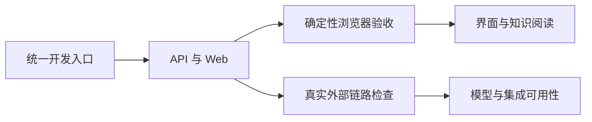

# 开发、分层验收与仓库知识维护

项目以统一入口启动本地应用，并将验证拆分为确定性浏览器验收、真实外部链路检查、质量评测与仓库知识刷新。各层证明范围不同：界面流程可复现不代表模型或飞书可用，任务入列和文件写出也不代表知识已经复核并发布。

来源：gpt-5.6-sol 分析，gpt-5.6-sol 独立复核；模型解释仍可被原始证据纠正。

## 从统一入口进入可验证的开发环境

开发入口把 API、Web、端口选择和健康检查编排为一个完整过程：后端就绪后才公布访问地址，端口冲突、健康检查超时或子进程失败会向上暴露。这样开发者启动的是可直接操作的应用，而不是彼此脱节的服务。参考 [开发启动流程 ↗](c80ddf4d487be75fb725d4a2b25eaada83c3dd0ee7583263278e19e9b52b7fb2.md#dev-startup "提供统一入口、端口预检、API 与 Web 编排及健康检查的下钻说明。")

浏览器脚本运行真实 Vue、API 与 SQLite，仅以 Agent fixture 稳定模型相关断言。参考 [真实应用浏览器栈 ↗](../../../scripts/browser-smoke.ts#L1 "支持浏览器验收运行真实 Vue、API 和 SQLite，同时使用 fixture 稳定 Agent 断言。") 飞书注册器和凭据提供器也是脚本内替身，因此这层适合检查界面及应用逻辑，不能证明真实飞书平台已经连通。参考 [飞书注册替身 ↗](../../../scripts/browser-smoke.ts#L19 "支持浏览器验收中的飞书注册过程由脚本内适配器模拟。") 完整的产品与知识阅读覆盖范围见分层说明。延伸阅读：[浏览器验收分层 ↗](c80ddf4d487be75fb725d4a2b25eaada83c3dd0ee7583263278e19e9b52b7fb2.md#browser-layers "支持材料录入、任务通知、引用阅读、深链和源码导航等确定性浏览器覆盖范围。")

## 不同验收层分别证明什么

确定性浏览器层覆盖材料录入、提案应用、任务与通知，也检查引用展开、深链恢复、焦点归还和固定源码范围阅读。参考 [浏览器验收分层 ↗](c80ddf4d487be75fb725d4a2b25eaada83c3dd0ee7583263278e19e9b52b7fb2.md#browser-layers "支持材料录入、任务通知、引用阅读、深链和源码导航等确定性浏览器覆盖范围。") 这些检查强调产品行为可复现，但其中的 Agent 与部分飞书能力由 fixture 提供。

真实链路层另行调用 ACP、抽取与复核角色、学习流水线或飞书宿主，用实际运行结果检查外部依赖与落库链路。参考 [真实外部链路 ↗](c80ddf4d487be75fb725d4a2b25eaada83c3dd0ee7583263278e19e9b52b7fb2.md#live-validation "解释真实 ACP、学习闭环和飞书连接检查与浏览器 fixture 的分工。")、[真实角色与任务验证 ↗](7343906ff4606be19d720148b9045c013f97b2e00ef36ff5359dc5137dd1bdfe.md#validation-layers "支持角色冒烟和任务冒烟分别保存轨迹、运行学习流水线并检查落库结果。") 两层相互补充，但浏览器通过不能替代 live 验收，连接成功也不能自动证明字段语义和消息闭环正确。

质量评测继续回答“结果是否可靠”：人工标注形成冻结数据集，在线 runner 隔离执行样本，离线门禁检查自动应用精确率、语义支持、引用和证据覆盖；单样本失败会留下需要背景的预测记录。参考 [质量评测闭环 ↗](7343906ff4606be19d720148b9045c013f97b2e00ef36ff5359dc5137dd1bdfe.md#quality-evaluation "支持从人工标注、冻结数据集、隔离执行到离线质量门禁的流程概括。")

## 代码修改后如何刷新仓库知识

仓库知识维护复用共享知识流水线：先同步原始材料与代码投影，再依据材料类型选择分析角色，保存运行轨迹和覆盖状态；只有下层知识处于当前版本时，才继续合成模块、主题与概览。定向更新还需逐层刷新受影响的上层文章，最终索引只纳入当前页面。参考 [仓库知识刷新 ↗](7343906ff4606be19d720148b9045c013f97b2e00ef36ff5359dc5137dd1bdfe.md#knowledge-refresh "支持材料同步、角色分析、覆盖记录、分层合成和当前索引的更新流程。")

代码结构图是已捕获原文片段上的确定性投影，用于选材、定位与导航，不是新的事实来源。它不能证明跨版本符号身份连续，也不能把 import 邻接解释为完整的跨文件调用关系；知识正文仍应沿内联引用回到固定原文。参考 [代码投影边界 ↗](7343906ff4606be19d720148b9045c013f97b2e00ef36ff5359dc5137dd1bdfe.md#limits "支持代码结构图依附已捕获证据且不代表跨版本身份或完整跨文件调用关系。")

角色任务完成、文件生成或作业成功入列都只是过程状态。判断知识是否可用，还需结合独立复核、覆盖记录、引用有效性和发布后的当前索引。参考 [知识证据边界 ↗](7343906ff4606be19d720148b9045c013f97b2e00ef36ff5359dc5137dd1bdfe.md#limits "说明持久任务、过程状态与派生知识不能替代固定原始证据和完整复核。")

## 当前进展与能力边界

现有脚本已经形成从本地启动、产品流程、知识阅读、真实 Agent、飞书连接到质量门禁和知识刷新的分层框架。评估进展时仍需核对实际命令、退出码、运行轨迹、覆盖记录与报告；源码中存在检查脚本并不代表当前环境已经执行成功。参考 [验收进展与限制 ↗](c80ddf4d487be75fb725d4a2b25eaada83c3dd0ee7583263278e19e9b52b7fb2.md#progress-limits "支持按实际运行证据判断进展，并说明端口竞态、Chromium 范围和部分 live 检查的最小断言边界。")

已知边界包括端口预检释放临时监听后仍可能出现抢占窗口、浏览器检查主要依赖 Chromium，以及部分 live 冒烟只验证最小输出、提案应用或连接状态。参考 [验收进展与限制 ↗](c80ddf4d487be75fb725d4a2b25eaada83c3dd0ee7583263278e19e9b52b7fb2.md#progress-limits "支持按实际运行证据判断进展，并说明端口竞态、Chromium 范围和部分 live 检查的最小断言边界。") 固定作业处理上限能否覆盖全部派生任务，以及知识分析失败后旧页面何时保留或失效，目前仍缺少足够材料，应作为后续行为验证问题，而不是视为已经确定的能力。
