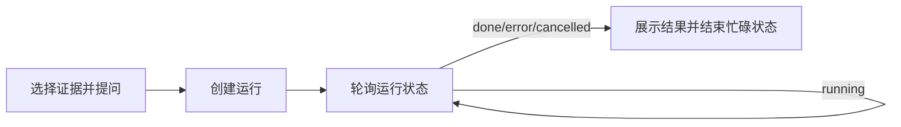

# 基于固定证据的记忆问答面板

该组件让用户围绕当前证据片段或引用路径发起问答，轮询展示 Agent 运行结果，并提供取消、错误反馈和证据回查；它依赖共享 UI 组件与统一 API 类型，但不负责逐项核验回答主张。

来源：gpt-5.6-sol 分析，gpt-5.6-sol 独立复核；模型解释仍可被原始证据纠正。

## 围绕可回查证据提问

组件解决的是“针对已打开材料继续追问”的场景：必须先有当前片段，才能输入并发送问题；界面同时展示固定证据，避免用户误以为这是无上下文聊天。回答范围可选当前片段或当前引用路径，后者把路径中的片段标识作为额外上下文提交。参考 [焦点证据展示 ↗](../../../apps/web/src/ChatPane.vue#L87 "支持组件要求用户先选择片段，并在问答区展示固定证据的说明。") [问答范围选择 ↗](../../../apps/web/src/ChatPane.vue#L124 "支持当前片段与当前引用路径两种范围，以及输入框依赖焦点证据的说明。")

## 从发起运行到持续展示结果

提交时组件会防止空问题、缺少焦点或重复运行，并携带 profile、焦点、可选模型、effort 与上下文创建运行。随后约每 450 毫秒查询一次状态：运行中继续轮询，结束后解除忙碌状态，成功时通知父组件刷新已保存内容。文本事件按顺序拼接成回答，权限和错误事件则单独醒目展示。参考 [运行创建参数 ↗](../../../apps/web/src/ChatPane.vue#L49 "说明发送前置条件以及 profile、焦点、模型、effort 和路径上下文如何提交。") [状态轮询与结果拼接 ↗](../../../apps/web/src/ChatPane.vue#L19 "支持定时查询运行状态、成功通知父组件以及文本事件拼接行为。")

运行对象的状态集合、事件列表及可选回答标识由共享 API 类型约束。参考 [运行数据合同 ↗](../../../apps/web/src/api.ts#L58 "说明组件依赖的运行状态、事件列表与回答标识来自共享 API 类型。")

## 取消、卸载与可信度边界

用户可请求取消当前运行，但组件本身不立即改写状态，最终状态仍取决于后续查询结果。组件卸载时会清除定时器，并通过 disposed 标记阻止已返回的异步结果继续写入界面。参考 [取消与卸载清理 ↗](../../../apps/web/src/ChatPane.vue#L69 "支持取消请求、错误处理、定时器清理及阻止卸载后更新的边界说明。")

完成后只提供本次焦点证据的回查入口；界面明确说明系统尚未自动核验回答中每个主张的支持度。因此这里实现的是“有证据上下文且可追溯”的交互入口，而不是事实验证器。当前材料也未包含服务端运行、取消接口或组件测试，无法据此确认取消收敛时延、轮询并发行为及所有终态的端到端断言。参考 [证据回查与核验提示 ↗](../../../apps/web/src/ChatPane.vue#L95 "支持完成后提供证据入口，同时明确回答主张尚未被自动逐项核验。")
