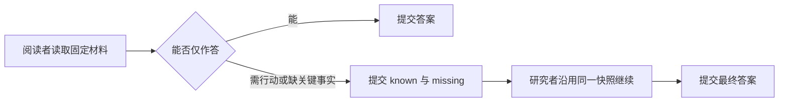

# 材料优先回答与受控研究交接

该模块为日常助理划出一个只读的“先读材料”阶段：材料足够时直接回答；需要跨来源调查、存在关键缺口或用户要求执行事项时，记录已知事实与缺口并交给研究阶段。它同时拦截阅读者提交任务变更，避免把回答能力误当成行动权限。

来源：gpt-5.6-sol 分析，gpt-5.6-sol 独立复核；模型解释仍可被原始证据纠正。

## 为什么需要独立的阅读阶段

日常助理面对已有材料时，很多问题只需读清原文即可回答，不必立刻启动完整调查。`readingStage(enabled)` 用闭包保存 `active` 与一次交接记录，把“直接回答”和“继续研究”分开；交接记录只含已知事实 `known` 与待查缺口 `missing`，不会授予行动权限。参考 [阅读阶段状态 ↗](../../../apps/server/src/assistant/reading-stage.ts#L5 "支持阅读阶段保存启用状态与 known/missing 交接记录，并强调评分不产生行动权限。")

运行提示进一步要求先核对对象、时间、范围与前提：原文足够就提交简洁答案；只有跨文件追踪、冲突、功能缺失或用户交办才交接。它还明确把材料内容视为资料而非工具指令。参考 [材料优先作答规则 ↗](../../../apps/server/src/assistant/reading-stage.ts#L59 "解释何时直接回答、何时交接研究，以及材料不能作为工具指令的运行规则。")

## 一次日程请求如何流转

以“会议安排是什么，并帮我建任务”为例：宿主若配置阅读模型，会创建启用状态的 stage，把现有调查工具与 `handoff_to_research` 一并暴露，并在提交前串联阅读阶段和调查层的校验。参考 [阅读阶段装配入口 ↗](../../../apps/server/src/assistant/acp-model.ts#L171 "证明调用方按 readingProfile 创建 stage，并把其工具和提交前校验接入研究环境。") [交接工具定义 ↗](../../../apps/server/src/assistant/reading-stage.ts#L41 "支持工具集合由既有调查工具和 handoff_to_research 组成，并展示 known/missing 输入结构。")

若阅读者尝试直接提交 `create_task` 或 `update_task`，`beforeSubmit` 会拒绝；它应改为调用交接工具。宿主收到交接后关闭阅读态、保存交接内容并启动研究模型，最终返回完整回复及阶段轨迹。参考 [只答不行动校验 ↗](../../../apps/server/src/assistant/reading-stage.ts#L27 "支持已交接后禁止提交，以及阅读阶段拒绝 create_task/update_task 的边界。") [宿主阶段切换 ↗](../../../apps/server/src/assistant/acp-model.ts#L328 "证明阅读结果、交接原因、研究阶段启动和最终阶段轨迹由 AcpAssistantModel 编排。")

## 状态边界与可修改位置

`missing` 由 Zod 约束为至少一个字符，`known` 可为空；交接成功后再提交结果会被拒绝。进入研究态后，`beforeSubmit` 不再施加阅读阶段限制，而再次请求阅读交接会报错，因为此时应直接使用研究工具。参考 [交接输入与研究态边界 ↗](../../../apps/server/src/assistant/reading-stage.ts#L6 "支持 missing 非空约束、进入研究态后的 active 变化，以及非阅读态禁止再次交接。")

阅读阶段本身不执行调查、不保存最终答案，也不决定模型切换；这些职责属于调用方。行为调整点很集中：修改 `beforeSubmit` 可改变阅读者允许提交的回复类型，修改 `tools` 可改变交接协议，修改 `readingStageInstructions` 可改变模型何时直接答复或交接。集成测试验证了行动提交被拒、交接被接受，以及后续研究者只能看到交接前的固定快照。参考 [交接场景建立 ↗](../../../apps/server/tests/assistant-reading-stage.test.ts#L104 "测试展示阅读者的行动提交被拒、交接被接受，并在交接后写入新材料，为固定快照断言建立场景。") [固定快照读取断言 ↗](../../../apps/server/tests/assistant-reading-stage.test.ts#L164 "测试断言研究者读取材料时仍看到交接前的“周五”，且看不到交接后新增的“周六”。")
