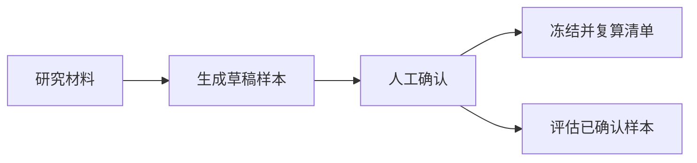

# 质量评测与人工标注闭环

质量模块把研究材料转换为待人工确认的评测样本，通过飞书卡片形成金标，并从标签一致性、证据定位、语义支持、数字事实槽、任务完成和不必要打断等维度评估预测。冻结能力可建立稳定基线，但当前材料尚不能证明所有评估入口都会强制校验冻结清单。

来源：gpt-5.6-sol 分析，gpt-5.6-sol 独立复核；模型解释仍可被原始证据纠正。

## 为什么需要独立的质量评测

知识提炼不仅要找到原文，还要判断材料是否值得长期保留、陈述是否忠于证据，以及结果能否自动应用。质量标签因此区分提炼、弃权和需要上下文；提炼必须产生对象，非提炼结果不得自动应用。参考 [质量标签约束 ↗](../../../apps/server/src/quality/repository.ts#L39 "支持三种处置、提炼对象类型以及提炼和自动应用之间的跨字段约束。")

规则样本生成器只服务研究标注集，与普通捕获、导入和学习链路隔离。它生成的逐字主张和自动应用建议只是待人工判断的草稿，不能直接视为生产知识。参考 [研究评测隔离边界 ↗](../../../apps/server/src/quality/import.ts#L1 "证明规则样本生成器仅用于人工标注研究集，不属于普通捕获和知识学习链路。")

## 从研究材料到稳定评测集

导入必须携带评测专用开关，随后生成候选、创建数据集并批量写入样本。参考 [评测数据集导入流程 ↗](../../../apps/server/src/quality/import.ts#L156 "支持显式评测开关以及生成样本、创建数据集和批量写入的调用顺序。") 样本分别保存草稿标签、确认标签、状态、评审人和摘要；人工动作在写入阶段再次校验待审状态与标签摘要，以发现过期操作。参考 [质量样本持久化结构 ↗](../../../apps/server/src/quality/repository.ts#L79 "支持草稿标签、确认标签、评审状态、评审人和摘要分别保存。") [人工标注并发校验 ↗](../../../apps/server/src/quality/repository.ts#L278 "支持人工动作映射、标签摘要校验以及写入阶段再次限制待审状态。")

全部目标样本确认后，仓储可以按顺序、输入摘要和确认标签摘要冻结数据集，并在之后复算清单完整性。参考 [冻结与完整性复算 ↗](../../../apps/server/src/quality/repository.ts#L358 "支持冻结所需的全量确认条件、清单摘要组成及冻结后的完整性复算能力。") 评估器自身只筛选已确认且具有确认标签的样本，不接收数据集状态或清单摘要；因此只能确认冻结能力存在，不能确认每次评估前都必然执行冻结校验。参考 [评估样本筛选条件 ↗](../../../apps/server/src/quality/evaluator.ts#L234 "证明评估器只筛选已确认且带确认标签的样本，未检查数据集冻结状态或清单摘要。")

## 人工复核与预测评估如何协作

飞书卡片展示原始材料、建议处置、提炼对象和标注进度，并提供确认、弃权、需要修改和稍后处理四种动作。参考 [飞书质量标注卡片 ↗](../../../apps/server/src/quality/lark-annotations.ts#L42 "支持卡片展示内容、进度和四种人工评审动作。") 回调会先持久化并去重事件，再核对活动会话、当前样本、owner、聊天、消息、应用、有效期、标签摘要和随机凭据；通过后在事务中记录标签、审计事件并推进下一条。参考 [飞书卡片回调流程 ↗](../../../apps/server/src/quality/lark-annotations.ts#L355 "支持事件去重、完整会话上下文校验以及事务内记录标签并推进下一样本。")

评估时，每个预测对象分别计算短引定位、规则式语义支持和数字事实槽一致性。任务完成则另按处置、预期对象覆盖和“没有语义矛盾”判断，不会因引用未定位、数字槽不一致、部分支持或不支持而单独失败。参考 [对象评估与任务完成规则 ↗](../../../apps/server/src/quality/evaluator.ts#L285 "支持三个对象级信号，以及任务完成仅使用处置、证据覆盖和语义矛盾的判定边界。") 汇总结果还包括精确匹配、自动应用精度、必要证据召回、不必要打断、延迟和失败明细；没有预测对象时，对象级比率为空。参考 [质量指标汇总 ↗](../../../apps/server/src/quality/evaluator.ts#L387 "支持对象级、任务级、延迟和失败指标，以及对象分母为空时返回空值。")

## 当前能力边界与风险

当前存储明确建立在单用户 SQLite 基础上，不能据此推断已有团队租户隔离。参考 [单用户存储基础 ↗](../../../apps/server/src/store.ts#L4 "说明当前 SQLite 实现面向单用户，团队权限执行仍属于后续迁移。") 语义支持裁决依赖有限的否定、反义、时间、限制词和二元词组规则；数字由另一个有限的 token 检查处理，两者都不等同于完整自然语言推理。参考 [语义与数字裁决规则 ↗](../../../apps/server/src/quality/evaluator.ts#L138 "支持语义裁决依赖有限规则和词面重合，而数字事实槽由独立函数有限检查。")

仓储仍有写阶段风险：修订只在读取时排除已确认样本，最终更新没有再次限制允许状态；冻结更新也未检查实际更新行数。参考 [修订与冻结写入条件 ↗](../../../apps/server/src/quality/repository.ts#L328 "支持修订写阶段未再次限制样本状态，以及冻结更新未检查实际更新行数的风险。") 飞书标注会话在创建时将消息标识置空，显式续发也会再次清空该字段。参考 [会话消息标识初始化 ↗](../../../apps/server/src/quality/lark-annotations.ts#L289 "证明新建标注会话时消息标识被写为空值。") [续发时重置消息标识 ↗](../../../apps/server/src/quality/lark-annotations.ts#L191 "证明显式续发活动会话时会将消息标识重新置空并轮换随机凭据。") 回调却要求数据库中的消息标识与入站事件完全一致，因此成功发送后的标识回填必须由其他流程完成；当前材料尚未证明该流程是否存在。参考 [回调消息标识校验 ↗](../../../apps/server/src/quality/lark-annotations.ts#L378 "证明卡片回调要求会话中的消息标识与入站事件消息标识完全一致。")
