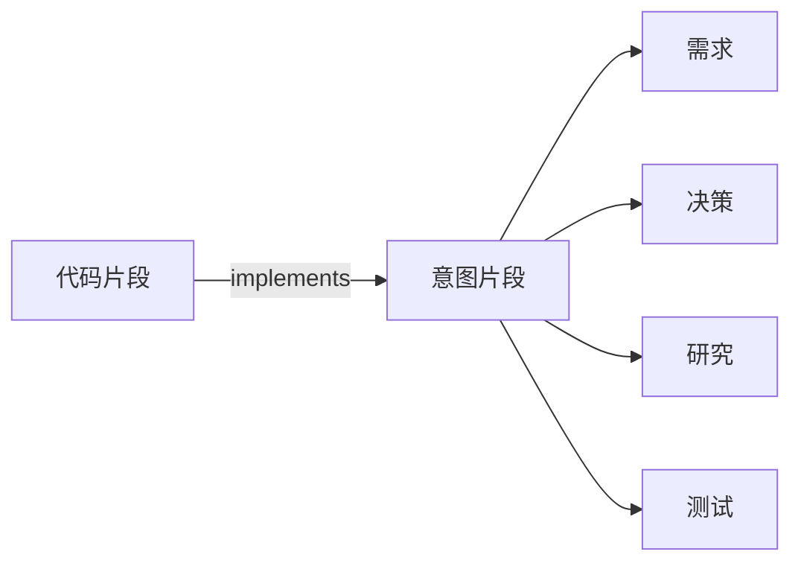

# 仓库评审数据的隔离存储与证据关系追踪

仓库评审复用 omem 的通用 SQLite 与仓储能力，但使用独立运行目录；文件以路径维持稳定身份，旧快照保留为不可变历史，代码与需求、决策、研究和测试之间则通过可失效的确定性关系连接。

来源：gpt-5.6-sol 分析，gpt-5.6-sol 独立复核；模型解释仍可被原始证据纠正。

## 隔离评审数据，同时复用通用存储

repo-review 面向仓库代码评审，复用 omem 的捕获、检索和 Store 基础，但数据库、状态与资源均位于仓库自己的运行目录，不接触个人工作区数据、密钥或无关 worker。参考 [评审存储隔离边界 ↗](../../../apps/server/src/review/store.ts#L1 "支持 repo-review 复用通用捕获和检索能力，同时隔离个人数据库、worker 与密钥的说明。")

`createReviewStore` 将通用 Store 绑定到 `.repo-review/runtime/data`；Store 会创建 SQLite、执行迁移、准备资源目录并初始化各类仓储服务。默认启动不依赖旧快照，只有显式设置导入开关时才执行历史导入。参考 [通用 Store 初始化 ↗](../../../apps/server/src/store.ts#L38 "说明通用 Store 如何创建 SQLite、执行迁移并初始化资源目录和仓储服务。") [评审 Store 创建入口 ↗](../../../apps/server/src/review/store.ts#L100 "支持评审数据库目录绑定及旧历史仅在显式开关下导入的结论。")

导入过程先复制数据库及 WAL 文件到临时目录，再通过 `VACUUM INTO` 生成一致快照；若失败会清理不完整目标，旧档案始终保持不变。参考 [一致快照导入 ↗](../../../apps/server/src/review/store.ts#L51 "支持临时复制、SQLite 一致快照、失败清理以及旧档案保持不变的流程说明。")

## 稳定文件身份与历史迁移

文件来源使用 `omem:<仓库相对路径>` 作为稳定身份：同一路径内容变化时累积新的 revision，而内容相同但路径不同的文件仍属于不同来源。评审侧表记录删除、移动、迁移和旧来源别名；其中删除标记可由检索读取，用于默认排除已删除证据。参考 [路径稳定身份 ↗](../../../apps/server/src/review/store.ts#L29 "支持同一路径跨内容修改累积 revision、不同路径保持独立来源的身份规则。") [来源状态元数据 ↗](../../../apps/server/src/review/store.ts#L115 "支持删除、移动、迁移和旧来源别名由评审侧表维护的说明。") [删除来源过滤集合 ↗](../../../apps/server/src/review/store.ts#L219 "直接支持检索读取已删除来源集合，并默认排除过期或已删除证据的论断。")

旧内容哈希来源迁移时，系统从最新 revision 的上下文提取文件路径并分组。若尚无对应路径身份，组选出的最新快照取得该身份；其余旧来源只摘除当前 head 并登记为历史别名，revision 与 fragment 不会被删除。参考 [旧来源迁移分组与选择 ↗](../../../apps/server/src/review/store.ts#L282 "支持按文件路径分组、选择最新快照取得路径身份以及降级其余旧来源的流程。") [历史来源降级 ↗](../../../apps/server/src/review/store.ts#L238 "支持降级操作只清除当前 head、记录路径别名，而不删除 revision 和 fragment。")

无法解析正文或缺少 `context.filePath` 的来源不会进入迁移分组。迁移完成后写入标记，正常情况下后续启动直接返回；只有仍存在关联当前 head 的旧身份时才重新扫描。参考 [缺少路径的迁移处理 ↗](../../../apps/server/src/review/store.ts#L305 "说明正文无法解析或缺少文件路径时，该来源不会进入迁移分组。") [迁移标记与快速返回 ↗](../../../apps/server/src/review/store.ts#L261 "支持迁移标记避免常规重复扫描，同时允许异常遗留的活动旧来源再次迁移。")

## 从代码追到需求、决策与测试

评审关系保存 `implements`、`requires`、`decided_by`、`researched_by`、`tested_by` 等正向类型，反向名称在查询时派生。关系由 seed 身份生成稳定 ID并幂等更新；缺少新结构字段的旧派生表可以重建，因为权威输入仍是关联 seed。参考 [关系类型与反向名称 ↗](../../../apps/server/src/review/store.ts#L367 "支持评审关系保存正向类型，并在反向查询时派生可读关系名称。") [确定性关系写入 ↗](../../../apps/server/src/review/store.ts#L407 "支持旧派生表可重建、关系 ID 由 seed 身份确定以及重复同步幂等更新的说明。")

代码路径查询先取得文件当前 revision 的片段及其出边，再沿 `implements` 到达意图片段，并补充这些意图片段的一层出边。因此它提供代码到背景证据的两层追踪链，而不是任意深度的图遍历。参考 [代码证据追踪链 ↗](../../../apps/server/src/review/store.ts#L689 "支持代码片段出边经 implements 扩展到意图片段出边的两层追踪流程。")

## 关系过期规则与待确认边界

读取单个片段的关系时，系统同时检查存储状态、另一端是否仍属于来源当前 head，以及来源是否已删除。即使数据库中仍为 confirmed，只要另一端过期或被删除，对外状态就会降为 stale；默认查询过滤 stale，但保留无法解析另一端的 missing 关系。参考 [关系有效状态计算 ↗](../../../apps/server/src/review/store.ts#L506 "支持依据另一端当前性与删除状态计算有效状态，以及普通片段查询默认过滤 stale、保留 missing 的行为。")

同步前的失效逻辑会检查关系两端，将指向非当前 revision、无 head 或已删除来源的关系标为 stale，并保留明确的空端点，以便重建阶段重新写入仍有效的边。参考 [同步前关系失效 ↗](../../../apps/server/src/review/store.ts#L753 "支持关系任一端失去当前性或来源被删除时标记 stale，并保留未解析空端点的规则。")

两个边界仍需结合调用方与行为测试确认：有效 seed 集合为空时，removed-seed 失效函数直接返回；代码路径查询虽然构造了目标端当前性和删除状态条件，最终 SQL 却只直接应用了代码源 head 与存储状态条件。参考 [空 seed 集合分支 ↗](../../../apps/server/src/review/store.ts#L485 "支持有效 seed 集合为空时 removed-seed 失效函数直接返回的边界观察。") [代码路径过滤实现 ↗](../../../apps/server/src/review/store.ts#L680 "支持目标端过滤条件虽被构造、最终查询却只直接拼接代码源 head 与存储 stale 条件的观察。")
