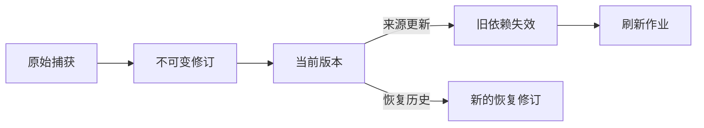

# 可信运行边界与可追溯状态演进

系统以单用户 SQLite、不可变修订和乐观版本检查保存状态变化，并将角色配置、模型能力、会话隔离、权限请求和失败结果纳入可追踪边界；仓库同步与旧数据迁移遵循显式、幂等和失败可重试原则。

来源：gpt-5.6-sol 分析，gpt-5.6-sol 独立复核；模型解释仍可被原始证据纠正。

## 从原始输入建立可信状态

系统面向个人记忆场景，当前以**单用户 SQLite**为持久化基础；修订、变更记录和通知 outbox 在数据库事务中共同演进，团队级租户约束仍是后续能力。参考 [单用户存储边界 ↗](../../../apps/server/src/store.ts#L4 "说明当前以单用户 SQLite 为基础，并明确团队级约束尚未实现。")

捕获入口统一接收文本、图片和链接，并可保留采集者、主体、事件时间、转发状态及原始或派生属性。参考 [统一捕获与溯源合同 ↗](../../../packages/contracts/src/index.ts#L20 "支持捕获输入包含文本、图片和链接，并保存主体、时间、转发及派生属性。") 相同事件或相同内容可幂等复用已有修订；内容改变则创建新的不可变修订与固定片段。新版本成为来源当前版本后，依赖旧版的记忆被标记过期，并创建后续刷新作业。参考 [捕获去重与新修订 ↗](../../../apps/server/src/store.ts#L143 "支持按事件和内容去重，并在内容变化时创建新的不可变修订与片段。") [来源更新与依赖刷新 ↗](../../../apps/server/src/store.ts#L231 "支持切换来源当前版本、使旧依赖过期并创建刷新作业。")

## 用新版本表达修改与恢复

状态变化遵循“追加历史、切换当前版本”，而非原地改写。恢复旧内容时会复制出新修订，并要求调用方提供当前版本；基线已变化时返回重基错误，避免覆盖并发更新。参考 [历史恢复为新修订 ↗](../../../apps/server/src/store.ts#L488 "支持恢复操作检查当前基线、复制历史内容并产生新的当前修订。") 待办状态同样采用期望版本检查，每次有效变更追加任务修订和通知，相同状态的重复提交不会增加版本。参考 [待办乐观版本更新 ↗](../../../apps/server/src/store.ts#L693 "支持待办状态按期望版本更新、追加任务修订并生成变更通知。")

该流程同时保留当前采用的状态与完整历史。参考 [来源更新与依赖刷新 ↗](../../../apps/server/src/store.ts#L231 "支持切换来源当前版本、使旧依赖过期并创建刷新作业。") [历史恢复为新修订 ↗](../../../apps/server/src/store.ts#L488 "支持恢复操作检查当前基线、复制历史内容并产生新的当前修订。")

## 角色运行时如何限制模型影响

角色清单绑定提示模板、技能版本、输出合同、工具策略、会话策略和预算；无工具角色不能声明可用工具，也不继承用户技能或 MCP。参考 [角色安全清单 ↗](../../../packages/contracts/src/index.ts#L675 "说明角色清单对技能、输出合同、工具、会话继承和预算的约束。") 执行记录保存角色包、提示词、技能摘要及结构化输出合同，使各角色的有效配置可以事后核对。参考 [角色配置与执行追踪 ↗](../../../apps/server/tests/role-runtime.test.ts#L95 "支持不同角色使用不同提示和技能摘要，并把有效配置写入作业执行记录。")

模型与推理强度先协商再校验，不支持的组合会在执行前拒绝。格式错误、输出超限、非正常结束或超时也不会生成任务或应用回执。参考 [模型能力协商 ↗](../../../apps/server/tests/role-runtime.test.ts#L226 "支持先协商有效模型和推理强度，并拒绝模型不支持的设置。") [失败结果不应用 ↗](../../../apps/server/tests/role-runtime.test.ts#L293 "支持格式、容量、结束状态和超时错误不会产生任务或应用回执。") 不同项目使用隔离会话，verifier 只接收自身固定输入。参考 [角色会话隔离 ↗](../../../apps/server/tests/role-runtime.test.ts#L338 "支持不同项目使用独立会话，并确保 verifier 不继承其他项目上下文。") 材料中的工具调用或权限修改文字只按数据处理；被拒绝的运行时请求不能迟到批准，也不会转化为业务决定。参考 [材料指令与权限隔离 ↗](../../../apps/server/tests/role-runtime.test.ts#L372 "支持把材料中的命令视为数据、拒绝运行时权限请求，并阻止迟到批准成为业务决定。")

## 仓库知识的迁移、同步与现有限制

仓库评审运行时默认不读取旧数据目录；只有显式种子流程才复制旧数据库与同步状态，并保持旧快照不变。已有运行时不会被第二次种子覆盖，失败产生的部分目标会被清理以便重试。参考 [旧数据显式迁移 ↗](../../../apps/server/tests/review-runtime-seed.test.ts#L97 "支持默认启动隔离旧库，以及显式种子的复制、幂等和失败清理规则。")

文件路径构成稳定来源身份；内容更新会追加修订，旧版本退出默认召回，删除来源也默认退出检索。参考 [来源身份与修订历史 ↗](../../../apps/server/tests/review-sync.test.ts#L143 "支持按路径区分来源、内容更新追加修订，以及历史或删除来源默认退出检索。") 版本接口会列出来源的全部修订及其当前状态。参考 [来源版本接口 ↗](../../../apps/server/tests/review-sync.test.ts#L433 "支持版本接口列出来源的全部修订，并明确标记当前版本和历史版本。") 脏工作树或文件处理失败时，同步不会推进干净基线；恢复或修复后会重新扫描，避免把部分成功误判为完整同步。参考 [同步基线控制 ↗](../../../apps/server/tests/review-sync.test.ts#L527 "支持脏同步或文件部分失败时不推进干净基线，并在状态恢复后重新处理。")

图片资产先写入文件系统，修订和通知随后才进入 SQLite 事务，因此数据库阶段失败时是否遗留未引用资产尚无证据。参考 [资产写入与事务顺序 ↗](../../../apps/server/src/store.ts#L102 "显示图片资产先写入文件系统，而数据库修订随后才进入事务，为跨存储原子性疑问提供依据。") 角色运行测试使用本地夹具代理，证明了宿主安全逻辑，但不能代表所有真实 ACP/Agent CLI 的兼容性。参考 [本地角色代理夹具 ↗](../../../apps/server/tests/role-runtime.test.ts#L39 "说明角色运行测试使用本地 Node 夹具代理和受控超时，不能直接代表全部真实外部 CLI。")
