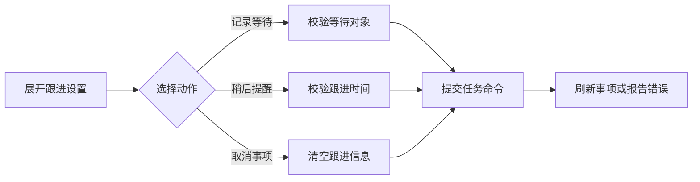

# 事项等待、稍后提醒与取消控制

该组件为仍可处理的事项提供跟进设置入口，将记录等待、稍后提醒和取消事项转换为带版本与请求标识的统一任务命令，并通知父组件刷新结果或展示错误。

来源：gpt-5.6-sol 分析，gpt-5.6-sol 独立复核；模型解释仍可被原始证据纠正。

## 解决什么问题

组件用于管理尚未结束事项的后续动作：仅当事项处于 `open` 或 `waiting` 状态时显示入口。用户可以记录正在等待的对象或结果、设置下次检查时间，或者取消事项；界面明确说明跟进时间不会改变截止时间，也不会自动联系对方。参考 [跟进设置界面 ↗](../../../apps/web/src/TaskFollowUpControls.vue#L25 "支持入口的状态条件、三种用户操作以及不改变截止时间和不自动联络的界面说明。")

组件接收统一的 `Task` 对象：`status` 控制入口可见性，`followUp` 保存跟进信息，`version` 用于命令提交。参考 [事项数据合同 ↗](../../../apps/web/src/api.ts#L40 "支持 Task 的状态、跟进信息和版本字段构成组件输入合同。") `TaskFollowUp` 类型从共享任务流合同导入，因此组件没有另行定义跟进数据结构。参考 [共享跟进类型 ↗](../../../apps/web/src/api.ts#L1 "支持 TaskFollowUp 从共享任务流合同导入，而非由组件或页面接口文件自行定义。")

## 从表单输入到任务命令

操作流程如下：

提交前，组件以 `busy` 阻止自身重复执行，并分别校验等待对象和提醒时间。输入时间会转换为 ISO 字符串；请求携带动作、当前任务版本及随机请求标识。成功后收起表单并通知父组件刷新，失败时上报错误，最后恢复可操作状态。参考 [命令提交流程 ↗](../../../apps/web/src/TaskFollowUpControls.vue#L8 "支持输入校验、忙碌状态保护、时间转换、命令提交、成功刷新、错误上报和状态恢复的流程。")

## 动作差异与集成边界

三个动作共用 `/tasks/{task.id}/commands` 接口，但负载不同：`wait` 要求等待对象，并可附带检查时间；`snooze` 要求时间，并将其同时作为下次检查点和暂缓截止点；`cancel` 发送空的跟进信息。非取消动作还会携带原始时间表达式和浏览器时区。参考 [三类跟进负载 ↗](../../../apps/web/src/TaskFollowUpControls.vue#L14 "支持三个动作共用命令接口，以及取消、等待和稍后提醒各自的跟进字段差异。")

组件负责采集、校验和发送命令，不直接修改传入的任务，也不负责自动联络。当前材料没有给出服务端的版本冲突、幂等和时间校验语义。此外，“稍后提醒”和“取消事项”位于表单内但未显式声明按钮类型，其点击是否额外触发表单提交取决于 `OmButton` 的默认行为，仍需通过按钮实现与交互测试确认。参考 [表单按钮定义 ↗](../../../apps/web/src/TaskFollowUpControls.vue#L27 "支持记录等待使用显式提交按钮，而另外两个表单内按钮未显式声明类型的边界分析。")
