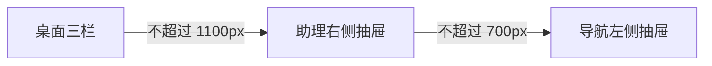

# 自适应三栏应用外壳

OmShell 为 omem 页面提供统一的顶部栏、导航区、主内容区和可选助理区，并通过断点把固定侧栏转换为移动端抽屉。组件只负责布局与显隐状态，具体导航、页面内容和助理能力由插槽注入。

来源：gpt-5.6-sol 分析，gpt-5.6-sol 独立复核；模型解释仍可被原始证据纠正。

## 统一页面骨架

OmShell 解决不同页面重复搭建应用框架的问题：顶部栏承载品牌与页面级工具，主体按“导航—内容—助理”组织。`top`、`navigation`、默认插槽和 `assistant` 插槽让调用方提供业务内容；只有传入助理插槽时，追问按钮与右侧区域才会出现。参考 [页面插槽与三栏结构 ↗](../../../packages/ui/src/components/OmShell.vue#L8 "支持顶部、导航、正文和可选助理区域由插槽组成，以及助理区域按插槽存在性渲染的说明。")

外壳占满动态视口并锁住根滚动，三个内容区域各自承担滚动；主内容通过弹性宽度占据剩余空间，导航和助理保持固定宽度。这使长文阅读、目录导航和辅助问答可以同时存在。参考 [桌面布局与滚动规则 ↗](../../../packages/ui/src/components/OmShell.vue#L46 "支持全视口外壳、固定宽度侧栏、弹性主内容及各区域滚动行为的说明。")

## 从固定侧栏切换为抽屉

组件用两个本地布尔状态分别控制导航与助理显隐。桌面宽度下按钮隐藏、侧栏常驻；宽度不超过 1100px 时助理改为右侧固定抽屉，不超过 700px 时导航也改为左侧抽屉，同时压缩顶栏并简化品牌信息。参考 [响应式侧栏规则 ↗](../../../packages/ui/src/components/OmShell.vue#L107 "支持两个断点下助理与导航从常驻侧栏变为固定抽屉，以及移动端顶栏简化的流程。")

导航区域自身被点击后会关闭，助理则只通过顶部“追问”按钮切换；当前材料没有显示遮罩层、Esc 关闭或焦点管理。参考 [导航与助理显隐状态 ↗](../../../packages/ui/src/components/OmShell.vue#L2 "支持两个独立布尔状态、按钮切换方式及导航区域点击后关闭的说明。")

## 基础组件依赖与职责边界

外壳直接复用 OmButton 和 OmIcon：菜单与品牌图形由图标组件绘制，切换控件使用 ghost 按钮样式。图标对未知名称会回退为书本图形；按钮负责原生禁用与忙碌语义，但 OmShell 只使用普通点击状态。参考 [图标回退行为 ↗](../../../packages/ui/src/components/OmIcon.vue#L2 "支持 OmIcon 提供菜单和层叠图形，并在未知名称时回退到默认书本图形的说明。") [按钮交互语义 ↗](../../../packages/ui/src/components/OmButton.vue#L2 "支持 OmButton 的样式变体、禁用与忙碌状态语义，以及 ghost 外观的说明。")

该组件不解析路由、不保存展开状态，也不实现助理业务逻辑；品牌链接还通过 `prevent` 阻止默认跳转。因此它是纯页面容器，导航目标、助理内容及持久化策略均需由上层提供。参考 [品牌链接与组件状态 ↗](../../../packages/ui/src/components/OmShell.vue#L2 "支持品牌链接阻止默认跳转、组件仅维护导航和助理显隐状态，因此未承担路由与持久化职责的判断。")
