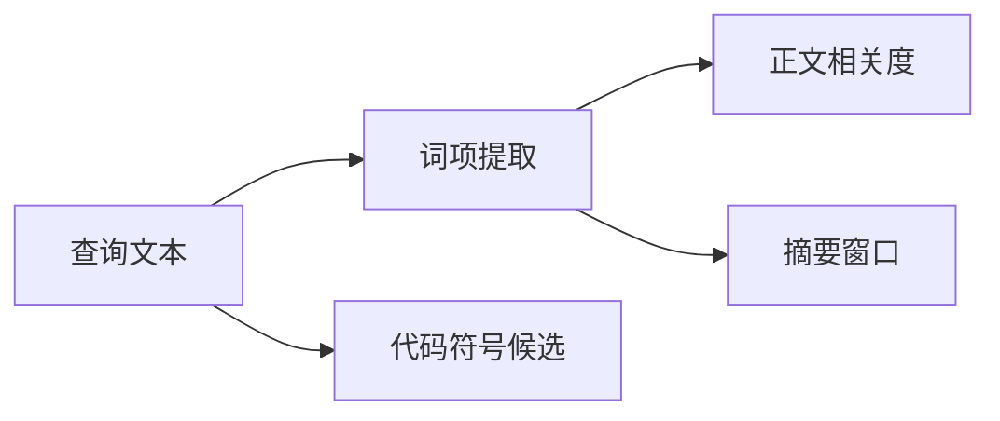

# 检索查询的词项、代码符号与摘要启发式

这一组无状态辅助函数把自然语言查询整理成可检索词项和谨慎的代码符号候选，再用正文覆盖率过滤候选并选择关键词较集中的摘要窗口。它是词面检索的公共判断层，不负责数据库查询、语义向量或最终融合排序。

来源：gpt-5.6-sol 分析，gpt-5.6-sol 独立复核；模型解释仍可被原始证据纠正。

## 解决什么问题

检索入口既会收到中文问题，也会收到路径、函数名和中英混合文本。这里先用中文 ICU 分词保留词语边界，同时单独提取 ASCII 标识符；结果统一转小写、去重，并过滤单字符及常见虚词。对 2～8 个纯汉字组成的短查询，还保留整句作为领域复合词，避免“重试”一类词被分散。`exactLookup` 则识别由标识符或路径字符组成的整串精确查询。参考 [查询词项与精确查找 ↗](../../../apps/server/src/retrieval/relevance.ts#L1 "支持中文分词、ASCII 标识符提取、短汉字复合词保留、去重停用词过滤及精确查找格式的说明。")

## 一条代表性调用

以“`renderArticle` 如何处理 Markdown 和 JSON？”为例，查询先产生词项；随后符号识别只保留显式代码写法。`renderArticle` 因驼峰形式成为小写符号候选 `renderarticle`，普通大写单词和缩写不会仅凭外观被当成操作名；被引号包围的简单名称（如 `apply`）或整串精确查找则可以进入候选。这里的输出只是**导航候选**，并不证明对应定义能回答问题。参考 [代码符号候选规则 ↗](../../../apps/server/src/retrieval/relevance.ts#L18 "支持显式代码拼写、引号、驼峰或限定名的筛选规则，以及符号候选不等于答案的边界。")

词项、符号、分数与摘要由上层检索组合使用；本文件本身不读取索引，也不做向量召回。参考 [查询词项与精确查找 ↗](../../../apps/server/src/retrieval/relevance.ts#L1 "支持中文分词、ASCII 标识符提取、短汉字复合词保留、去重停用词过滤及精确查找格式的说明。") [代码符号候选规则 ↗](../../../apps/server/src/retrieval/relevance.ts#L18 "支持显式代码拼写、引号、驼峰或限定名的筛选规则，以及符号候选不等于答案的边界。") [正文覆盖率评分 ↗](../../../apps/server/src/retrieval/relevance.ts#L47 "支持正文最低命中门槛、加权覆盖率平方与标题小幅加分的评分机制。") [摘要候选与同分规则 ↗](../../../apps/server/src/retrieval/relevance.ts#L58 "支持按词项及出现次序构造候选、计算查询词覆盖数、同分保留先遇候选及非文首省略号的说明。")

## 评分、摘要与边界

`relevance` 先要求正文命中足够多的查询词：词项不超过两个时至少命中一个，较长查询要求约三分之一且最多三个。未过门槛直接返回 0；标题只能在正文已过门槛后增加少量分数。最终分数以加权覆盖率的平方为主，因此完整覆盖明显优于零散命中。参考 [正文覆盖率评分 ↗](../../../apps/server/src/retrieval/relevance.ts#L47 "支持正文最低命中门槛、加权覆盖率平方与标题小幅加分的评分机制。")

`bestSnippet` 会按词项顺序收集每个词最多 30 个出现位置，并依次考察文首以及每个出现位置前 60 个字符处开始的固定长度窗口。它选择覆盖不同查询词最多的候选；同分时不再更新，因此保留遍历中先遇到的窗口。非文首窗口会加前导省略号。这个过程按子串而非语义匹配，窗口不保证句子完整，也不负责最终候选融合。参考 [摘要候选与同分规则 ↗](../../../apps/server/src/retrieval/relevance.ts#L58 "支持按词项及出现次序构造候选、计算查询词覆盖数、同分保留先遇候选及非文首省略号的说明。")
