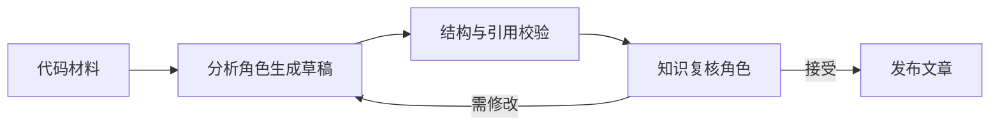

# 知识文章的生成、复核与发布管线

KnowledgePipeline 把已捕获材料转成可发布知识：按材料类型选择分析角色，以持久任务执行生成，校验文档和引用，再经独立复核后发布；同时提供读者页面研究与已复核文章综合入口。

来源：gpt-5.6-sol 分析，gpt-5.6-sol 独立复核；模型解释仍可被原始证据纠正。

## 它解决什么问题

这条管线负责把**原始材料**变成可追溯、已复核的知识文章，并阻止模型草稿未经独立复核直接发布为知识文章。材料先按图片、会话或代码/普通文档选择分析角色；其中代码扩展名会进入代码分析角色。参考 [材料分析角色选择 ↗](../../../apps/server/src/knowledge/pipeline.ts#L18 "支持图片、会话、代码与普通材料如何选择分析角色的说明。")

批量 `analyze` 会跳过仍可复用的当前文章，把每份待处理材料拆成独立批次，并以可配置并发运行；回答材料、显式补充材料和自主研究可见材料会加入上下文。单份失败会被收集，最终返回总数、复用数和失败列表。参考 [批量材料分析流程 ↗](../../../apps/server/src/knowledge/pipeline.ts#L182 "支持当前文章复用、单材料批次、补充上下文、并发处理与结果汇总。")

## 一份代码材料如何变成文章

代表性输入是 `analyze([代码材料])`。它选择 `code-analyst` 后进入统一生成闸门：

参考 [持久角色任务执行 ↗](../../../apps/server/src/knowledge/pipeline.ts#L71 "支持持久任务登记、成功结果复用、运行网关调用和角色输出追踪保存。") [文档与引用校验 ↗](../../../apps/server/src/knowledge/pipeline.ts#L109 "支持目标 key 完整性、提供范围与引用行号边界的校验。") [生成复核发布闸门 ↗](../../../apps/server/src/knowledge/pipeline.ts#L126 "支持生成、独立复核、接受后发布以及拒绝后限次修订的主流程。")

角色执行不是一次临时调用：`runRole` 先登记持久任务，可复用已成功输出；否则由 worker 调用运行网关，并保存结果、模型参数、用量与 trace。草稿必须精确覆盖目标 key，引用只能指向已提供材料/文章且行号落在可见范围。复核接受后才组装依赖、生成与复核元数据并发布；拒绝项携带旧草稿和问题重写，最多四轮，仍未通过则报错。

## 上下文边界与其他入口

自主研究模式只在上下文中放固定原文目录提示，由研究工具按需读取；受限模式则把获准行段分块送入，并附带图片资产。两种模式都要求至少有一份固定原文，因而不会在无来源时生成。参考 [原文上下文构造 ↗](../../../apps/server/src/knowledge/pipeline.ts#L35 "支持自主研究与受限上下文的差异、行段分块、图片注入和固定原文要求。")

面向读者的 `writePage` 复用同一生成—复核—发布闸门：自主模式要求研究角色先完成调查，受限模式最多进行三轮请求与补读。参考 [自主研究页面生成 ↗](../../../apps/server/src/knowledge/pipeline.ts#L214 "支持读者页面在自主模式下先研究、确认调查完成，再进入统一写作复核流程。") [受限页面研究轮次 ↗](../../../apps/server/src/knowledge/pipeline.ts#L232 "支持受限模式的材料搜索、最多三轮研究请求和最终写作入口。") 另一个 `synthesize` 入口只接收当前、已复核的子文章；超过 12 篇会先分组综合，依赖未变化时直接复用现有结果。参考 [已复核文章综合 ↗](../../../apps/server/src/knowledge/pipeline.ts#L268 "支持只选择当前子文章、空输入拒绝、超过十二篇分组以及依赖不变时复用。")

可调整点集中在构造参数：并发数、生成预算、研究模式、检索配置与发布回调；`stop()` 会停止在途 worker，发布前再次检查停止状态。参考 [运行参数与停止控制 ↗](../../../apps/server/src/knowledge/pipeline.ts#L24 "支持可配置预算、研究、检索、并发与发布回调，以及停止在途 worker。")
