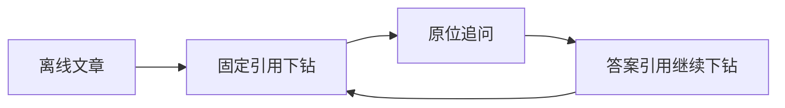

# 首轮设计与离线原型验证

记录 2026 年 9 月 26 日对设计材料和离线交互原型的验证范围，证明引用下钻、追问、历史版本、响应式布局等交互设想可以运行，但不代表真实模型、后端服务、连接器或当前 Vue 产品已经通过验收。

来源：gpt-5.6-sol 分析，gpt-5.6-sol 独立复核；模型解释仍可被原始证据纠正。

## 验证对象与证据边界

这份记录解决的是“第一轮设计和离线原型是否具备可演示、可复现的交互闭环”，而不是证明生产系统已经交付。验证发生于 2026 年 9 月 26 日，当时开源引擎、真实模型和服务端均未部署；文档也明确要求以实施状态和决策记录判断后续实际能力。参考 [原型验证定位 ↗](../../../docs/validation.md#L3 "支持本次验证仅面向第一轮设计材料和离线原型、并非当前运行代码或生产部署验收的判断。")

因此，文中的“通过”应理解为历史原型证据：它能说明方案曾在特定浏览器环境中运行，却不能直接外推为当前 Vue 应用、真实数据链路或线上部署的验收结果。

## 原型覆盖的阅读与引用交互

验证过程包括材料与上游项目核验、自包含 HTML 构建、多个视口的浏览器测试、人工视觉检查及静态一致性检查。参考 [验证执行范围 ↗](../../../docs/validation.md#L7 "说明材料核验、原型构建、浏览器测试、人工视觉检查和静态一致性检查构成了本次验证方法。")

浏览器重点覆盖了证据阅读体验：多层引用下钻、循环检测、固定历史版本、弹窗内追问、原文圈选、返回后的滚动与焦点恢复，以及无权限、删除和定位不确定等异常状态；同时检查搜索、同步演示、刷新恢复、移动端布局，并确认没有脚本异常或外部网络请求。参考 [浏览器交互覆盖 ↗](../../../docs/validation.md#L16 "支持多层引用、循环检测、历史版本、追问、焦点恢复、异常状态和响应式布局等原型行为已被浏览器检查覆盖。")

这条流程仅表达原型中已验证的交互关系，不包含真实后端知识生成或模型调用。

## 未验证事项与当前状态的关系

该轮没有验证真实引用支持准确率、中文语义检索质量、事实幻觉率，也没有覆盖 WeKnora/Hindsight 部署、真实飞书或 Git 连接器、团队权限、数据库并发、灾备及完整无障碍兼容性；后端学习流程、自动执行 Skill 和真正的多版本恢复同样不在范围内。参考 [未验证能力边界 ↗](../../../docs/validation.md#L45 "列明真实质量、外部集成、生产运行、无障碍兼容及后端工作流等未被本轮原型验证覆盖的事项。")

后续实施记录显示，项目已经增加统一知识阅读、日常助理、中文向量检索、来源更新闭环和真实 ACP 验证等能力，但这些属于 2026 年 10 月的新实现与新验收，不能倒填为本次历史原型已经验证的内容；实施记录也继续保留尚未完成的能力边界。延伸阅读：[后续实施进展 ↗](../../../docs/implementation/status.md#L1 "用于区分首轮原型的历史验证与 2026 年 10 月已经新增、另行检查且仍有限制的实际能力。")
