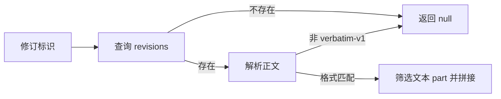

# 从固定捕获版本读取原始文本

该文件提供一个窄而关键的证据读取入口：只从 SQLite 中指定的不可变修订读取逐字捕获文本，缺失或有损的旧格式明确返回空结果，避免用当前工作区内容重构历史证据。

来源：gpt-5.6-sol 分析，gpt-5.6-sol 独立复核；模型解释仍可被原始证据纠正。

## 保证引用对应当时的原始证据

`revisionText` 解决的是历史证据漂移问题：调用方给出修订标识后，它只查询该固定修订保存的正文，而不读取当前工作区文件。这样，即使源文件后来变化，问答、引用或复核仍能基于捕获当时的内容；注释还明确规定旧式有损捕获应被视为未命中。参考 [固定修订证据约束 ↗](../../../apps/server/src/source-text.ts#L3 "支持函数只读取固定捕获修订、且不以当前工作区重构旧证据的用途说明。")

## 读取与格式门禁

处理流程很短但有明确门禁：先从 `revisions` 表按标识读取 `body`；记录不存在时返回 `null`；随后解析 JSON，并要求捕获格式为 `verbatim-v1`。通过检查后，仅筛选文本类型的 part，按原顺序无分隔符拼接并返回。参考 [文本提取流程 ↗](../../../apps/server/src/source-text.ts#L6 "说明记录缺失、捕获格式检查以及文本 part 拼接的实际控制流程。")

## 依赖关系与失败边界

该函数通过 `Store` 暴露的数据库连接直接执行同步查询；`Store` 本身负责创建 SQLite 文件、迁移数据库并初始化相关仓储，因此这里依赖数据库结构已准备完成。参考 [数据库连接依赖 ↗](../../../apps/server/src/source-text.ts#L1 "证明函数导入并依赖 Store 类型，而不是自行创建存储连接。") [SQLite 初始化流程 ↗](../../../apps/server/src/store.ts#L38 "支持 Store 创建数据库、执行迁移并提供公开数据库连接的关系说明。")

边界上，缺失修订和非逐字格式是可预期的 `null`；图片等非文本 part 会被忽略，多个文本 part 之间不会自动添加换行。材料没有显示对损坏 JSON、缺失 `parts` 或数据库异常的兜底，因此这些情况可能直接抛错，而不是转成未命中。
