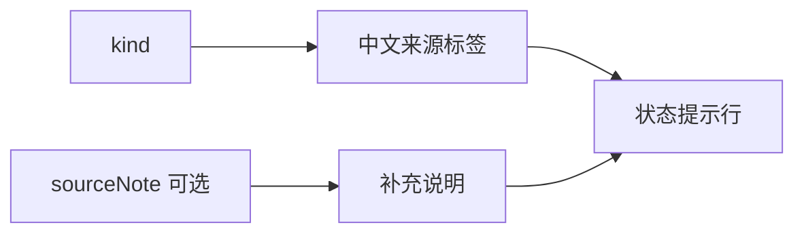

# 内容来源层级状态提示

一个轻量的 Vue 3 展示组件，用统一的中文标签和视觉样式区分原始证据、派生说明、候选判断、过期内容、加载错误与人工整理内容；它只表达内容的来源层级，不承担关系状态判断。

来源：gpt-5.6-sol 分析，gpt-5.6-sol 独立复核；模型解释仍可被原始证据纠正。

## 解决什么问题

知识阅读界面会同时呈现原始材料、系统生成的解释和尚未确认的判断。该组件在内容块前提供紧凑状态行，让读者先辨认内容的**来源与可信阶段**，避免把派生说明或候选猜测误读成原始证据。它明确不表示关系边的确认状态；关系状态应继续由其他徽章组件承担。参考 [来源层级职责边界 ↗](../../../packages/ui/src/components/OmStatusLine.vue#L2 "支持组件用于区分内容来源层级，并明确不承担关系状态展示的论断。")

## 状态映射与渲染流程

组件接收必填的 `kind` 和可选的 `sourceNote`。六种允许状态会映射为固定中文标签：原始证据、派生说明、候选未登记、已过期、加载失败和人工整理。模板始终显示标签，仅在提供说明时追加辅助文字；根节点带有 `role="note"`，使这段信息在语义上成为内容注记。参考 [标签映射与模板渲染 ↗](../../../packages/ui/src/components/OmStatusLine.vue#L6 "支持六类中文标签、必选状态参数、可选来源说明及 note 语义角色的流程说明。")

参考 [标签映射与模板渲染 ↗](../../../packages/ui/src/components/OmStatusLine.vue#L6 "支持六类中文标签、必选状态参数、可选来源说明及 note 语义角色的流程说明。")

## 视觉区分与能力边界

基础样式保持小字号、弱背景和单行标签；派生内容与人工整理使用不同左边框，候选状态采用警示色，过期状态增加删除线，错误状态使用危险色。原始状态没有专属覆盖样式，因此沿用基础外观。参考 [状态视觉样式 ↗](../../../packages/ui/src/components/OmStatusLine.vue#L27 "支持派生、人工、候选、过期和错误状态采用不同视觉表达，以及原始状态沿用基础样式的说明。")

组件只负责展示：状态集合由 TypeScript 联合类型封闭，传入方必须自行决定内容属于哪一类；它不执行数据校验、状态转换、点击交互或关系跳转。当前材料也未提供测试文件，因而无法确认无障碍读屏效果、长说明文本布局及各主题变量下的视觉表现。
