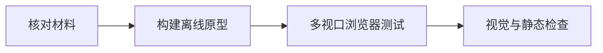

# 首轮原型验证与当前交付边界

说明首轮离线原型验证解决的问题、执行流程、已覆盖交互及未验证边界，并区分历史原型证据与当前统一知识阅读、检索和持续验收能力。

来源：gpt-5.6-sol 分析，gpt-5.6-sol 独立复核；模型解释仍可被原始证据纠正。

## 验证记录解决什么问题

这份记录回答的是：第一轮设计材料和离线交互原型能否形成可演示、可复现的阅读闭环。它不是生产系统验收；记录形成时，真实模型、服务端和开源引擎尚未部署，因此其中的“通过”不能解释为当前产品已经完成端到端交付。参考 [首轮验证定位 ↗](../../../docs/validation.md#L3 "支持该记录只面向第一轮设计材料和离线原型、当时尚未部署真实模型与服务端的范围判断。")

首次阅读项目时，可以用它了解引用下钻、原位追问等体验最初如何被验证；判断现有能力则应转向最新实施状态和实时验收报告。

## 验证如何执行

验证依次核对设计与上游材料、构建自包含 HTML，在桌面、低高度窗口和手机视口运行 Chromium 测试，并辅以人工视觉检查和 Markdown、JSON、引用节点等静态一致性检查。参考 [验证执行流程 ↗](../../../docs/validation.md#L7 "说明材料核验、原型构建、多视口浏览器测试、人工视觉检查和静态一致性检查共同组成验证流程。")

文档还给出了安装 Chromium、构建和运行测试的旧原型复现步骤，以及复用本机浏览器的配置方式。参考 [原型复现步骤 ↗](../../../docs/validation.md#L33 "支持旧离线原型提供了浏览器安装、构建、测试以及复用本机 Chromium 的具体复现方式。")

## 原型证明了哪些交互

浏览器检查覆盖多层引用下钻与返回、循环引用截断、历史版本固定、弹窗追问、原文圈选，以及返回后的滚动位置和焦点恢复；无权限、已删除、定位不确定、无搜索结果等异常状态也在范围内。参考 [浏览器交互覆盖 ↗](../../../docs/validation.md#L16 "支持多层引用、循环处理、固定历史版本、追问、焦点恢复和异常状态等交互经过浏览器检查。")

这些结果只证明指定离线环境中的交互设计可以运行。真实引用准确率、中文检索质量、模型幻觉率、外部连接器、团队权限、并发灾备、完整无障碍审计和真正的后端学习流程均未在该轮得到验证。参考 [未验证能力边界 ↗](../../../docs/validation.md#L45 "界定真实检索与生成质量、外部集成、生产运行、兼容性和后端工作流不属于首轮验证结论。")

## 与当前实施进展的关系

当前项目已把仓库材料、已复核文章和必要历史证据接入个人知识库，并提供功能目录、完整文章、页内导航、段末引用和 Mermaid 渲染；旧正文仍需经过真实 ACP 分析与独立复核，界面升级不会自动提升知识质量。参考 [统一知识阅读 ↗](../../../docs/implementation/status.md#L1 "直接支持当前已接入统一知识阅读、完整文章、页内导航、段末引用和标准 Mermaid 渲染，并说明旧正文仍需重新分析复核。")

项目也已提供 osdk 管理的生成与全量验证入口，并加入中文向量检索、来源更新闭环和覆盖状态报告；但全库知识仍未完整，实际覆盖、失败与索引状态必须以当次报告为准。参考 [当前检索与验收状态 ↗](../../../docs/implementation/status.md#L5 "支持 osdk 验收入口、中文语义检索、来源更新闭环和覆盖报告已落地，同时说明全库知识仍未完整。") 因而，首轮验证应作为历史原型证据保留，而不应替代当前运行环境的验收。
