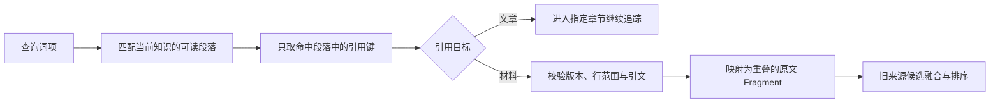

# 旧来源接口中的知识证据投影

说明兼容的 KeywordRetrieval 来源检索如何用知识文章导航到固定原文：只匹配读者可见段落、沿实际引用递归、校验版本与引文后投影为 Fragment。当前主要 UnifiedRetrieval 会直接返回知识讲解；本机制只适用于仍要求 SourceCandidate 的旧链路。

来源：gpt-5.6-sol 分析，gpt-5.6-sol 独立复核；模型解释仍可被原始证据纠正。

## 它解决的是兼容链路问题

当前读者与 Agent 的主要搜索入口是 `UnifiedRetrieval`：知识命中可以直接返回讲解正文，并附上正文中出现的固定引用。`knowledge/retrieval.ts` 不是这一主入口的一般返回规则，而是为旧来源接口准备的投影机制——当旧处理器仍需要 `SourceCandidate` 时，用知识讲解找到相关原文 Fragment。参考 [当前检索入口 ↗](../../../docs/reader-first/current-system.md#L21 "说明当前主要入口使用 UnifiedRetrieval，知识命中会直接返回讲解及固定引用，旧模块只作兼容。") [统一检索职责 ↗](../../../apps/server/src/retrieval/unified.ts#L40 "直接说明读者与 Agent 搜索使用统一检索单位，旧 source port 只为旧处理器投影回不可变证据。") [知识结果与引用 ↗](../../../apps/server/src/retrieval/unified.ts#L683 "支持统一检索直接保留知识正文，并把正文出现的文章引用附到 RetrievalHit。")

因此，这里的“讲解只作导航、输出回到原文”应理解为 **KeywordRetrieval 的兼容链路行为**，不能外推成“所有知识搜索都只返回原始 Fragment”。该旧链路把知识候选与符号、全文、短词和记忆候选并列，随后再统一过滤、评分和排序。参考 [旧来源候选融合 ↗](../../../apps/server/src/retrieval/keyword.ts#L98 "说明 KeywordRetrieval 将知识投影与其他来源分支融合，并最终生成 SourceCandidate。")

## 从讲解段落到原始 Fragment

以旧接口搜索“知识文章怎样找到原始证据”为例：`KeywordRetrieval.searchSources` 先生成查询词项，空词项直接结束；知识分支随后调用 `knowledgeEvidenceCandidates`。参考 [旧查询入口 ↗](../../../apps/server/src/retrieval/keyword.ts#L54 "支持旧 searchSources 从查询生成词项、空词项提前返回。")

匹配单位是段落、列表项、引用块和表格行；标题、代码块与 Mermaid 不作为解释正文。函数读取当前知识修订，按相关性挑出可读块，并只沿块内真实出现的 `[[引用键]]` 前进，避免一次章节命中抬高文章其他位置的全部来源。参考 [可读段落提取 ↗](../../../apps/server/src/knowledge/retrieval.ts#L11 "说明哪些 Markdown 内容会作为与引用同粒度的可读正文参与匹配。") [知识段落命中 ↗](../../../apps/server/src/knowledge/retrieval.ts#L92 "说明函数只读取当前知识头，按段落相关性匹配并从命中正文提取引用键。")

文章引用会进入当前子文章；若引用指定章节，即使词汇不同也只把该章节当背景，不扩散到兄弟章节。材料引用则解析当前原件、核对固定行范围和引文，再把字符区间映射为所有重叠 Fragment。结果回到 `KeywordRetrieval` 后，仍要经过时间与可见性过滤、分支融合、去重和证据排序。参考 [子文章追踪 ↗](../../../apps/server/src/knowledge/retrieval.ts#L57 "说明文章引用如何限定章节、匹配可读块并只沿块内引用继续递归。") [原文片段映射 ↗](../../../apps/server/src/knowledge/retrieval.ts#L71 "说明材料引用的行范围、引文校验及重叠 Fragment 投影过程。") [旧候选排序 ↗](../../../apps/server/src/retrieval/keyword.ts#L109 "支持知识候选离开投影函数后仍经过可见性过滤、融合、去重和统一排序。")

## 可信边界与修改入口

投影前会解析材料键、拒绝派生来源，并以正文、图片和来源属性计算摘要；若文章声明的材料摘要或子文章版本与当前状态不一致，该知识路径会被跳过。参考 [材料身份与摘要 ↗](../../../apps/server/src/knowledge/retrieval.ts#L30 "说明材料键解析、派生来源拒绝，以及用于依赖核对的稳定摘要内容。") [递归与依赖闸门 ↗](../../../apps/server/src/knowledge/retrieval.ts#L50 "说明 visit 入口的深度、当前结果数检查，以及材料或文章依赖版本不匹配时跳过路径。")

递归深度超过 8 层会停止。结果数量的检查不是严格“最多 100 个”：每次进入 `visit` 前若已有 100 个结果，就不再进入新的访问或递归路径；但已经进入的访问会继续遍历引用，材料分支也会加入当前范围内全部重叠 Fragment，因此最终数量可能越过 100。参考 [递归与依赖闸门 ↗](../../../apps/server/src/knowledge/retrieval.ts#L50 "说明 visit 入口的深度、当前结果数检查，以及材料或文章依赖版本不匹配时跳过路径。") [当前访问继续收集 ↗](../../../apps/server/src/knowledge/retrieval.ts#L82 "说明一次已经进入的材料访问会遍历全部 Fragment，并把范围内所有重叠项加入结果，期间没有再次检查 100 条阈值。")

缺少原件、引文为空、行号缺失或越界、引文不在指定范围时，该引用不会产生候选；单篇知识解析或投影失败也不会中断其他文章，函数会返回已经收集的结果。参考 [引用有效性检查 ↗](../../../apps/server/src/knowledge/retrieval.ts#L71 "说明材料不存在、引文为空、行号无效或引文不在范围内时不会产生候选。") [失败隔离 ↗](../../../apps/server/src/knowledge/retrieval.ts#L92 "说明单篇知识解析或投影异常被隔离，函数仍返回其他已收集候选。")

需要修改时，可按职责定位：`passages` 控制哪些 Markdown 内容参与匹配；`visit` 控制递归、去重、依赖版本与数量闸门；材料分支负责行范围到 Fragment 的映射。若要改变当前主要搜索如何直接展示知识正文，应修改 `UnifiedRetrieval`；若要改变旧 `SourceCandidate` 的最终融合与截断，则查看 `KeywordRetrieval.searchSources`。参考 [统一检索职责 ↗](../../../apps/server/src/retrieval/unified.ts#L40 "直接说明读者与 Agent 搜索使用统一检索单位，旧 source port 只为旧处理器投影回不可变证据。") [旧来源候选融合 ↗](../../../apps/server/src/retrieval/keyword.ts#L98 "说明 KeywordRetrieval 将知识投影与其他来源分支融合，并最终生成 SourceCandidate。")
