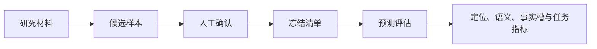

# 验证体系、质量评测与证据强度

项目以研究专用金标数据集衡量知识提炼质量，并用单元与集成测试、真实浏览器流程、独立模型复核和窄范围实机快照验证不同层次的能力。各种证据的证明范围不可互换：引用可定位不代表语义正确，受控夹具通过不代表外部服务可用，历史快照也不代表当前版本持续通过。

来源：gpt-5.6-sol 分析，gpt-5.6-sol 独立复核；模型解释仍可被原始证据纠正。

## 为什么需要分层验证

知识系统既要判断“有没有找到原文”，也要判断“陈述是否忠于原文、是否遗漏限制、是否值得长期保留，以及能否自动生效”。因此，质量标签把结果分为提炼、弃权和需要上下文；提炼结果必须携带对象，非提炼结果不得自动应用。参考 [质量评测闭环 ↗](9f9a271cae333333972dbf1ee63356a0627defffcf9b624072cdb0dec804fe38.md#purpose "提供质量标签用途、研究评测隔离和人工确认流程的子知识下钻入口；附近论断仍由原始代码引用支撑。")、[质量标签约束 ↗](../../../apps/server/src/quality/repository.ts#L39 "支持提炼、弃权、需要上下文三种处置，并证明提炼必须包含对象、非提炼结果不得自动应用。")

研究样本生成与普通捕获严格隔离：规则切分产生的逐字主张和自动应用建议只是待人工确认的草稿，不能回流为生产知识。参考 [研究样本隔离边界 ↗](../../../apps/server/src/quality/import.ts#L1 "证明规则切分样本只用于人工标注研究，不属于普通捕获、导入和学习链路。") 这形成了一条重要证据边界：**固定原文是事实依据，人工金标是评测基准，测试与报告只证明特定行为曾被观察到，派生文章用于解释和下钻而不是新增事实来源。**

## 从人工金标到拆分质量指标

数据集只有在目标样本全部确认后才能冻结；冻结摘要绑定样本顺序、输入摘要和确认标签，之后可重新计算以发现内容漂移。参考 [冻结与完整性复算 ↗](../../../apps/server/src/quality/repository.ts#L358 "支持全部样本确认后生成清单摘要，并通过重新计算发现冻结内容漂移。") 但评估函数自身只选择已确认且带确认标签的样本，没有接收数据集状态或清单摘要，因此现有材料不能证明所有评估入口都会强制执行冻结校验。参考 [评估样本筛选 ↗](../../../apps/server/src/quality/evaluator.ts#L234 "证明评估器只筛选已确认样本，函数自身没有检查数据集冻结状态或清单摘要。")

评估不会把“引文是原文子串”当成完整支持，而是分别计算引用定位、规则式语义支持和数字事实槽一致性；必要证据覆盖、任务完成与不必要打断又从不同角度衡量遗漏和过度询问。参考 [对象与任务判定 ↗](../../../apps/server/src/quality/evaluator.ts#L285 "支持引用定位、语义支持、事实槽和任务完成采用不同判定条件。")、[拆分质量指标 ↗](../../../apps/server/src/quality/evaluator.ts#L387 "支持引用定位、语义支持、事实槽、证据覆盖、任务完成、不必要打断和空分母语义。") 这使反向陈述即使引用位置正确也会被识别为矛盾，空预测也不会因零对象获得虚假的满分。

## 各类验收分别证明什么

项目把验证分为互补层次：类型检查、测试与构建验证代码合同；进程内集成测试验证路由、SQLite、作业和知识流水线编排；浏览器验收验证用户可见的完整交互；真实 ACP 或飞书检查则负责外部依赖。各层的职责关系可沿分层验收章节继续下钻。延伸阅读：[分层验收说明 ↗](97762e76cba3d5e9bc19883e9db79e5f8ed0afd3e77c4114d9fc9ae68437691e.md#layered-validation "提供浏览器夹具、真实外部链路与质量评测之间职责分工的子知识入口。")

浏览器脚本运行真实 Vue、API 和 SQLite，但 Agent 采用确定性协议夹具，以稳定材料录入、提案应用、通知、证据阅读、响应式布局和故障展示等断言。参考 [真实应用浏览器栈 ↗](../../../scripts/browser-smoke.ts#L1 "证明浏览器验收使用真实 Vue、API 和 SQLite，同时以 fixture Agent 保持界面断言确定性。") 2026-10-01 的记录显示这些场景在指定 Chromium 版本下无错误完成，不过它是一次历史快照，不能外推到其他浏览器、后续提交或真实模型。参考 [浏览器验收快照 ↗](../../../docs/implementation/browser-verification.json#L2 "支持指定日期、浏览器版本、覆盖场景、无错误结果以及确定性 ACP 夹具边界。")

知识发布本身采用“生成—独立复核—接受后发布”的流程；被拒绝目标会携带旧草稿与反馈重试，未被接受的结果不会晋升。参考 [复核后发布流程 ↗](../../../apps/server/src/knowledge/pipeline.ts#L113 "支持知识草稿经独立复核后才发布，并对拒绝目标携带反馈继续修订。") 测试还覆盖复核会话隔离、来源运行中变化时拒绝发布，以及拒绝后续跑，但模拟角色网关并不能证明真实模型的普遍语义质量。参考 [知识流水线行为测试 ↗](../../../apps/server/tests/knowledge-pipeline.test.ts#L39 "支持独立会话、复核后发布、来源变化保护和拒绝后续跑，同时表明测试使用模拟角色。")

## 当前进展、证据强弱与剩余限制

已有实现记录显示依赖冻结、类型检查、全量测试、构建和多条浏览器流程曾以退出码 0 完成，并做过一个 GPT-5.6-Sol 的小型复核校准；同一记录明确排除了嵌入检索、跨文件类型感知调用解析、真实飞书 WebSocket 验收和租户隔离等能力。参考 [实现验证记录 ↗](../../../docs/implementation/knowledge-verification.json#L7 "支持依赖、测试、构建、浏览器和小型模型校准的历史结果，并明确记录中的剩余限制。")

实机证据仍有强弱差异：ACP 快照记录了 Agent 版本、模型、思考强度、回答和事件类型，却没有输入、执行时间、退出码或正确性断言。参考 [ACP 实机快照 ↗](../../../docs/implementation/live-acp-verification.json#L1 "支持快照中已有的 Agent、模型、思考强度、回答与事件字段，也显示输入和退出状态等信息缺失。") 飞书快照只记录文档标题、版本、part 类型和文本规模，未关联固定修订、授权范围或幂等验证。参考 [飞书导入实机快照 ↗](../../../docs/implementation/live-lark-verification.json#L1 "支持文档标题、版本、part 类型和文本规模的窄范围记录，并界定未记录字段。") 因此它们只能证明窄范围观察，不能替代可复现的端到端验收。

当前存储基础明确是单用户 SQLite，不能把共享令牌或本地运行解释为团队租户隔离。参考 [单用户存储基础 ↗](../../../apps/server/src/store.ts#L4 "说明当前 SQLite 实现面向单用户，团队权限执行仍属于后续迁移。") 飞书质量标注还有一处需要现场验证的衔接：会话创建时消息标识为空，而卡片回调要求该标识与入站事件完全一致；现有材料尚未展示发送成功后的回填步骤。参考 [标注会话初始化 ↗](../../../apps/server/src/quality/lark-annotations.ts#L289 "证明新建飞书质量标注会话时消息标识被写为空值。")、[卡片回调校验 ↗](../../../apps/server/src/quality/lark-annotations.ts#L378 "证明回调要求会话消息标识与入站事件完全一致，支持指出回填流程仍需验证。")
