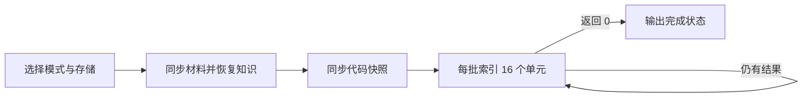

# 批量追平语义检索索引

说明检索索引维护脚本如何选择普通或仓库评审数据源，准备材料与代码知识，分批补齐语义向量，并报告进度、处理并发写入及可靠释放资源。

来源：gpt-5.6-sol 分析，gpt-5.6-sol 独立复核；模型解释仍可被原始证据纠正。

## 解决什么问题

这个脚本是**显式追平索引**的维护入口，适合首次导入或一次积累了较多材料后，把尚未建立语义向量的检索单元批量补齐；后续新捕获仍由服务端继续索引，因此它不是常驻搜索服务。它把任务参数、存储、中文 embedding、统一检索器以及仓库评审同步能力装配到同一个短生命周期进程中。参考 [索引维护入口依赖 ↗](../../../scripts/retrieval-index.ts#L1 "支持脚本用于大批导入后的显式追平，并展示其装配的检索、存储和评审同步模块。")

## 一次评审模式调用如何流转

以 `review=true` 的一次调用为例：脚本以当前工作目录为仓库根目录，优先读取 `REVIEW_RETRIEVAL_CONFIG` 指定的配置，否则使用仓库内默认检索配置，并打开隔离的评审存储；普通模式则改用应用配置和个人数据目录。参考 [模式与数据源选择 ↗](../../../scripts/retrieval-index.ts#L13 "支持 review 标志如何决定配置文件和存储实例，以及当前工作目录作为仓库根目录。")

评审模式依次执行材料同步、知识恢复和代码同步，然后循环调用统一检索器的 `indexBatch(16)`；每批累计数量并打印健康状态，返回 0 时结束，最终输出带 `completed: true` 的 JSON。参考 [评审准备与分批索引 ↗](../../../scripts/retrieval-index.ts#L20 "支持评审模式的三步准备流程、每批 16 个单元的循环、进度输出和最终完成状态。")

## 边界与模块关系

脚本本身负责**编排**，向量切窗、模型调用和持久化由 `UnifiedRetrieval` 实现；模型由中文 embedding 加载器按所选配置延迟提供。为容纳其他维护命令同时写库，它把 SQLite `busy_timeout` 设为 10 秒，这只是等待短暂写锁，并不消除并发冲突。参考 [写锁等待与检索器创建 ↗](../../../scripts/retrieval-index.ts#L16 "支持 SQLite 短暂写锁等待设置，以及统一检索器和中文 embedding 加载器的装配关系。")

失败不会被脚本吞掉：同步、模型加载或索引异常会向调用方传播；但 `finally` 始终关闭检索器和存储。因而调用方应以进程退出结果判断成功，并只在最终 JSON 出现时视为本轮追平完成。参考 [资源释放 ↗](../../../scripts/retrieval-index.ts#L25 "支持无论成功或失败都会关闭检索器与存储的清理语义。")
