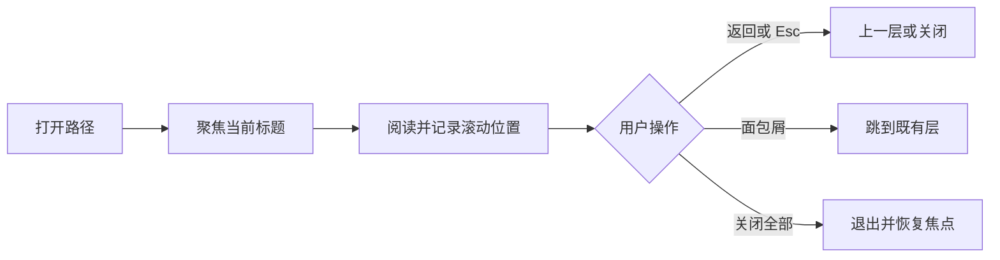

# 证据路径的分层阅读抽屉

以原生模态对话框承载受控的证据阅读栈，让用户在材料之间逐层下钻、返回或跳转，同时保存各层滚动位置、提示循环访问，并在关闭后恢复焦点。

来源：gpt-5.6-sol 分析，gpt-5.6-sol 独立复核；模型解释仍可被原始证据纠正。

## 在连续追溯中保留阅读上下文

该抽屉用于从知识正文继续查看来源、符号或其他证据。父级传入完整帧栈与当前位置，组件呈现标题、面包屑、父层入口和当前正文，并通过事件请求关闭、返回或跳转；数据加载与栈状态仍由父级控制。参考 [受控抽屉输入输出 ↗](../../../packages/ui/src/components/OmTrailDrawer.vue#L14 "支持组件由 open、frames、current 等属性控制，并把关闭、返回、跳转等导航意图交给父级。") [证据路径界面结构 ↗](../../../packages/ui/src/components/OmTrailDrawer.vue#L87 "支持抽屉包含标题栏、面包屑、父层入口、当前标题与正文插槽。")

共享帧合同可表示模块、文件、符号、知识、引用和原始来源等对象，其中稳定身份用于循环检测，标题用于展示，引用字段供父级加载内容。延伸阅读：[路径帧数据合同 ↗](../../../packages/ui/src/trail.ts#L6 "解释路径可承载的对象种类、稳定身份、显示标题和供父级加载内容的引用字段。")

## 逐层导航与阅读位置恢复

组件在打开及切换层级后聚焦当前标题，并从帧中恢复滚动位置；阅读滚动时再把位置写回当前帧。参考 [打开与切层焦点 ↗](../../../packages/ui/src/components/OmTrailDrawer.vue#L35 "支持打开抽屉、切换层级时聚焦标题，并恢复目标帧的滚动位置。") [返回与滚动记录 ↗](../../../packages/ui/src/components/OmTrailDrawer.vue#L66 "支持 Esc 根据栈深度返回或关闭，以及把滚动位置写入当前帧。")

Esc 在多层路径中请求返回，仅剩一层时请求关闭。父级若检测到重复对象，可传入 `loopAt` 显示警告，让用户跳回已有层或留在当前层；循环检测本身不由抽屉执行。参考 [循环访问提示 ↗](../../../packages/ui/src/components/OmTrailDrawer.vue#L129 "支持 loopAt 驱动重复访问警告，并允许用户跳回已有层或取消提示。")

## 关闭行为、深度边界与公共控件

点击关闭按钮或遮罩只会发出关闭请求；父级将 `open` 更新为假后，组件才关闭原生对话框。焦点优先归还显式指定且仍存在的元素，否则返回打开前的焦点；卸载时也会执行关闭与焦点归还。参考 [关闭与焦点归还 ↗](../../../packages/ui/src/components/OmTrailDrawer.vue#L35 "支持关闭依赖 open 状态变化，以及显式目标、先前焦点和卸载清理的恢复顺序。")

当前实现中，`MAX_TRAIL` 的说明把它定义为 URL 深链持久化预算，并称渲染栈不截断；但 `pushFrame` 的注释称入栈受该常量约束，函数实际却直接追加帧。因而可以确认的运行行为是**入栈不截断**，而预期合同仍存在注释矛盾。参考 [路径深度合同 ↗](../../../packages/ui/src/trail.ts#L37 "同时呈现 MAX_TRAIL 的 URL 预算说明、pushFrame 的限制注释及直接追加实现，支持识别当前行为与注释之间的矛盾。") 窄屏时抽屉扩展为完整视口。参考 [移动端全屏布局 ↗](../../../packages/ui/src/components/OmTrailDrawer.vue#L260 "支持窄屏时抽屉采用完整视口宽高。")

抽屉复用公共按钮和图标组件。按钮支持样式变体，并在禁用或加载时禁用原生按钮、用 `aria-busy` 表达加载状态；图标作为装饰性 SVG 对辅助技术隐藏。参考 [公共控件复用 ↗](../../../packages/ui/src/components/OmTrailDrawer.vue#L9 "支持抽屉依赖并复用公共按钮、图标及共享帧类型。") [按钮状态与变体 ↗](../../../packages/ui/src/components/OmButton.vue#L2 "支持公共按钮的样式变体、禁用与加载状态，以及 aria-busy 的可访问性表达。") [装饰图标可访问性 ↗](../../../packages/ui/src/components/OmIcon.vue#L20 "支持公共图标以 aria-hidden 标记为装饰内容，不向辅助技术重复传达信息。")
