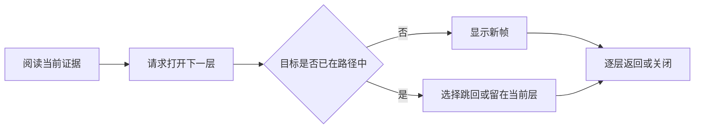

# 可追溯证据路径抽屉

该组件以受控模态抽屉承载逐层深入的证据阅读路径，提供层级返回、循环提示、滚动恢复、焦点管理和响应式布局；帧栈更新、内容加载及 URL 深链仍由父容器负责。

来源：gpt-5.6-sol 分析，gpt-5.6-sol 独立复核；模型解释仍可被原始证据纠正。

## 在深入阅读时保留来路

`OmTrailDrawer` 用于从知识正文继续查看文件、符号、决策或引用，并让读者随时沿原路径返回。父容器传入打开状态、完整帧栈、当前位置与循环位置；组件只发出关闭、后退、跳转和消除循环提示等事件，因此不会自行加载证据或改写路径。参考 [受控状态与导航事件 ↗](../../../packages/ui/src/components/OmTrailDrawer.vue#L14 "支持父容器传入路径状态、组件仅上报关闭、后退、跳转和循环处理意图的论断。")

路径中的每一层都是可序列化帧，包含类型、稳定身份、可读标题、滚动位置以及可选的文件或符号定位信息，可作为深链恢复的基础。参考 [路径帧数据合同 ↗](../../../packages/ui/src/trail.ts#L1 "说明路径帧可序列化，并包含稳定身份、可读标题、滚动位置及可选定位字段。")

## 分层导航与循环处理

面包屑展示各层，并只允许跳回当前位置之前的层；顶部关闭按钮和遮罩点击会关闭整条路径，“来自上一层”及页脚按钮用于逐层返回。参考 [面包屑与返回入口 ↗](../../../packages/ui/src/components/OmTrailDrawer.vue#L107 "支持面包屑回跳、遮罩和顶部关闭、上一层入口以及页脚返回等具体交互。") 按 Esc 时，多层路径返回上一层，根层则关闭抽屉。参考 [Esc 分层退出 ↗](../../../packages/ui/src/components/OmTrailDrawer.vue#L84 "支持 Esc 在多层路径中后退、在根层关闭抽屉的行为。")

当父容器识别到相同类型与身份的帧已经存在时，抽屉显示循环提示，让用户选择跳回已有层或留在当前层，不会静默改变路径。参考 [循环路径提示 ↗](../../../packages/ui/src/components/OmTrailDrawer.vue#L148 "支持重复目标出现时让用户选择跳回已有层或保留当前层。")

循环检测依据帧的类型与稳定身份，渲染栈本身不因 URL 持久化预算而被截断。参考 [循环检测与深链预算 ↗](../../../packages/ui/src/trail.ts#L37 "说明循环按帧类型和身份检测，并区分无界渲染栈与 URL 持久化深度预算。")

## 焦点与滚动状态恢复

组件通过原生模态对话框限制焦点。打开后焦点移至当前标题；完整关闭后优先归还给显式触发元素，否则回到打开前的活动元素。参考 [打开与关闭焦点管理 ↗](../../../packages/ui/src/components/OmTrailDrawer.vue#L35 "支持打开时聚焦标题，以及正常关闭时将焦点归还触发元素或原活动元素。") 组件卸载时还会断开尺寸观察、关闭仍打开的对话框并尝试恢复焦点。参考 [卸载清理与焦点归还 ↗](../../../packages/ui/src/components/OmTrailDrawer.vue#L96 "支持卸载时断开尺寸观察、关闭对话框并尝试恢复焦点的论断。")

切换帧时，组件保存旧帧的滚动位置并恢复新帧的位置；异步内容改变尺寸时，`ResizeObserver` 会再次校正。参考 [逐帧滚动恢复 ↗](../../../packages/ui/src/components/OmTrailDrawer.vue#L54 "支持保存和恢复帧滚动位置，并在异步内容尺寸变化时重复校正。") 滚轮、触摸、指针或键盘输入会结束恢复模式，之后的滚动才写回当前帧。参考 [用户接管滚动 ↗](../../../packages/ui/src/components/OmTrailDrawer.vue#L158 "支持滚轮、触摸、指针和键盘输入结束恢复模式，以及滚动事件写回当前位置。")

## 桌面模态与移动端全屏

桌面端抽屉限制在视口范围内，并以半透明模糊遮罩突出当前阅读任务。参考 [桌面模态外观 ↗](../../../packages/ui/src/components/OmTrailDrawer.vue#L175 "支持桌面端尺寸限制、面板样式及半透明模糊遮罩的说明。") 内容区独立滚动；当视口宽度不超过 700 像素时，抽屉铺满整个视口并移除边框与圆角。布局变化只影响呈现，不改变帧栈及导航事件合同。参考 [滚动区与移动端布局 ↗](../../../packages/ui/src/components/OmTrailDrawer.vue#L271 "支持内容区独立滚动以及窄屏时铺满视口并移除边框圆角的说明。")
