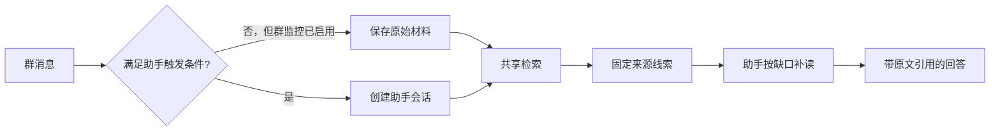

# 一次提问如何找到答案：共享搜索、上下文与 RAG

以一条飞书群消息为贯穿示例，解释顶部搜索、知识搜索和助手如何共享召回基础又承担不同职责；说明全文、中文短词、符号、向量、知识与记忆如何协作，命中后怎样补齐结构上下文、继续调查并落到固定原文引用，最后给出模型与时间检索边界、修改入口及召回/回答问题的排查方法。

来源：gpt-5.6-sol 分析，gpt-5.6-sol 独立复核；模型解释仍可被原始证据纠正。

## 先分清：搜索找线索，回答解决问题

假设用户想弄清“一条群消息怎样进入助理”。在已启用监控的飞书群里，普通消息可以被保存为原始 Capture；只有绑定的 owner 发言，并且群聊中提及机器人时，消息才直接路由为助手提问。这个例子说明：**进入材料库**与**唤起助手**是两件事，不能把所有群消息都理解成一次问答。参考 [飞书消息分流 ↗](../../../apps/server/src/integrations/lark/realtime.ts#L524 "支持教学场景中 owner 提及触发助手、其他受监控群消息进入 Capture 的分流条件。")

群聊助手只可见同一群聊已经采集的证据，私聊和 Web 会话不因此暴露；会话随后进入助手 turn。参考 [群聊证据可见性 ↗](../../../apps/server/src/integrations/lark/runtime.ts#L90 "支持群聊仅能读取同一 chatId 已采集证据以及群聊会话建立方式。") 因而本页把 **RAG** 理解为“先检索线索，再围绕问题补读和生成回答”：搜索结果可以直接供人打开，也可以成为助手调查的起点，但相关性分数本身不代表材料已经回答了问题。参考 [搜索与回答边界 ↗](../../../docs/reader-first/architecture.md#L19 "说明统一检索按问题补上下文，并提醒命中片段不是完整回答材料。")

## 三个入口共用基础，但查询约束不同

服务启动时只装配一个检索对象，并同时注入知识路由与普通助手；顶部 `/api/search` 也调用同一对象。因此顶部搜索、知识搜索和助手共享 `RetrievalPort` 与 `UnifiedRetrieval` 的结构化单位、候选与排序基础。参考 [共享检索装配 ↗](../../../apps/server/src/app.ts#L99 "证明同一 assistantRetrieval 同时注入知识路由和普通助手。")

| 入口 | 主要目的 | 代码中的约束 |
| --- | --- | --- |
| 顶部搜索 | 在全库找可读线索 | 默认 `balanced`，最多 30 条，可带用途、代码导航、材料角色和生效时间 |
| 知识搜索 | 在讲解目录中找文章 | 只查 `knowledge`，默认 `concept`，可限分类；每篇文章只展示最佳章节 |
| 助手 | 为当前问题准备调查材料 | 首轮最多 16 条，并先按会话可见性过滤 |

顶部入口的参数与调用见 [顶部搜索参数 ↗](../../../apps/server/src/app.ts#L312 "支持顶部搜索默认用途、数量和筛选参数，并证明它调用共享检索对象。")；知识搜索的限定与文章去重见 [知识搜索限定 ↗](../../../apps/server/src/knowledge/api.ts#L118 "支持知识搜索只查知识、默认 concept、限定 topicPath 并按文章去重。")。助手把 source 命中的原件范围转成 evidence，把知识、记忆、事项等非原件命中保留为 background；这些都是后续调查的线索，不是已经写好的最终答案。参考 [助手首轮召回 ↗](../../../apps/server/src/assistant/runtime.ts#L918 "支持助手 limit、可见性过滤，以及原件转 evidence、非原件转 background 的行为。")

## 全文、符号、向量、知识与记忆各做什么

统一检索不是单一模型，而是多种互补信号：

- **全文与中文短词**寻找原词、术语和路径。查询先经中文 ICU 分词；2–8 字的纯中文短查询还保留整词，随后由 FTS5/BM25 匹配结构文本、标题路径和正式概念别称。参考 [中文查询切词 ↗](../../../apps/server/src/retrieval/relevance.ts#L1 "支持 ICU 中文分词与短纯中文查询保留整词的说明。") [全文 BM25 召回 ↗](../../../apps/server/src/retrieval/unified.ts#L414 "支持检索单位通过 FTS5/BM25 匹配正文、标题路径与概念上下文。")
- **符号**面向明确的函数或方法名。AST 定义候选有独立通道；“谁调用”返回名称级调用候选和调用行，但不是类型解析后的完整跨文件调用图。参考 [符号与调用候选 ↗](../../../apps/server/src/retrieval/unified.ts#L312 "支持 AST 定义独立召回和 callers 仅为名称级候选、保留调用位置的边界。")
- **中文向量**把不同说法映射到相近表示，适合用户描述与源码术语不一致的情况。查询向量与检索单元窗口计算相似度，过滤弱尾部后再和全文、符号分支融合；相似度不是答案正确概率。参考 [向量融合流程 ↗](../../../apps/server/src/retrieval/unified.ts#L476 "支持查询向量、窗口相似度、弱尾部过滤和多分支融合，并显示失败时回退全文。")
- **知识**是按读者问题组织的讲解章节，能帮助先看整体；只有复核通过且原始依赖仍可用的文章才进入检索，章节仍携带落回原文的 references。参考 [知识章节投影 ↗](../../../apps/server/src/retrieval/units.ts#L589 "支持知识文章的复核与依赖可用性条件、章节检索单位和原文 references。")
- **记忆**只投影 active 的已应用事实、经历或方法，并保留其原始证据引用；它适合个人背景与后续事项，但仍是派生状态。参考 [记忆检索单位 ↗](../../../apps/server/src/retrieval/units.ts#L804 "支持只投影 active 记忆、保留类型、版本及原始证据引用。")

`purpose` 只改变导航偏好：`concept` 偏知识，`implementation` 偏代码，`background` 偏知识与记忆，`follow-up` 偏事项、记忆和会话。它帮助排序，不判定事实真假。参考 [用途排序偏好 ↗](../../../apps/server/src/retrieval/unified.ts#L606 "支持 concept、implementation、background、follow-up 对不同单位的导航偏好。")

## 命中片段后，怎样恢复可读上下文

检索前，原件已经被投影成适合找回、但仍指向固定版本和行范围的单位。Markdown 按标题下的段落、列表、表格与代码块组织，引导句会和紧随其后的块合并；TS、JS 与 Vue 则优先保留完整函数、方法或组件，并让 imports、顶层配置继续可搜。参考 [Markdown 结构切分 ↗](../../../apps/server/src/retrieval/units.ts#L31 "支持按标题组织块并把引导句与表格、列表或代码块合并。") [代码完整操作切分 ↗](../../../apps/server/src/retrieval/units.ts#L90 "支持以完整函数、方法、组件为单位并保留 imports 与顶层配置。") 会话材料还把发言人、事件时间、会话与回复关系放进 context，避免一句话脱离对话背景。参考 [会话上下文投影 ↗](../../../apps/server/src/retrieval/units.ts#L265 "支持检索单位携带会话、发言人、事件时间与回复关系。")

命中返回的不只有摘录：`RetrievalHit` 同时携带 `context`、`headingPath`、固定 target、原件 references 与来源信息。参考 [统一命中结构 ↗](../../../apps/server/src/retrieval/port.ts#L45 "说明 RetrievalHit 同时携带正文、结构上下文、固定目标、references 与来源信息。") 助手先把 references 转成精确 evidence；若命中的是讲解，则讲解作为背景，其引用继续指向原件。之后 Agent 可用 `read_section` 从命中行打开完整章节或完整方法，用 `read_material` 精读范围，用 `code_navigation` 看定义、导入、调用候选与外围方法。调用仍是候选，跨文件业务链需要沿缺口继续调查。参考 [完整章节补读 ↗](../../../apps/server/src/knowledge/agent-research.ts#L442 "支持 read_section 从命中行恢复完整章节或外围代码符号。") [代码导航能力 ↗](../../../apps/server/src/knowledge/agent-research.ts#L731 "支持定义、导入、调用候选及外围方法定位，并明确调用是候选而非完整调用图。")

## 助手如何补查并生成固定引用

助手执行一轮时，先按当前问题调用共享检索，再合并同会话历史、上一轮工作上下文、用户纠正、可见事项与当前时钟，才交给模型。参考 [助手上下文装配 ↗](../../../apps/server/src/assistant/runtime.ts#L560 "支持助手合并首轮检索、同会话历史、前轮上下文、纠正、事项与时钟后调用模型。") ACP 调查环境把问题、初始 evidence 与讲解背景写入临时工作区，并明确告诉 Agent：初始命中只是阅读线索，可以按问题继续搜索材料、知识、记忆、历史或代码。参考 [ACP 调查入口 ↗](../../../apps/server/src/assistant/acp-model.ts#L163 "支持临时工作区、初始材料与讲解线索，以及允许 Agent 自主继续补查的行为。")

调查使用封存快照：只复制本轮可见的 Source、Revision、Fragment，以及依赖版本匹配的知识和有可见证据支持的记忆、事项。这让作者与独立核对者面对同一材料时点，避免调查中途的新变化混入。参考 [封存研究快照 ↗](../../../apps/server/src/knowledge/research-snapshot.ts#L50 "支持仅复制可见原件、依赖匹配知识及有可见证据的记忆和事项。")

最终提交不能只说“我读过”。宿主会检查材料 key、历史 revision、行范围、来源身份与可见性，并把正文中的引用编号映射到实际固定范围；研究模式还禁止借回答偷偷执行事项操作。参考 [固定引用校验 ↗](../../../apps/server/src/assistant/research.ts#L102 "支持对授权材料、历史版本、可见性、行范围和正文引用映射的校验。") 因而知识讲解可以帮助理解，但最终事实引用仍能回到当时的原文。

## 什么时候需要独立核对答案

复杂问题容易在三个位置丢条件：没有召回必要材料、命中后没有读完整上下文、已经读到却没有写进结论。助手可用 `investigation_notes` 记录“问题要什么、哪些材料真正回答、还缺什么”；它是工作笔记，不是个人记忆，也不是额外事实来源。跨来源机制、冲突、当前行为或重要前提可标记 `review_answer`，简单直接查找不必强制增加一次模型调用。参考 [调查笔记与复核门槛 ↗](../../../apps/server/src/assistant/answer-review.ts#L26 "支持事实工作笔记的定位，以及复杂问题可复核、简单查询不强制复核。")

独立核对在新的 Agent 会话中读取原问题、候选答案和同一封存快照，但不拿作者笔记，也不能递归再开 reviewer。它只返回会改变结论或行动的遗漏、错误或偏题，并验证所引原文仍在授权范围。若作者已经要求复核，复核完成前不能提交；有实质问题时，原样草稿也不能提交。参考 [独立答案核对 ↗](../../../apps/server/src/assistant/answer-review.ts#L103 "支持新会话基于同一快照核对答案、验证引用范围且不接收作者笔记。") 这道门能发现关键缺口，却不能证明改写后的语义必然正确，复核者也可能遗漏。

## 当前边界、修改入口与排障方法

当前默认配置启用 `memory-zh`，锁定的本地 embedding 是量化 BGE-small-zh-v1.5；应用只读取并校验本地快照，不在运行时隐式下载。默认配置没有 reranker，虽然仓库锁定了可选的 BGE reranker 模型。参考 [默认中文向量配置 ↗](../../../config/retrieval.json#L1 "证明当前默认开启 memory-zh 且未配置 reranker。") [锁定的中文模型 ↗](../../../osdk.toml#L7 "支持 memory-zh 对应量化 BGE-small-zh-v1.5，以及可选 reranker 模型已锁定。") 启用重排时只处理融合后的前 40 个候选，并把 cross-encoder 分数与原融合分数混合；加载或评分失败会保留已有融合结果。它是可选改进，不应被描述为中文搜索已经整体解决。参考 [可选重排流程 ↗](../../../apps/server/src/retrieval/unified.ts#L545 "支持只重排前 40 个融合候选、混合分数并在失败时保留原结果。")

时间条件也要分开：`timeRange` 过滤的是捕获 revision 的 provenance time；`effectiveAt` 只在材料明确保存 `validFrom/validUntil` 时筛选；会话、记忆和事项另有 eventAt 或 valid_from。当前并没有可靠的“某个时点全库状态”推理。参考 [时间查询合同 ↗](../../../apps/server/src/retrieval/port.ts#L96 "区分 timeRange 的捕获时间含义与 effectiveAt 的业务生效时间入口。") [时间检索边界 ↗](../../../docs/reader-first/current-system.md#L54 "说明事件时间、捕获时间和有效期尚未形成完整时态检索。")

要修改行为，可按问题进入：

- 群消息何时捕获或唤起助手：`integrations/lark/realtime.ts`；群聊可见性与会话绑定：`integrations/lark/runtime.ts`。
- 检索合同与用途：`retrieval/port.ts`；结构投影：`retrieval/units.ts`；候选、融合、purpose 与重排：`retrieval/unified.ts`。
- 首轮命中怎样进入回答：`assistant/runtime.ts#retrieveContext`；Agent 启动与阅读线索：`assistant/acp-model.ts#investigate`；固定引用校验：`assistant/research.ts`；独立核对：`assistant/answer-review.ts`。

排障时先看实际命中与调查记录：关键原文或讲解根本未进候选，或只留下错误范围、错误时效，是**召回/上下文问题**；材料已经进入初始命中或确实被补读，答案仍漏触发条件、适用对象、时间、例外或修改入口，则是**回答问题**。工具调用、引用数量和复核通过都不能单独证明答案可用。参考 [召回与回答排障 ↗](../../../docs/reader-first/answer-investigation.md#L33 "支持按初始命中、补读记录与最终答案区分未找到、未补读和最后遗漏。")
