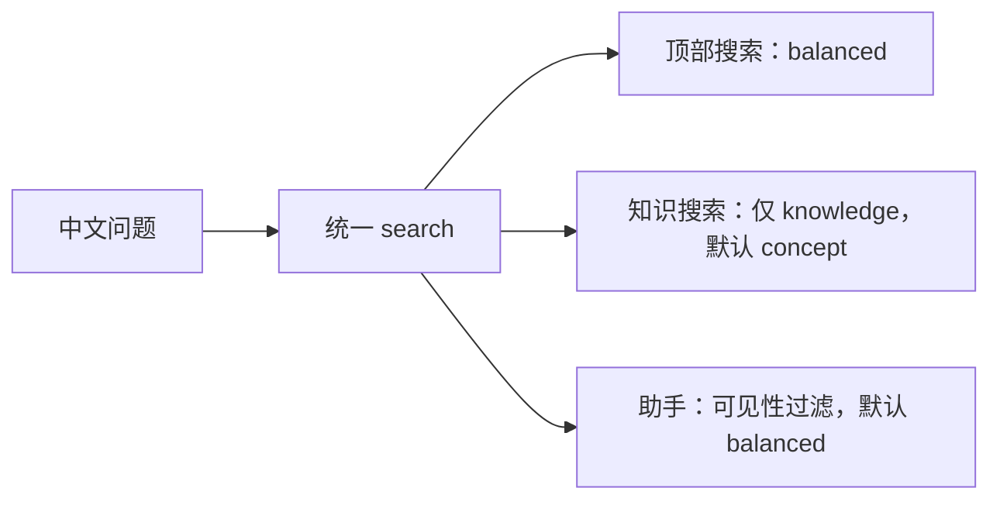

# 一次中文提问如何找到答案：统一搜索、上下文与 RAG

以“飞书 消息 后台”为贯穿示例，解释顶部搜索、知识搜索与助手如何共享结构化召回，词法、符号、中文向量、知识和记忆怎样分工，命中后如何回到固定原文，以及如何区分召回失败、上下文不足和模型回答失败。

来源：gpt-5.6-sol 分析，gpt-5.6-sol 独立复核；模型解释仍可被原始证据纠正。

## 先看一次容易误判的搜索

假设你只记得“飞书消息会交给后台处理”，于是输入 **飞书 消息 后台**。页面出现结果，只能说明某些检索单位与这些词相关，不能说明已经找到了真实处理链。仓库里的同名示例本身就是测试夹具：它先人工写入一句“消息先保存，再交给后台任务处理”，再断言全局搜索能返回它。参考 [中文搜索测试夹具 ↗](../../../apps/server/tests/reading-context.test.ts#L32 "说明贯穿示例中的中文句子是人工写入的回归测试数据，只验证全局搜索能返回结果。")

要追问“实际怎样处理”，应把第一轮结果当线索，查看结果类型、标题路径和来源范围，再改搜具体类或方法。例如 `LarkEventInbox.processMessage` 会在进入业务分支前调用 `persist`；后者按应用与事件 ID 查询收件箱，同一载荷返回重复标记，载荷摘要冲突则报错，新事件写成 `received`。参考 [事件收件箱持久化与去重 ↗](../../../apps/server/src/integrations/lark/realtime.ts#L337 "支持 persist 按应用和事件 ID 检查已有收件记录、校验载荷摘要，并将新事件以 received 状态写入收件箱。") [消息处理先登记事件 ↗](../../../apps/server/src/integrations/lark/realtime.ts#L419 "支持 processMessage 在进入业务分支前先调用 persist，并跳过已经处理过的重复事件。") 已绑定 owner 的私聊或明确提及机器人的群聊进入助手并将回复写入 outbox，其他允许监控的群消息则保存为聊天捕获。参考 [飞书消息实际分支 ↗](../../../apps/server/src/integrations/lark/realtime.ts#L524 "支持已绑定 owner 消息进入助手、回复写入 outbox，以及普通受监控群消息保存为捕获的当前实现。")

因此，本页的贯穿方法是：**先用自然语言发现候选，再用业务名或符号收窄，最后沿固定原文解释流程**。示例查询是教学输入，不是生产飞书流程的事实来源。

## 三个入口，共用一条召回底座

服务端只装配一个检索服务，并把同一个检索对象交给知识路由和助手；顶部 `/api/search` 在统一 `search` 可用时也直接调用这个对象，只有兼容场景才回退到 source-only 接口。参考 [共享检索服务装配 ↗](../../../apps/server/src/app.ts#L81 "证明同一个检索对象被传给知识路由和助手运行时。") [顶部搜索调用统一接口 ↗](../../../apps/server/src/app.ts#L274 "直接证明顶部 /api/search 调用同一 assistantRetrieval.search，并保留 source-only 兼容回退。")

差异发生在**搜索目的和结果边界**：知识搜索显式限制为知识文章，可再按正式分类路径筛选，并让一篇文章只保留最佳章节；助手则在统一搜索中加入当前会话的证据可见性，默认取 16 个候选。参考 [知识搜索范围 ↗](../../../apps/server/src/knowledge/api.ts#L100 "支持知识搜索默认概念用途、限定 knowledge 类型、按分类过滤并为每篇文章保留最佳章节。") [助手统一搜索入口 ↗](../../../apps/server/src/assistant/runtime.ts#L804 "支持助手通过统一 search 使用 balanced 目的、限制候选数并应用会话可见性。")

## 搜索的单位为什么不是任意碎片

检索先把保存形态投影成适合找回的结构单位。Markdown 按段落、列表、表格、代码围栏等连贯块切分，并保留父标题；TypeScript/Vue 按函数、方法等 AST 符号范围切分，局部变量留在所属操作里，避免一次方法被拆成失去控制流的小片段。参考 [文档与代码结构单位 ↗](../../../apps/server/src/retrieval/units.ts#L29 "支持 Markdown 连贯块、标题路径和 AST 符号范围的切分方式。")

每个命中都带可读正文、标题路径、路由、固定目标和原文引用；类型可为 source、knowledge、memory 或 task。这样“找到一段讲解”和“找到原始代码”可以同时出现，但仍能辨认各自角色。参考 [统一命中合同 ↗](../../../apps/server/src/retrieval/port.ts#L19 "支持命中类型、可读正文、标题路径、路由、固定目标和原文引用等字段。")

这里有三个不同层次：原始版本负责保真，结构单位负责召回，知识文章负责按读者问题讲解。结构单位可以随当前版本重建，旧原文和固定引用不因此消失。

## 词法、符号、向量与知识怎样协作

| 路径 | 主要解决的问题 | 使用时机 |
| --- | --- | --- |
| 中文词法 / BM25 | 记得原词、短词、路径片段 | “飞书 消息 后台”这类词面查询 |
| 精确符号 | 定位已知类、方法或标识符 | `LarkEventInbox.processMessage` |
| 中文向量 | 词面不同但意思相近 | 不记得源码用词时扩召回 |
| 知识文章 | 补整体概念与跨材料解释 | 想先理解“为什么、如何协作” |
| 记忆 / 事项 | 找个人当前事实与跟进状态 | 背景或 follow-up 问题 |

查询词先经中文 ICU 分词，常见停用词被移除；2–8 个汉字的完整短词会额外保留。纯 ASCII 标识符按精确字面匹配，若不存在可以诚实返回空。参考 [中文词项与精确标识符 ↗](../../../apps/server/src/retrieval/relevance.ts#L1 "支持 ICU 中文分词、停用词、短复合词保留和 ASCII 标识符精确查找规则。")

当前中文向量模型从 osdk 锁定的 BGE-small-zh-v1.5 本地快照加载，查询加中文检索指令，正文不加，结果经 CLS 池化和归一化；运行时禁止联网下载。参考 [中文向量模型加载 ↗](../../../apps/server/src/retrieval/embedding.ts#L14 "支持锁定 BGE 中文模型、本地校验、禁止远程下载、查询指令及归一化方式。") 长单位按 400 字符窗口、步长 320 建向量，窗口会带上最多 180 字符的结构上下文；最终阅读目标仍是原结构单位。参考 [向量重叠窗口 ↗](../../../apps/server/src/retrieval/semantic.ts#L159 "支持每个向量窗口长 400 字符、步长 320，即相邻窗口重叠 80 字符。") [检索单位向量化 ↗](../../../apps/server/src/retrieval/unified.ts#L147 "支持结构单位按重叠窗口嵌入，并在正文窗口前加入最多 180 字符上下文。")

检索先取得词法候选和超过绝对/相对门槛的语义候选，再按排名衰减融合；向量失败时回退词法。随后用途影响排序：concept 偏知识，implementation 偏代码，background 偏知识与记忆，follow-up 偏事项及近期个人状态；同一 owner 默认最多保留两条，并去除完全重复正文。参考 [词法与向量融合 ↗](../../../apps/server/src/retrieval/unified.ts#L268 "支持词法候选、语义门槛、一次融合、可选重排和向量失败后词法降级的流程。") [用途排序与结果去重 ↗](../../../apps/server/src/retrieval/unified.ts#L423 "支持不同 purpose 的类型偏好、符号定义加权、按 owner 限量和重复正文去重。")

已应用记忆及当前事项会把状态和可读内容投影到同一结果池；只有当关联原文仍能定位时，它们才携带 references，不能假定每条记忆或事项都可回溯原件。它们仍是非 source 背景，不会变成新的原始事实来源。参考 [事项与记忆投影 ↗](../../../apps/server/src/retrieval/units.ts#L589 "说明事项和 active 记忆进入统一检索单位，但只在关联证据仍能定位时生成原文 references。")

## 命中以后，怎样拿到足够上下文

第一层上下文已经包含在检索单位中：文档命中带父标题和完整块，代码命中带完整符号范围，会话命中可带发言人、回复关系与事件时间。助手再遍历命中的固定 references，从指定修订和行范围取回原始文本；知识、记忆或事项的可读说明单独放入 background，原件放入 evidence。参考 [原文证据与派生背景分离 ↗](../../../apps/server/src/assistant/runtime.ts#L824 "支持助手按固定引用范围读取原文，并把非 source 讲解单独作为 background 提供。")

需要注意一个当前边界：`evidenceNeighbors` 能在同一 Markdown 章节内补标题、前一片段和后一片段，并逐项检查可见性；但已配置统一 `search` 的主路径并不调用它，它只在 source-only 兼容路径中使用。参考 [相邻片段的适用路径 ↗](../../../apps/server/src/assistant/runtime.ts#L875 "支持统一 search 主路径与 source-only 路径的差异，以及后者才调用章节邻居补充。") 所以准确说法是：**主路径依靠结构单位、标题路径和固定引用范围补上下文**，不能假设每次命中都会自动带上相邻 Fragment。跨文件流程仍可能需要继续查询调用者。

## 助手如何补查并形成回答

助手先把当前问题、同会话最近历史、可见原始证据、派生背景、事项和时间交给模型。若材料不足，模型最多提出 3 个补查词，并为每个词选择 concept、implementation、background 或 follow-up；宿主并行调用同一个检索入口，合并证据和背景后只再生成一次。参考 [助手二次补查 ↗](../../../apps/server/src/assistant/runtime.ts#L553 "支持初轮生成后最多三条用途化查询、并行补查、合并上下文并只再生成一次。")

模型被明确告知：派生讲解只是背景，不是独立事实；只能引用 evidence 列表中的标识。第二轮搜索预算耗尽后必须基于现有材料回答，仍缺信息就明说。参考 [模型证据与搜索约束 ↗](../../../apps/server/src/assistant/acp-model.ts#L59 "支持讲解仅作背景、证据白名单、一次补查预算和缺信息时明确说明的提示合同。") 最终运行时还会把模型返回的引用与实际提供的 evidence 白名单求交，只保存允许的证据。参考 [最终引用白名单 ↗](../../../apps/server/src/assistant/runtime.ts#L737 "支持最终引用只保留运行时实际提供证据的机制。")

因此，“助手会进一步查询”是一次受限的 RAG 补查机会，不是保证它必然猜中正确符号。若第一轮自然语言只召回测试句或旧说明，模型可能改搜具体方法，也可能仍缺少跨文件链。

## 区分找不到、找偏了和答不好

排查时按结果所处阶段判断：

1. **结果为空**：检查查询是否只剩停用词，ASCII 标识符是否确实存在，类型、分类、可见性或时间范围是否过滤了结果，以及语义索引是否就绪。空结果比用低相似向量硬填更可信。
2. **有结果但排前的是测试、旧设计或复述问题**：这是候选或排序问题。查看 `routes`、`kind`、`headingPath` 和固定目标，切换 implementation，并改用类名、方法名或业务状态。
3. **命中正确，但解释缺上游或下游**：这是上下文问题。继续查调用者、被调用服务或相关知识章节；不要把单个完整方法误当完整跨文件调用图。
4. **evidence 与 background 已足够，回答仍错误、遗漏或表达生硬**：这是生成问题，再调召回通常无效。引用存在也不等于论断成立。

当前质量记录也区分了这几层：完整方法和知识背景能够定位，但复杂概念问题仍可能把主题相近却不能回答的旧说明或检查记录排在前面；可选中文重排有局部收益也有退步，因此没有默认开启。参考 [当前检索质量结论 ↗](../../../docs/reader-first/progress.md#L9 "支持复杂问题仍会命中不能回答的旧内容，以及中文重排效果不稳定而保持可选的现状。") 中文向量当前配置已启用 `memory-zh`，但配置未启用重排器。参考 [当前中文向量配置 ↗](../../../config/retrieval.json#L1 "支持当前启用 memory-zh 中文向量模型且配置中没有重排器项。")

时间过滤要按结果类型理解。查询合同把 `timeRange` 描述为捕获修订时间，而统一实现实际比较每个检索单位的 `provenance.time`。参考 [时间范围查询合同 ↗](../../../apps/server/src/retrieval/port.ts#L76 "说明 SearchQuery 对 timeRange 的公开描述是捕获修订时间，而不是事件时间或历史时点。") [统一时间过滤实现 ↗](../../../apps/server/src/retrieval/unified.ts#L218 "证明统一检索对所有类型比较检索单位自身的 provenance.time。") 对原始 source，这个值来自修订创建时间；知识用文章生成时间，事项用事项创建时间，记忆用更新时间。参考 [原文与知识时间来源 ↗](../../../apps/server/src/retrieval/units.ts#L368 "支持 source 使用修订创建时间，而 knowledge 使用文章生成时间作为 provenance.time。") [知识生成时间 ↗](../../../apps/server/src/retrieval/units.ts#L547 "补充证明知识检索单位的 provenance.time 来自文章生成时间。") [事项与记忆时间来源 ↗](../../../apps/server/src/retrieval/units.ts#L623 "支持事项以创建时间、记忆以更新时间作为各自的 provenance.time。") 因而它不是业务事件时间，也不是 historical as-of；当前入口也没有把自然语言日期自动转成该字段。follow-up 的近期加成会参考部分单位的 `eventAt`，但仍不等于“检索上周发生的消息”。完整意图路由和跨文件功能链仍在后续范围。参考 [统一检索后续边界 ↗](../../../docs/reader-first/progress.md#L29 "支持当前统一搜索与上下文属于首片实现，完整意图路由和跨文件功能链仍未完成。")
