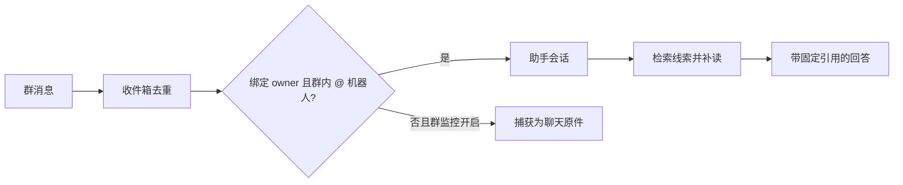
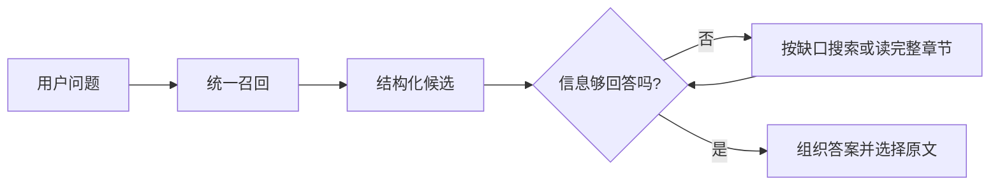

# 一次提问如何找到答案：搜索、补读与固定引用

面向需要理解和诊断 omem 搜索效果的开发者，沿一条群消息进入助手的教学示意，说明顶部搜索、知识搜索与助手如何复用统一召回，又如何因用途和可见范围而得到不同结果；解释全文、中文短词、结构单元、符号、向量、知识、记忆与事项的分工，以及助手如何补读原文并生成固定引用。最后给出问答模型选择、中文语义检索与重排的现实边界，并提供区分召回问题、上下文问题和回答问题的排查顺序。

来源：gpt-5.6-sol 分析，gpt-5.6-sol 独立复核；模型解释仍可被原始证据纠正。

## 从一条群消息开始

先看一个**教学示意**：用户在已经接入的飞书群里 @ 助手，问“这条群消息为什么没有进入回答，我该改哪里？”系统先按应用和事件标识把事件写入收件箱，重复载荷会复用记录，冲突载荷会被拒绝。参考 [飞书事件持久化与去重 ↗](../../../apps/server/src/integrations/lark/realtime.ts#L337 "支持事件先按应用和事件标识持久化，并对重复载荷与冲突载荷作不同处理。")

这并不表示群里的每条消息都会触发问答。只有消息来自已绑定的 owner，并且群聊中明确提到机器人，才会进入助手；其他启用了群监控的消息会作为聊天原件捕获，供以后搜索。参考 [助手触发条件 ↗](../../../apps/server/src/integrations/lark/realtime.ts#L524 "支持只有绑定 owner 的私聊消息或群内明确提及机器人时才进入助手。") [群消息捕获分支 ↗](../../../apps/server/src/integrations/lark/realtime.ts#L602 "支持未进入助手的受监控群消息会被保存为带会话和来源信息的聊天原件。") 群会话还能读取的证据只限同一 chatId 已采集的内容，不能越到私聊或其他群。参考 [群会话证据范围 ↗](../../../apps/server/src/integrations/lark/runtime.ts#L90 "支持群会话只允许读取同一 chatId 已采集证据的可见性规则。")

这条路线把两个问题分开：消息是否进入助手由飞书入口决定；进入以后能否答好，才由检索、补读和生成共同决定。

## 搜索负责找线索，助手负责形成回答

生产应用只创建一套检索服务，并把它同时注入知识路由和 `AssistantRuntime`，所以顶部搜索、知识搜索和助手确实共用 `RetrievalPort` 与统一投影。参考 [统一检索装配 ↗](../../../apps/server/src/app.ts#L99 "支持生产应用创建一次检索服务并注入知识路由和助手运行时。") 但“共用底座”不等于“返回同一批结果”：

| 入口 | 默认目标 | 关键差异 |
| --- | --- | --- |
| 顶部搜索 | 浏览全库候选 | `/api/search` 默认 `balanced`，可传用途、代码意图、材料角色和有效时间；未限定结果种类。参考 [顶部搜索入口 ↗](../../../apps/server/src/app.ts#L312 "支持顶部搜索的默认用途、过滤参数、结果上限及统一 search 调用。") |
| 知识搜索 | 先读成篇解释 | `/api/knowledge/search` 默认 `concept`，只查 `knowledge`，可按 `topicPath` 限定，并让每篇文章只占一个最佳章节。参考 [知识搜索入口 ↗](../../../apps/server/src/knowledge/api.ts#L118 "支持知识搜索默认概念用途、只查知识、按主题限定及每篇文章一个最佳章节。") |
| 助手 | 为当前问题准备证据 | 默认取 16 个统一检索结果，并先应用会话可见性；原件命中成为 evidence，知识、记忆和事项成为 background，但它们仍携带回到原件的引用。参考 [助手检索上下文 ↗](../../../apps/server/src/assistant/runtime.ts#L917 "支持助手统一检索的数量与可见性参数，并说明 source 转证据、其他结果转背景的过程。") |

因此，顶部搜索适合观察“库里有哪些候选”，知识搜索适合先建立整体理解，助手则会把候选当调查起点。RAG 在这里不是另一个数据库，而是“召回线索 → 补齐上下文 → 生成回答”的协作过程。

## 不同线索各自解决什么

统一检索不是只做一次字符串匹配，而是让不同表示互补：

| 线索 | 最擅长解决的问题 | 不应误解为 |
| --- | --- | --- |
| 全文与中文短词 | 标题、结构上下文和正文分别写入 FTS5，查询使用 MATCH 与 BM25。参考 [全文索引字段 ↗](../../../apps/server/src/retrieval/units.ts#L942 "支持标题、结构上下文和去除引用标记后的正文分别写入 FTS5 检索表。") [BM25 全文查询 ↗](../../../apps/server/src/retrieval/unified.ts#L414 "支持把查询词转换为 FTS5 MATCH 表达式，并使用 BM25 对命中检索单位排序。") 中文用 ICU 分词，2–8 个纯汉字短查询还保留整词，可找“重试”这类领域词。参考 [中文查询词处理 ↗](../../../apps/server/src/retrieval/relevance.ts#L1 "支持 ICU 中文分词、短汉字整词保留、停用词过滤和最低词项覆盖规则。") | 任意一个相同汉字就算命中；长问题仍有最低词项覆盖门槛 |
| 结构单元 | Markdown 保留标题下的段落、表格、列表和代码块；TS/JS/Vue 尽量保留完整函数或方法。参考 [Markdown 结构单元 ↗](../../../apps/server/src/retrieval/units.ts#L31 "支持按标题组织段落并保持引导句、表格、列表和代码块连贯。") [代码结构单元 ↗](../../../apps/server/src/retrieval/units.ts#L90 "支持代码按完整操作范围组织，避免局部声明切碎方法控制流。") 聊天单元把发言人、事件时间和回复关系写入对应片段的上下文。参考 [聊天片段上下文 ↗](../../../apps/server/src/retrieval/units.ts#L330 "支持从片段来源提取发言人、事件时间与回复关系，并写入对应检索单位的上下文。") | 随机字符切片，或完整跨文件业务链 |
| 符号 | 明确函数名可独立召回 AST 定义；显式 `callers` 查找返回带调用行号的候选。参考 [符号定义与调用候选 ↗](../../../apps/server/src/retrieval/unified.ts#L303 "支持独立的 AST 名称定义分支与带调用行号的名称级调用候选分支。") | 已做类型解析的完整调用图 |
| 向量 | 中文问法与原文措辞不完全一致时补语义候选；查询与正文向量归一化后比较，正文按局部窗口索引。参考 [中文向量模型 ↗](../../../apps/server/src/retrieval/embedding.ts#L14 "支持中文 BGE 模型的锁定版本、哈希检查、离线 q8 CPU 加载与查询指令。") [词法与语义融合 ↗](../../../apps/server/src/retrieval/unified.ts#L476 "支持向量查询、最佳窗口选择、失败时回退词法，以及与词法和符号结果融合。") | 答案正确率或事实置信度 |
| 知识 | 已接受且引用依赖仍可用的文章按章节参与检索，并递归保留指向原件的锚点。参考 [知识章节投影 ↗](../../../apps/server/src/retrieval/units.ts#L589 "支持只投影引用依赖可用的已接受文章，并让章节结果递归保留原文引用。") | 第二份独立事实来源 |
| 记忆与事项 | 只投影 active memory 的当前 head 和事项当前状态，适合“现在的约定”和“下一步是什么”。参考 [当前事项投影 ↗](../../../apps/server/src/retrieval/units.ts#L747 "支持事项当前状态、下一步、到期与原始证据引用进入检索单位。") [活动记忆投影 ↗](../../../apps/server/src/retrieval/units.ts#L804 "支持只读取 active memory 的当前 head，并保留其原始证据与有效起点。") | 原始记录本身 |

各支路按名次衰减融合；`purpose` 再偏好概念、实现、背景或跟进状态。参考 [用途排序与结果去重 ↗](../../../apps/server/src/retrieval/unified.ts#L606 "支持按用途和跟进时间调整优先级，以及按 owner 限额与正文去重。") 在未显式筛选材料角色、且目的不是背景调查时，计划、调研、示例以及 proposed、historical、superseded 状态会获得较低的导航权重；这只是排序偏好，不是事实判定。参考 [材料适用性权重 ↗](../../../apps/server/src/retrieval/unified.ts#L279 "支持在默认导航中降低计划、调研、示例及 proposed、historical、superseded 材料的排序权重，并明确这不是事实判定。") 最终通常每个 owner 最多保留两条，避免一个文件占满结果。参考 [用途排序与结果去重 ↗](../../../apps/server/src/retrieval/unified.ts#L606 "支持按用途和跟进时间调整优先级，以及按 owner 限额与正文去重。")

## 命中片段之后，怎样补成可回答的上下文

命中本身已经尽量是可读的结构单元，并带标题路径与固定原文范围；助手把 source 命中还原为原文 evidence，把知识、记忆和事项放入 background。参考 [助手检索上下文 ↗](../../../apps/server/src/assistant/runtime.ts#L917 "支持助手统一检索的数量与可见性参数，并说明 source 转证据、其他结果转背景的过程。") 但初始结果只是线索，不规定阅读顺序。原生 Agent 可以继续搜索原件或知识、读取完整材料或章节，再用代码导航查看定义、import 和候选调用位置。参考 [原件搜索与章节补读工具 ↗](../../../apps/server/src/knowledge/agent-research.ts#L388 "支持 Agent 按需搜索原件、读取材料或完整章节，并取得真实范围与结构信息。") [知识与记忆查询工具 ↗](../../../apps/server/src/knowledge/agent-research.ts#L489 "支持 Agent 搜索和读取派生讲解与活动记忆，同时保留它们回到原始证据的关系。") [代码导航工具 ↗](../../../apps/server/src/knowledge/agent-research.ts#L633 "支持按材料或符号读取定义、import 和候选调用位置，并明确这些调用不是完整调用图。")

当前生产主路径不会无条件把每个命中自动扩成整章；相邻证据补充位于兼容的 source-only 检索路径。参考 [兼容路径的相邻证据补充 ↗](../../../apps/server/src/assistant/runtime.ts#L978 "支持 source-only 兼容检索路径在保留排序命中后调用相邻证据补充。") 该补充只选择命中所在章节的标题、前一片段和后一片段，并再次应用可见性过滤。参考 [同章节邻居范围 ↗](../../../apps/server/src/retrieval/context.ts#L5 "支持邻居补充仅选择命中所在章节的标题与前后片段，并再次执行可见性过滤。") 因而理解跨文件流程时，Agent 仍需沿函数、import、调用候选和设计说明继续调查。修改“怎么切出可读单位”看 `retrieval/units.ts`；修改多路召回与排序看 `retrieval/unified.ts` 和 `retrieval/relevance.ts`；修改助手如何消费结果看 `assistant/runtime.ts`。

## 为什么回答能回到固定原文

检索结果的 source target 不只是文件名，还包含 material key、revision、digest、精确行范围和覆盖的 fragment。参考 [固定来源锚点 ↗](../../../apps/server/src/retrieval/port.ts#L25 "支持检索结果以材料 key、revision、digest、行范围和 fragment 集合描述固定原文。") Agent 最终提交的是自己的短引用编号、真实材料 key 与行范围；宿主会检查范围、来源版本和可见性，再从原文复制内容。正文用了却没有声明定位的引用会被拒绝。参考 [引用范围与可见性校验 ↗](../../../apps/server/src/assistant/research.ts#L97 "支持宿主验证 Agent 提交的材料、版本、行范围与可见性，并拒绝正文中的无定位引用。")

会话保存前，运行时还会把引用限制在本轮实际提供或调查得到的 evidence 中，并只保留答案真正选择的证据。参考 [最终证据筛选 ↗](../../../apps/server/src/assistant/runtime.ts#L843 "支持会话持久化前只接受运行时实际供应的引用并保存答案选中的证据。") 所以知识文章可以帮助组织理解，但事实引用仍落回固定原件；查看历史变化时也不能把旧版本的论断链接到当前正文。

## 单独选择问答模型，实际节省了什么

个人配置可用 `assistant.profileId` 单独选择日常问答的 ACP profile；未配置时使用第一个 ACP profile，找不到指定 profile 或选到非 ACP transport 会直接报错。知识写作、材料整理和后台学习不随它一起切换。参考 [问答模型独立配置 ↗](../../../apps/server/src/config.ts#L100 "支持 assistant.profileId 独立选择 ACP profile、默认选择和错误处理。") ACP 连接建立后会从服务端实际支持的配置项中选择 model 和 reasoning effort；不支持的值不会被静默接受。参考 [ACP 模型能力协商 ↗](../../../apps/server/src/agents.ts#L310 "支持从会话实际配置项选择模型和推理强度，并拒绝不支持的值。")

当前示例提供 Sol 与 Luna 两个 profile，但“快模型”只是可选配置，不是自动路由。已有一次同题记录中，Luna 为 136 秒、Sol 为 148 秒，其中材料准备约 37 秒；Agent 时间还包含启动、工具调用和提交，不能当作纯推理或首字延迟。当前也没有复杂问题自动转交 Sol 或双模型并跑。参考 [快模型实测边界 ↗](../../../docs/reader-first/fast-assistant.md#L1 "支持 Luna 与 Sol 的一次耗时记录、材料准备成本、独立配置及没有自动模型转交的当前事实。") 换模型只可能缩短链条中的一部分，快照准备、搜索、补读和引用校验仍然存在。

## 怎样定位效果问题与当前限制

建议按以下顺序排查一次真实问题：

1. **看候选池。** 保留原始问法并查看前列正文；若没有任何能回答问题的原件或讲解，这是召回问题。可分别尝试同义词、明确 symbol、`purpose`、`codeIntent`、材料角色和 `effectiveAt`，但人工改写后的成功不能冒充原问法成功。
2. **看上下文。** 若候选只是入口，读取完整章节、原件或调用位置；补读后才出现关键条件，说明召回有入口，但上下文扩展不足。
3. **看回答。** 若足够原文已经交给助手，结果仍遗漏条件、混淆现行与计划、引用错位或不承认未知，这是回答或生成问题。助手的初始检索与最终选证是两个明确阶段。参考 [助手两阶段上下文 ↗](../../../apps/server/src/assistant/runtime.ts#L587 "支持助手先做初始检索，再合并补充查询结果并把实际调查证据加入上下文的处理阶段。")
4. **不要用重排掩盖漏召回。** 可选 cross-encoder 只处理融合后的前 40 个候选；长单位最多选两个约 800 字符局部段落，最高局部分也不保证整篇可回答。参考 [可选候选重排 ↗](../../../apps/server/src/retrieval/unified.ts#L545 "支持重排仅处理融合后的前 40 个候选、组合局部分数，并在失败时保留原排序。") [长单位重排窗口 ↗](../../../apps/server/src/retrieval/rerank-passages.ts#L1 "支持长单位最多选择两个约 800 字符的局部段落，固定完整单位仍可继续阅读。")

中文语义模型当前是 osdk 锁定的本地 `bge-small-zh-v1.5`，以 q8 CPU 离线加载并核验文件哈希；模型不可用时统一检索退回词法，后台索引未追平时语义覆盖也可能不完整。参考 [中文向量模型 ↗](../../../apps/server/src/retrieval/embedding.ts#L14 "支持中文 BGE 模型的锁定版本、哈希检查、离线 q8 CPU 加载与查询指令。") [词法与语义融合 ↗](../../../apps/server/src/retrieval/unified.ts#L476 "支持向量查询、最佳窗口选择、失败时回退词法，以及与词法和符号结果融合。") 默认仍未启用 reranker；名称级调用候选也可能混入同名接收者，别名或动态调用可能漏掉。参考 [当前检索配置边界 ↗](../../../apps/server/src/retrieval/factory.ts#L9 "支持 embedding 为可开关配置而 reranker 为可选配置，并显示其统一检索装配方式。") [名称级调用导航限制 ↗](../../../docs/reader-first/code-navigation-and-passages.md#L17 "支持当前调用方导航没有跨文件类型解析，可能混入同名方法或漏掉别名与动态调用。")

时间字段同样要分清：`timeRange` 过滤捕获版本时间，`effectiveAt` 只依据材料说明中明确的有效期，跟进排序才使用事项、记忆或会话的 `eventAt`；这还不是历史 as-of 推理。参考 [检索时间字段合同 ↗](../../../apps/server/src/retrieval/port.ts#L96 "支持 timeRange 明确指向捕获版本时间，而 effectiveAt 是单独的有效时间过滤字段。") [有效期与事件时间处理 ↗](../../../apps/server/src/retrieval/unified.ts#L225 "支持 effectiveAt、捕获时间范围和跟进 eventAt 在过滤与排序中承担不同职责。") 修改统一字段与过滤合同从 `retrieval/port.ts` 开始；入口差异看 `app.ts` 与 `knowledge/api.ts`；问答调查和固定引用看 `assistant/runtime.ts`、`assistant/acp-model.ts`、`assistant/research.ts`；问答模型选择看 `config.ts`。
