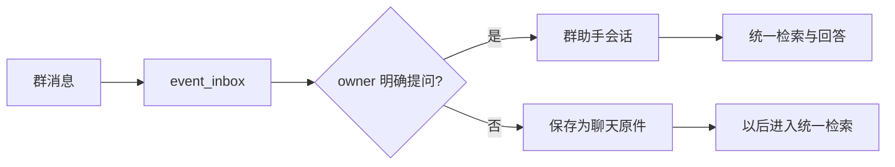

# 一次提问如何找到答案：召回、上下文与 RAG

用一条群消息的阅读路线解释顶部搜索、知识搜索与助手如何共用召回基础，又怎样分别筛选结果、补足结构上下文、回到固定原件并继续调查；同时给出中文词法、符号、向量、记忆和知识的分工，以及区分召回问题、上下文问题和回答问题的修改入口。

来源：gpt-5.6-sol 分析，gpt-5.6-sol 独立复核；模型解释仍可被原始证据纠正。

## 先分清搜索与回答

假设群里出现一句“收件箱处理后再交给助手”，后来开发者用自己的话问：“群消息怎样进入助理？”这是**教学示意**，用于说明阅读路线，不承诺这个问法一定把某个文件排在第一位。

搜索负责从原件、知识、记忆和事项中找候选；回答负责判断候选是否足够、补读原文并组织解释。应用只创建一套检索服务：知识路由与普通助手接收同一个检索实例，启用飞书时，该实例也会注入飞书运行时。参考 [共享检索装配 ↗](../../../apps/server/src/app.ts#L99 "支持知识路由和普通助手接收同一个统一检索实例。") [飞书共享检索装配 ↗](../../../apps/server/src/app.ts#L136 "支持启用飞书时把同一个 assistantRetrieval 注入 LarkRuntimeHost。")

共享基础不等于结果相同：

| 入口 | 默认做法 | 读者看到什么 |
| --- | --- | --- |
| 顶部搜索 | 综合用途，最多 30 项 | 原件、知识、记忆、事项的混合命中 |
| 知识搜索 | 概念用途，只取知识，可限定主题路径 | 每篇文章最相关的一个章节 |
| 助手 | 用用户原话召回，并应用会话可见性 | 原件证据、知识/记忆背景，再生成回答 |

顶部和知识接口分别传入不同的用途、类型与数量；助手则把同一检索结果拆成可引用原件和可读背景。参考 [顶部搜索入口 ↗](../../../apps/server/src/app.ts#L303 "支持顶部搜索的默认用途、数量及统一检索调用。") [知识搜索入口 ↗](../../../apps/server/src/knowledge/api.ts#L100 "支持知识搜索按类型、主题与用途筛选并按文章去重。") [助手召回拆分 ↗](../../../apps/server/src/assistant/runtime.ts#L913 "支持助手用统一检索并把固定原件变为证据、派生命中变为背景。")

## 一条群消息走哪条路

飞书事件先进入持久收件箱，以应用和事件标识去重，并保存事件时间、发言人、群、消息与原始载荷。之后有两条分支：已绑定的 owner 在群内明确 @ 机器人时，消息直接进入该群的助手会话；普通群消息在启用监控后作为聊天原件保存，等以后搜索。参考 [飞书事件收件箱 ↗](../../../apps/server/src/integrations/lark/realtime.ts#L337 "支持入站事件先去重持久化并保存事件元数据。") [直接提问与背景捕获 ↗](../../../apps/server/src/integrations/lark/realtime.ts#L503 "支持 owner 明确提问走助手、普通群消息保存为聊天原件的两条分支。")

群助手不是私有资料的旁路：会话按应用、绑定版本和群隔离，群内只能看到实际从该群采集的证据；回复先进入投递 outbox，再把收件箱标成已处理，以减少重投造成的重复回复。参考 [群会话与助手调用 ↗](../../../apps/server/src/integrations/lark/runtime.ts#L144 "支持飞书群会话按绑定隔离并调用 AssistantRuntime。") [群证据可见性 ↗](../../../apps/server/src/integrations/lark/runtime.ts#L90 "支持群会话只能读取同一群实际采集的证据。")

## 不同检索表示各解决什么

系统把保存单位和检索单位分开：Markdown 保留标题路径、列表、表格与代码块，代码按完整函数、方法或组件建立单位，局部变量留在所属操作中。这样命中“一个名字”时，读者更可能拿到可理解的操作，而不是孤立一行。参考 [Markdown 结构单位 ↗](../../../apps/server/src/retrieval/units.ts#L29 "支持 Markdown 按连贯块切分并保留标题路径。") [完整代码操作 ↗](../../../apps/server/src/retrieval/units.ts#L68 "支持代码以完整方法、函数或组件为单位，局部变量留在操作内。")

| 表示 | 更擅长 | 不应误解为 |
| --- | --- | --- |
| 全文 / BM25 | 原文里确实出现的业务词、标题、代码文字 | 自动理解同义表达 |
| 中文短词 | 保留 2–8 字完整短语，并过滤常见虚词 | 对长问句自动扩写同义词 |
| 符号 | 精确标识符、路径、定义名 | 猜测一个“语义接近”的函数 |
| 向量 | 用户说法与原文措辞不同的候选发现 | 相似就一定能回答 |
| 记忆 | 已应用、仍 active 的事实、经历或方法 | 第二份独立原始事实 |
| 知识 | 先读按问题组织的解释，再沿引用回原件 | 用讲解替代来源 |

词法候选来自 ICU 中文分词后的 FTS5；短中文词另保留完整字面，精确标识符则要求真实字面命中。参考 [中文查询词 ↗](../../../apps/server/src/retrieval/relevance.ts#L1 "支持中文分词、停用词、短词保留及精确标识符判断。") [BM25 词法候选 ↗](../../../apps/server/src/retrieval/unified.ts#L268 "支持 ICU 处理后的 FTS5 BM25 候选与字面和定义过滤。") 向量分支使用锁定的中文 BGE 快照，对查询和材料采用不同输入形式；词法与向量候选融合后，可选重排器只重排已进入候选池的前部结果。参考 [中文向量模型 ↗](../../../apps/server/src/retrieval/embedding.ts#L14 "支持锁定 BGE 中文快照、离线 q8 CPU 推理及查询和段落的不同输入。") [融合与候选重排 ↗](../../../apps/server/src/retrieval/unified.ts#L323 "支持语义失败回退词法、候选融合以及仅对前部候选做可选重排。") 记忆只投影 active 头版本，知识也只有复核通过、引用依赖仍可用且未失效的文章才能参与召回。参考 [当前记忆投影 ↗](../../../apps/server/src/retrieval/units.ts#L752 "支持仅 active 记忆头版本参与检索且仍保留原件引用。") [知识可召回条件 ↗](../../../apps/server/src/retrieval/units.ts#L545 "支持知识必须复核通过、引用依赖可用且未失效才进入投影。")

## 命中片段后怎样补成可读上下文

每个原件检索单位都带着固定 revision、摘要、准确行范围和所覆盖的片段标识；聊天还把会话、发言人、事件时间、回复与引用关系放进上下文。参考 [原件固定锚点 ↗](../../../apps/server/src/retrieval/units.ts#L222 "支持固定 revision、摘要、行范围与片段身份组成原件锚点。") [原件上下文投影 ↗](../../../apps/server/src/retrieval/units.ts#L243 "支持聊天会话、发言人、事件时间和回复关系进入检索上下文。") 知识单位保留自己的可读正文；投影当前段落时，实现会识别其中实际出现的文章引用：材料引用转成固定原件锚点，文章引用则继续读取被引用章节并递归收集原件锚点。参考 [知识引用递归锚定 ↗](../../../apps/server/src/retrieval/units.ts#L601 "支持知识段落把材料引用转成固定原件锚点，并递归展开被引用文章章节的原件引用。")

助手拿到命中后不会把知识正文冒充事实证据：知识、记忆和事项进入 background；它们指向的固定原件范围被重新读取，成为独立 citation。原件命中还保留章节或符号名。参考 [助手召回拆分 ↗](../../../apps/server/src/assistant/runtime.ts#L913 "支持助手用统一检索并把固定原件变为证据、派生命中变为背景。") [范围证据生成 ↗](../../../apps/server/src/assistant/research.ts#L14 "支持从固定材料行范围生成可见且独立的助手引用证据。")

兼容的旧原件路径会在保留排名命中的基础上，用剩余额度补同一章节的标题、前一片和后一片，而且每个补片都重新检查可见性。新的结构单元已经尽量给出完整 Markdown 块或完整代码操作；如果问题需要更大的父章节、下游方法或跨文件业务链，仍要继续补读。参考 [相邻章节补片 ↗](../../../apps/server/src/retrieval/context.ts#L5 "支持旧原件路径补标题和前后片段并逐片检查可见性。")

## 助手如何从线索走到引用答案

助手先用用户原话召回，再合并同一会话上一轮真正选用的证据，把原件、背景、事项和当前时钟交给模型。兼容模型可以提出最多三个补查词并再生成一次；当前原生路径则把初始命中当线索，让 Agent 按缺口反复读目录、原文、章节、知识、记忆、历史或代码符号。参考 [助手首轮与补查 ↗](../../../apps/server/src/assistant/runtime.ts#L548 "支持助手合并当前和上一轮证据，并允许兼容路径提出最多三个补查请求。") [原生调查入口 ↗](../../../apps/server/src/assistant/acp-model.ts#L162 "支持当前助手创建固定研究工作区并把初始命中作为调查线索。")

最终引用必须属于本次授权材料，历史版本必须来自同一来源，行范围必须有效且在当前会话可见；运行时还会过滤模型自行编造、未实际提供的引用编号。也就是说，RAG 的“G”生成解释，但“R”检索与固定来源决定哪些事实能被可靠引用。参考 [调查引用校验 ↗](../../../apps/server/src/assistant/research.ts#L43 "支持调查结果的授权材料、历史版本、行范围与可见性校验。") [运行时引用白名单 ↗](../../../apps/server/src/assistant/runtime.ts#L839 "支持最终只保留运行时实际提供的引用并保存选中证据。")

## 当前限制：模型、重排与时间

当前实际配置启用了本地 `memory-zh` 向量模型，没有默认启用重排器；`relevance-zh` 需要显式写入检索配置并重启。模型缺失或语义计算异常时仍保留词法结果，所以“配置了向量模型”不代表每次请求都一定走语义分支。参考 [当前检索配置 ↗](../../../config/retrieval.json#L1 "支持当前配置启用 memory-zh 且没有默认重排器字段。") [模型运行方式 ↗](../../../docs/reader-first/operations.md#L13 "支持 embedding 可选、不隐式下载且缺失时保留全文检索。") [重排器默认状态 ↗](../../../docs/reader-first/operations.md#L33 "支持 relevance-zh 当前不默认启用及其显式配置方式。")

还有三个重要边界：

- 向量相似不能判断一段内容是否足以回答；重排器也找不回从未进入候选池的材料。
- 长自然问句可能先命中指南、旧计划或近似主题；精确函数名混在长句中也未必让方法本体排前，Agent 补查可以补救，但不等于基础排序已经正确。参考 [长问句召回差异 ↗](../../../docs/reader-first/assistant-search-research.md#L34 "支持长问句带精确方法名仍可能先返回指南，单查符号才得到完整方法。")
- `timeRange` 的实现统一比较检索单元的 `provenance.time`，但不同结果类型写入的时间并不相同：原件是 revision 的创建时间，知识是文章生成时间，事项是事项创建时间，记忆是记忆更新时间。参考 [时间过滤与新近性 ↗](../../../apps/server/src/retrieval/unified.ts#L218 "支持实现按 provenance.time 过滤，并仅在跟进用途对特定结果使用 eventAt 新近性。") [原件投影时间 ↗](../../../apps/server/src/retrieval/units.ts#L350 "支持原件检索单元把 revision created_at 写入 provenance.time。") [知识投影时间 ↗](../../../apps/server/src/retrieval/units.ts#L665 "支持知识检索单元把文章 generation.at 写入 provenance.time。") [事项投影时间 ↗](../../../apps/server/src/retrieval/units.ts#L732 "支持事项检索单元把事项 created_at 写入 provenance.time。") [记忆投影时间 ↗](../../../apps/server/src/retrieval/units.ts#L816 "支持记忆检索单元把 memory updated_at 写入 provenance.time，并把 valid_from 单独放在 eventAt。") 因而只有原件结果可按“捕获修订时间”理解；它不是消息事件时间、事实有效期或历史 as-of。事件时间只在跟进用途里提供轻量新近性偏好。参考 [时间范围合同 ↗](../../../apps/server/src/retrieval/port.ts#L82 "支持 timeRange 合同排除事件时间和历史 as-of；结合具体投影字段理解其实际语义。") [时间过滤与新近性 ↗](../../../apps/server/src/retrieval/unified.ts#L218 "支持实现按 provenance.time 过滤，并仅在跟进用途对特定结果使用 eventAt 新近性。") 顶部、知识和助手初始查询也没有传入时间范围，因此“上周”“当时”的判断仍依赖文本、版本历史和 Agent 补读。

## 怎样定位问题与开始修改

遇到“答得不对”，先看实际命中，再沿下面的分界定位：

1. **正确原件、章节或方法根本不在候选中**：这是召回或索引表示问题。先看结构单位与中文分词，再看词法/向量融合、用途偏好和检索配置。
2. **候选方向正确，但只给了不足以回答的小块**：这是上下文或调查问题。检查固定父节、相邻片段、材料读取与 Agent 是否继续追查下游。
3. **正确原件和必要上下文都已提供，答案仍混淆事实与背景或引用选错**：这是回答组织或结果合同问题。检查助手模型提示、调查提交和运行时引用筛选。
4. **群里搜不到私有资料或消息没有进入预期分支**：先查收件箱的直接提问/背景捕获判断，再查群会话绑定与可见性策略。

修改入口也按这四层对应：检索单位在 `retrieval/units.ts`，排序在 `retrieval/unified.ts`，补读工具在 `knowledge/agent-research.ts`，回答装配在 `assistant/runtime.ts` 与 `assistant/acp-model.ts`，飞书入口在 `integrations/lark/realtime.ts`。真实自然问句的排名会随语料、索引状态和配置变化，调试时应保留“实际命中”和“综合回答”两份结果，不能只看最后答案。参考 [检索改造入口 ↗](../../../docs/reader-first/assistant-search-research.md#L151 "支持从检索单位、统一排序、研究工具和助手运行时分别定位修改点。") [召回与回答分开诊断 ↗](../../../docs/reader-first/assistant-search-research.md#L141 "支持同时观察实际命中和综合答案，以区分材料未召回与材料齐了仍答不好。")
