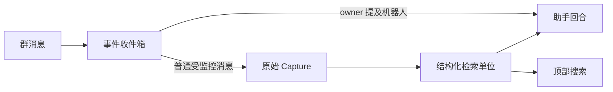

# 一次提问如何找到答案：搜索、上下文与 RAG

以一条群消息为教学示意，说明原件怎样进入统一检索，顶部搜索、知识搜索与助手如何共享召回底座但承担不同职责，以及全文、中文词项、符号、向量、知识、记忆和事项如何共同提供结构上下文与固定引用，最后给出区分召回问题和回答问题的方法。

来源：gpt-5.6-sol 分析，gpt-5.6-sol 独立复核；模型解释仍可被原始证据纠正。

## 从一条群消息开始

假设群里出现一句“登录改造要等安全组确认”。这是**教学示意**：它说明阅读路线，不承诺某组搜索词一定得到固定排名。

消息到达后先按应用和事件标识进入收件箱；同标识、同载荷会被识别为重复，不同载荷则报冲突。若发送者是已绑定的 owner，并在群里提及机器人，消息会立即进入助手回合；其他已允许监控的群消息不会当场触发回答，而是以 `source: "chat"` 保存为原始 Capture，并保留会话、发言人、事件时间和回复关系。参考 [事件收件箱与去重 ↗](../../../apps/server/src/integrations/lark/realtime.ts#L337 "支持 Lark 事件先进入收件箱，并按应用、事件标识和载荷摘要处理重复与冲突。") [提及触发助手 ↗](../../../apps/server/src/integrations/lark/realtime.ts#L524 "支持已绑定 owner 在群聊提及机器人时进入助手回合的条件。") [普通群消息捕获 ↗](../../../apps/server/src/integrations/lark/realtime.ts#L618 "支持受监控群消息作为 chat Capture 保存，并保留会话和来源元数据。")

这条链解释了两种用户结果：提及机器人会得到一次回答；普通群消息先成为以后可找回的原件。群聊助手只能使用同一 chatId 已捕获的证据，私聊才使用个人范围材料。参考 [群聊证据可见性 ↗](../../../apps/server/src/integrations/lark/runtime.ts#L86 "支持群聊只读取同一 chatId 捕获的证据，私聊使用个人范围。")

## 三个入口共用底座，但不做同一件事

应用只装配一份统一检索实例，并同时交给知识路由和助手运行时。统一命中不仅有文本和分数，还带结果类型、标题路径、命中路线、固定目标和原文 references，因此搜索可以给出讲解，也能继续回到原件。参考 [共享检索装配 ↗](../../../apps/server/src/app.ts#L81 "说明同一检索实例被交给知识路由和助手运行时。") [统一命中结构 ↗](../../../apps/server/src/retrieval/port.ts#L39 "说明统一结果携带类型、结构路径、命中路线、固定目标和原文 references。")

| 入口 | 查询约束 | 主要用途 |
| --- | --- | --- |
| 顶部搜索 | 默认综合，可选概念、实现、背景、跟进；不限定结果类型 | 在原件、知识、记忆和事项之间探索 |
| 知识搜索 | 默认概念，固定为知识类型，可限定分类 | 返回仍对应当前文章版本的最相关章节 |
| 助手 | 首轮综合，加入当前会话可见性 | 将原文依据与派生背景装配成回答上下文 |

顶部接口把读者选择的用途直接传给共享搜索；知识接口则添加 `kinds: ["knowledge"]`，并再次核对文章仍为 current 且 revision 相同。参考 [顶部搜索入口 ↗](../../../apps/server/src/app.ts#L274 "说明顶部搜索把显式用途传入共享 search，默认不限定结果类型。") [知识搜索边界 ↗](../../../apps/server/src/knowledge/api.ts#L100 "支持知识搜索限定 knowledge 类型，并只返回当前文章和匹配 revision 的章节。") 所以“共用召回”指共用结果合同、内容投影和词法/向量/排序实现，不表示三个入口会拿到完全相同的结果，也不表示搜索本身已经完成回答。

## 不同信号分别解决什么问题

统一检索先把内容变成适合查找的单位：Markdown 保留标题路径和连贯的段落、列表、表格、代码围栏；TypeScript/Vue 按完整函数、方法或顶层初始化组织，避免局部变量取代读者真正要看的控制流。参考 [Markdown 结构块 ↗](../../../apps/server/src/retrieval/units.ts#L29 "说明 Markdown 投影保留标题路径与连贯块边界。") [代码符号单位 ↗](../../../apps/server/src/retrieval/units.ts#L68 "说明代码按完整符号和顶层初始化形成可读检索单位。")

| 信号或结果 | 最适合解决 | 使用时要记住 |
| --- | --- | --- |
| 全文 BM25 | 原词、报错、配置名和业务短语 | 文本相关不等于足以回答 |
| 中文词项 | 自然中文问法与 2–8 字短复合词 | ICU 分词会过滤单字、停用词，并保留短查询整体 |
| 代码符号 | 类名、方法名、路径的精确定位 | AST 给出完整定义位置；跨文件业务链仍需继续调查 |
| 向量 | 用户换了说法、没有复用原词 | 是补充候选；不可用或推理失败时保留词法结果 |
| 知识 | 先读完整机制，再沿引用下钻 | 讲解是背景，事实仍回到固定原件 |
| 记忆 | 已应用的事实、经历和方法 | 只投影 active 状态，并保留其证据 |
| 事项 | 当前进展、等待对象和下一步 | 表示主机当前状态；可能没有原件引用 |

词法分支用查询词生成 FTS5/BM25 候选，再检查正文概念覆盖，并为真实出现的精确代码名称标记符号路线。参考 [中文查询词项 ↗](../../../apps/server/src/retrieval/relevance.ts#L1 "说明 ICU 中文分词、短复合词保留、停用词过滤和正文覆盖要求。") [词法候选与符号命中 ↗](../../../apps/server/src/retrieval/unified.ts#L259 "支持 FTS5 BM25、正文概念覆盖和精确代码符号路线。") 向量分支使用锁定的 BGE-small-zh-v1.5 本地模型，把结构上下文与正文窗口一起编码；弱尾候选会被截断，两路只融合一次，异常时退回词法结果。参考 [中文向量模型 ↗](../../../apps/server/src/retrieval/embedding.ts#L14 "说明锁定的 BGE-small-zh-v1.5 离线加载、查询指令、池化和归一化。") [语义融合与降级 ↗](../../../apps/server/src/retrieval/unified.ts#L323 "说明向量弱尾过滤、单次融合、可选重排以及异常时保留词法结果。")

知识文章按 Markdown 块成为独立结果，块内引用递归恢复固定原文；活动记忆和事项也分别成为结果，事项只有在存在可解析证据时才带原件 references。参考 [知识段落与原文引用 ↗](../../../apps/server/src/retrieval/units.ts#L601 "说明知识正文按块投影，并从块内引用递归恢复固定原文范围。") [事项投影 ↗](../../../apps/server/src/retrieval/units.ts#L684 "说明事项正文、下一步、期限和状态进入检索，且原件引用取决于可解析证据。") [活动记忆投影 ↗](../../../apps/server/src/retrieval/units.ts#L752 "说明只投影 active 记忆，并把证据集合解析为原文 references。")

## 命中之后怎样得到可读上下文

保存单位、检索单位和讲解单位彼此分开。原始 Revision 与 Fragment 保留历史；可重建的 source unit 保存材料标题、章节或函数路径，聊天还带会话、参与者、事件时间和回复关系，同时把固定 revision、行范围和 Fragment 集合写进 target/references。参考 [来源结构上下文 ↗](../../../apps/server/src/retrieval/units.ts#L243 "支持 source unit 保存标题路径、聊天背景、固定范围和投影时间。")

因此“补上下文”首先发生在索引表示中：命中正文时，调用方同时知道它属于哪个章节、函数或会话，而不是只得到一小段孤立字符。旧的 source-only 兼容路径还能补同章标题、前一片段和后一片段，并逐项检查可见性；统一主链不会为每个命中自动加载整个父章节。参考 [相邻上下文补读 ↗](../../../apps/server/src/retrieval/context.ts#L5 "说明兼容路径只补同章标题和相邻片段，并逐项检查可见性。")

用途通常是排序偏好：概念提高知识，实现提高代码并兼顾知识，背景提高知识和记忆，跟进提高事项、记忆与会话，并按事件时间轻微偏好近期内容。例外是 `follow-up` 还会过滤事项状态，只保留 `open` 或 `waiting`。参考 [跟进事项过滤 ↗](../../../apps/server/src/retrieval/unified.ts#L218 "支持 follow-up 查询排除非 open 或 waiting 的事项，并执行范围和时间过滤。") [用途偏好与近期加权 ↗](../../../apps/server/src/retrieval/unified.ts#L423 "说明各用途的结果偏好，以及 follow-up 对相关状态结果的轻量近期加权。")

## 助手怎样补查并形成可追溯回答

助手先用用户原问题做一次综合检索。source 命中的固定范围被切回原件并放进 `evidence`；知识、记忆和事项放进 `background`。background 只有在结果本身带 references 时才获得可引用的原文编号，所以无证据事项可以提供当前状态，却不会凭空获得来源。参考 [助手上下文装配 ↗](../../../apps/server/src/assistant/runtime.ts#L829 "说明助手将固定原文转为 evidence，将非 source 结果转为 background，并只从实际 references 生成引用。")

模型若认为上下文不足，可以提出最多三个短查询，并标明概念、实现、背景或跟进用途。宿主并行补查一次，合并去重后最多保留 24 条 evidence 和 16 条 background，再做第二次、也是最后一次生成。参考 [一次补充检索 ↗](../../../apps/server/src/assistant/runtime.ts#L531 "说明助手首轮后最多接受三个用途明确的补查请求，合并上下文后只再生成一次。")

模型看到的是本轮短编号 `cite_N`；派生讲解被明确标为理解背景，事实引用仍来自 evidence。适配器把短编号还原为运行时引用，最终保存前，运行时会过滤掉任何未实际提供的引用。参考 [短引用与背景规则 ↗](../../../apps/server/src/assistant/acp-model.ts#L64 "说明模型看到短引用编号、派生讲解作为背景，以及第二轮搜索预算限制。") [回答引用白名单 ↗](../../../apps/server/src/assistant/runtime.ts#L755 "说明最终只保留运行时实际提供过的证据引用。")

RAG 在这里可以理解为三步：检索器找候选并保留结构与固定来源；助手运行时装配原文证据和派生背景，必要时补查一次；模型组织答案，但引用边界由宿主执行。

## 当前限制、诊断顺序与修改入口

**中文模型与重排。** 当前配置启用了中文 embedding，没有默认启用 reranker。此前六个新问题的对照中，专用重排仍会抬高旧方案、问题复述或主题相近但不能回答的内容，因此它保持为显式实验选项；这不是 structure-icu-v4 的当前验收结论，v4 的完整复评仍在进行。参考 [当前检索配置 ↗](../../../config/retrieval.json#L1 "支持当前配置启用中文向量模型而没有默认启用重排器。") [此前重排对照 ↗](../../../docs/reader-first/component-integration.md#L43 "说明此前六问对照未提供默认启用重排器的充分证据，并发现会抬高不能回答问题的相近内容。") [v4 复评状态 ↗](../../../docs/reader-first/progress.md#L15 "说明 structure-icu-v4 的完整检查和统一检索复评仍在进行，旧轮次结果不能继承。")

**时间。** `SearchQuery.timeRange` 表示捕获修订时间，不是事件时间或历史 as-of；过滤器实际比较检索单位的 `provenance.time`。当前顶部搜索、知识搜索和助手调用也没有传入该字段，因此不能靠自然语言查询“某天当时系统相信什么”。参考 [时间范围接口 ↗](../../../apps/server/src/retrieval/port.ts#L82 "说明 timeRange 定义为捕获修订时间，而非事件时间或历史时点。") [统一时间过滤 ↗](../../../apps/server/src/retrieval/unified.ts#L243 "说明统一过滤器实际比较检索单位的 provenance.time。")

排查时先看“必要材料有没有到场”：若候选或补查上下文没有覆盖所需原文、正确章节或讲解，问题在召回或上下文装配；可继续看 `routes`、`target`、`headingPath` 和 `references`，但这些只解释候选为何出现。若 evidence/background 已覆盖必要事实，回答仍遗漏、误解或组织不清，才是回答生成问题。参考 [检索与回答的验收边界 ↗](../../../docs/reader-first/progress.md#L46 "支持用必要背景是否召回来区分检索失败和材料齐全后的生成失败。")

修改入口按责任分工：结果类型与过滤字段看 `retrieval/port.ts`；中文词项看 `relevance.ts`；各类内容如何成为检索单位看 `units.ts`；融合、用途、去重、重排和时间过滤看 `unified.ts`；知识页限定看 `knowledge/api.ts`；助手首轮检索、补查和引用白名单看 `assistant/runtime.ts` 与 `assistant/acp-model.ts`；群消息入口与会话可见性看 Lark 的 `realtime.ts` 和 `runtime.ts`。
