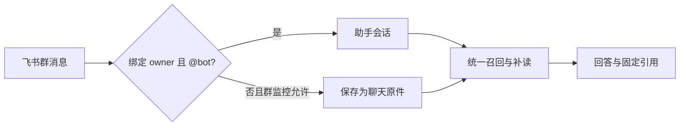

# 一次提问如何找到答案：召回、上下文与固定引用

用一条飞书群消息贯穿 omem 的搜索与回答流程：消息如何分流为即时问答或可检索原件，顶部搜索、知识搜索与助手为何共享召回却产生不同结果，全文、中文短词、符号、向量、知识与记忆分别解决什么问题，以及助手怎样补读完整上下文、固定引用并定位召回或回答故障。

来源：gpt-5.6-sol 分析，gpt-5.6-sol 独立复核；模型解释仍可被原始证据纠正。

## 从一条群消息开始

先看一个**教学示意**：owner 在受监控群里 @bot 问“这条报销约定后来怎么改的？”。消息先进入可去重的收件箱；只有发送者是已绑定 owner，且群聊确实提及 bot，才走即时问答。其他允许采集的群消息会保存成带会话、发言人与事件时间的原始材料，供以后搜索；未满足范围条件的消息则忽略。参考 [飞书消息进入助手的条件 ↗](../../../apps/server/src/integrations/lark/realtime.ts#L419 "支持消息先持久化去重，并仅在绑定 owner 且群聊提及 bot 时进入助手分支。") [问答与群消息采集分流 ↗](../../../apps/server/src/integrations/lark/realtime.ts#L503 "支持助手路由条件，以及未进入问答时按群监控范围保存消息和来源上下文。")

群聊问答会打开独立的群会话，只能看同一 chatId 已采集的证据；回答先进入可靠 outbox，再把收件箱标成完成。于是“进入 omem”有两种含义：**现在问助手**，或**先成为以后可找回的原件**。参考 [群会话证据可见性 ↗](../../../apps/server/src/integrations/lark/runtime.ts#L90 "支持群会话只读取同一 chatId 已采集证据，私聊材料不在其可见范围。") [飞书助手会话与回答交付 ↗](../../../apps/server/src/integrations/lark/runtime.ts#L147 "支持按飞书群聊或私聊打开隔离会话、调用 AssistantRuntime，并在回复入 outbox 后完成消息处理。")

参考 [飞书消息进入助手的条件 ↗](../../../apps/server/src/integrations/lark/realtime.ts#L419 "支持消息先持久化去重，并仅在绑定 owner 且群聊提及 bot 时进入助手分支。") [问答与群消息采集分流 ↗](../../../apps/server/src/integrations/lark/realtime.ts#L503 "支持助手路由条件，以及未进入问答时按群监控范围保存消息和来源上下文。") [飞书助手会话与回答交付 ↗](../../../apps/server/src/integrations/lark/runtime.ts#L147 "支持按飞书群聊或私聊打开隔离会话、调用 AssistantRuntime，并在回复入 outbox 后完成消息处理。")

## 三个入口共享召回，但不共享同一结果

顶部搜索、知识搜索和助手都可以调用同一个 `RetrievalPort.search`；结果类型统一为原件、知识、记忆或事项，并保留结构路径、检索路线和可回读的固定目标。参考 [统一检索结果与查询条件 ↗](../../../apps/server/src/retrieval/port.ts#L25 "支持原件、知识、记忆和事项共用 RetrievalHit，同时保留固定目标、结构路径、路线、引用和显式查询条件。")

| 入口 | 在共享召回上增加什么 | 用户看到什么 |
| --- | --- | --- |
| 顶部搜索 | 默认不限结果类型，可传用途、代码意图、材料角色与生效时间 | 实际命中的混合结果 |
| 知识搜索 | 限定 `knowledge`，可再限定主题路径，并按文章去重 | 最相关的讲解章节 |
| 搜索页综合回答 / 助手 | 先取候选，再叠加会话可见性、历史与自主补查 | 一段回答及其来源 |

这些差异来自入口参数，而不是三套互不相干的索引。顶部搜索直接走统一 search；知识 API 给同一端口加知识类型和 topicPath；搜索页综合回答则以只读 research 模式创建助手回合。参考 [顶部搜索入口 ↗](../../../apps/server/src/app.ts#L312 "支持顶部搜索把用途、代码意图、材料角色和生效时间交给统一 search，默认不限定结果类型。") [知识搜索入口 ↗](../../../apps/server/src/knowledge/api.ts#L118 "支持知识搜索在同一检索端口上限定 knowledge 与 topicPath，并按文章去重返回章节。") [搜索页只读综合回答 ↗](../../../apps/web/src/SearchAnswer.vue#L124 "支持搜索页以 research 模式创建助手回合，并传入当前检索用途。")

## 候选怎样被找出来

检索前先把材料变成适合查找的单位：Markdown 保留标题路径，并让表格、列表或代码与引导句保持连贯；TS/JS/Vue 以完整函数、方法或组件为单位，避免把局部变量拆出后丢失控制流。每个单位仍带固定原件行范围。参考 [结构化检索单位 ↗](../../../apps/server/src/retrieval/units.ts#L31 "支持 Markdown 结构块与完整代码操作的切分原则，说明为何检索单位保留可理解上下文。")

候选来自互补路线：

- **全文**：中文 ICU 分词后进入 FTS5/BM25，适合正文确实出现了关键词的情况。
- **中文短词**：2–8 个汉字的纯短查询额外保留整词，补“重试”之类被分词拆开的领域词；这是启发式，不是中文意图理解。参考 [中文短词与符号提取 ↗](../../../apps/server/src/retrieval/relevance.ts#L1 "支持 ICU 中文分词、2 至 8 字短词保护以及明确代码符号的保守识别。")
- **符号**：单独标识符、引号、驼峰、下划线或限定名可进入 AST 定义候选；明确查调用方时返回的是按名称找到的调用位置候选。参考 [定义与调用候选分路 ↗](../../../apps/server/src/retrieval/unified.ts#L303 "支持 AST 定义候选和名称级调用位置候选是独立检索路线。")
- **向量**：可选中文 embedding 使用锁定的 BGE-small-zh-v1.5 快照；长单位切成 400 字符、步长 320 的重叠窗口，取与问题最接近的窗口，再与全文、符号路线融合；精确路径或标识符仍优先字面匹配。参考 [中文向量模型快照 ↗](../../../apps/server/src/retrieval/embedding.ts#L17 "支持应用读取并校验锁定的 BGE-small-zh-v1.5 本地模型快照。") [向量窗口参数 ↗](../../../apps/server/src/retrieval/semantic.ts#L159 "支持长检索单位以 400 字符窗口、320 字符步长生成重叠 embedding 窗口。") [全文、向量与融合 ↗](../../../apps/server/src/retrieval/unified.ts#L414 "支持 FTS/BM25、已存语义窗口、符号候选的融合，以及精确字面查询不使用语义猜测。")
- **知识、记忆与事项**：知识章节是可读的整体解释，但仍递归保留原始来源；只有已接受且来源仍可用的文章进入投影。active 记忆与事项则把当前事实、经历、方法、下一步和期限带入 follow-up 检索。参考 [知识章节保留原始依据 ↗](../../../apps/server/src/retrieval/units.ts#L589 "支持被接受且来源可用的知识文章按章节投影，并递归还原正文引用对应的原始 SourceAnchor。") [记忆与事项检索投影 ↗](../../../apps/server/src/retrieval/units.ts#L736 "支持事项携带状态、期限与跟进，active 记忆携带正文、有效时间和原始证据。")

`purpose` 只是偏好：concept 偏知识，implementation 偏代码，background 偏知识/记忆，follow-up 偏事项、记忆和会话；它不承诺第一项一定能回答。参考 [用途与时间排序偏好 ↗](../../../apps/server/src/retrieval/unified.ts#L606 "支持不同 purpose 对知识、代码、记忆、事项和会话的偏好，并说明 needs-review 与近期 eventAt 的轻量调整。")

## 命中片段以后，怎样读懂并固定证据

“找得到”和“读得懂”使用不同粒度。命中单位保留标题路径与 `SourceAnchor`：材料 key、固定 revision、digest、起止行及覆盖片段；代码单位通常已经是完整方法，文档单位是结构块。参考 [固定原件锚点 ↗](../../../apps/server/src/retrieval/units.ts#L244 "支持检索单位用材料 key、revision、digest、行范围与片段集合固定回读位置。")

助手初轮最多取 16 个统一命中。原件命中的固定范围会展开为 evidence；知识、记忆和事项正文进入 background，同时携带它们最终指回原件的 citationIds。会话可见性在展开前逐条检查，所以群会话不会因为知识文章或记忆命中而绕过原件权限。参考 [助手初始证据与背景 ↗](../../../apps/server/src/assistant/runtime.ts#L918 "支持助手用统一检索取 16 个候选，把原件范围展开为 evidence，并把非原件结果作为带引用的 background。")

原生 Agent 把初始命中当**阅读线索**，可继续搜索材料、打开命中所在的完整章节或方法、读知识/记忆/历史并做代码导航。提交时必须给出授权材料中的真实 key 与行范围；宿主重新生成 evidence，并拒绝正文中没有原文定位的引用。参考 [最终引用授权校验 ↗](../../../apps/server/src/assistant/research.ts#L97 "支持原生研究只允许引用本次可见授权材料，并验证正文引用都有真实原文定位。") [原生调查线索与工具使用 ↗](../../../apps/server/src/assistant/acp-model.ts#L210 "支持初始命中只是阅读线索，Agent 可自主补查，并须提交真实材料 key 与精确行范围。")

## 问答模型只负责调查与表达

原生助手为每题准备只读研究工作区，把当前问题、初始原件线索、讲解、旧会话和当前事项交给 Agent。Agent 自己决定还要读哪些材料。参考 [调查工作区与问题上下文 ↗](../../../apps/server/src/assistant/acp-model.ts#L162 "支持每题建立原生调查工作区，并把当前问题、初始材料与会话背景准备给 Agent。")

运行记录把材料准备、Agent 阶段和总时间分开，并把 trace 写入研究工作区；因此“模型更快”只可能直接缩短其中一部分，检索、快照、工具读取与清理仍然存在。参考 [调查阶段耗时记录 ↗](../../../apps/server/src/assistant/acp-model.ts#L282 "支持 trace 分别记录材料准备、Agent 与总耗时，并将运行记录写入研究工作区。")

问答模型可用 `assistant.profileId` 独立选择，不会顺带改变知识写作或后台学习。不配置时采用第一个 ACP profile；配置不存在或不是 ACP 会明确报错。示例配置把 Sol 放在 `traex`、Luna 放在 `traex-fast`，需要手动选择，没有按问题复杂度自动切换，也没有双模型并行。参考 [问答 ACP profile 选择 ↗](../../../apps/server/src/config.ts#L100 "支持 assistant.profileId 独立选择问答 profile，以及缺失或非 ACP 配置明确报错。") [Sol 与 Luna 示例配置 ↗](../../../config/omem.example.json#L6 "支持示例中的 traex Sol 与 traex-fast Luna 两个独立 ACP profile。")

现有冻结材料对照里，Luna 为 136 秒、Sol 为 148 秒，其中材料准备约 37 秒；Luna 还修正过两次历史引用。这个小样本说明独立 profile 值得试用，却不能证明稳定加速或质量等价。参考 [快模型实际对照边界 ↗](../../../docs/reader-first/fast-assistant.md#L15 "支持 Luna 与 Sol 的单次耗时、材料准备成本和引用修正现象，并明确不能据此声称稳定加速。")

## 当前边界：中文、重排、时间与代码导航

当前默认中文向量模型是锁定快照的 BGE-small-zh-v1.5，应用只读取并校验本地模型，不在运行时隐式下载。cross-encoder 重排只有显式配置才启用；候选未进入前 40 时，后续重排也无法补回。参考 [中文向量模型快照 ↗](../../../apps/server/src/retrieval/embedding.ts#L17 "支持应用读取并校验锁定的 BGE-small-zh-v1.5 本地模型快照。") [向量与重排配置开关 ↗](../../../apps/server/src/retrieval/factory.ts#L9 "支持中文 embedding 由 enabled 开启，而 reranker 只有显式配置时才加载。")

`timeRange` 统一比较检索单位的 `provenance.time`，但这个时间随结果类型而不同：原件使用版本记录的创建时间，知识使用文章生成时间，事项使用事项创建时间，记忆使用最近更新时间。它因此不是聊天 `eventAt`，也不是“回到某一历史时点”的 as-of 查询。参考 [统一时间过滤与有效期 ↗](../../../apps/server/src/retrieval/unified.ts#L225 "支持 timeRange 比较每个检索单位的 provenance.time，同时 effectiveAt 单独检查材料有效期。") [原件的检索时间 ↗](../../../apps/server/src/retrieval/units.ts#L395 "支持原件检索单位把版本记录的 created_at 写入 provenance.time，并将聊天事件时间另存为 eventAt。") [知识的检索时间 ↗](../../../apps/server/src/retrieval/units.ts#L672 "支持知识检索单位把文章生成时间写入 provenance.time。") [事项的检索时间 ↗](../../../apps/server/src/retrieval/units.ts#L736 "支持事项检索单位把事项 created_at 写入 provenance.time，并把事项版本时间另存为 eventAt。") [记忆的检索时间 ↗](../../../apps/server/src/retrieval/units.ts#L804 "支持记忆检索单位把 updated_at 写入 provenance.time，并把 valid_from 另存为 eventAt。")

`effectiveAt` 是另一条条件，只依据材料说明中明确保存的有效期；follow-up 排序则会对事项、记忆和会话的 `eventAt` 给予轻量近期偏好。这两者都不构成完整时态推理。参考 [统一时间过滤与有效期 ↗](../../../apps/server/src/retrieval/unified.ts#L225 "支持 timeRange 比较每个检索单位的 provenance.time，同时 effectiveAt 单独检查材料有效期。") [用途与时间排序偏好 ↗](../../../apps/server/src/retrieval/unified.ts#L606 "支持不同 purpose 对知识、代码、记忆、事项和会话的偏好，并说明 needs-review 与近期 eventAt 的轻量调整。")

代码 callers 是名称级 AST 候选，不是类型解析后的完整调用图：同名接收者可能混入，别名或动态调用可能漏掉。重排对长单位最多读取两个局部窗口，最高局部分也不能证明整篇能回答；Agent 仍可继续打开完整原件。参考 [调用候选与局部重排限制 ↗](../../../docs/reader-first/code-navigation-and-passages.md#L17 "支持 callers 仅是名称级候选，以及长单位局部窗口、输入截断和最高局部分的限制。")

## 怎样区分召回问题与回答问题

定位时先保留四层观察：**实际命中 → Agent 补读 → 最终引用 → 答案条件**。

1. 能回答的原件或知识章节根本没进候选，或明确符号没进定义/调用候选：这是召回、分类、过滤或索引问题。先看 `retrieval/units.ts`（单位与上下文）、`relevance.ts`（中文词与符号）、`unified.ts`（候选、融合、用途和时间偏好）、`factory.ts`（向量与重排开关）。参考 [结构化检索单位 ↗](../../../apps/server/src/retrieval/units.ts#L31 "支持 Markdown 结构块与完整代码操作的切分原则，说明为何检索单位保留可理解上下文。") [中文短词与符号提取 ↗](../../../apps/server/src/retrieval/relevance.ts#L1 "支持 ICU 中文分词、2 至 8 字短词保护以及明确代码符号的保守识别。") [定义与调用候选分路 ↗](../../../apps/server/src/retrieval/unified.ts#L303 "支持 AST 定义候选和名称级调用位置候选是独立检索路线。") [全文、向量与融合 ↗](../../../apps/server/src/retrieval/unified.ts#L414 "支持 FTS/BM25、已存语义窗口、符号候选的融合，以及精确字面查询不使用语义猜测。") [向量与重排配置开关 ↗](../../../apps/server/src/retrieval/factory.ts#L9 "支持中文 embedding 由 enabled 开启，而 reranker 只有显式配置时才加载。")
2. 正确材料已命中，或 Agent 已打开完整方法，但回答仍漏条件、混淆计划与现状、不给使用入口：这是上下文选择、调查停止或生成表达问题。先看 `assistant/runtime.ts`（初始 evidence/background 与会话可见性）、`assistant/acp-model.ts`（自主调查）、`assistant/research.ts`（引用授权与行范围）。参考 [助手初始证据与背景 ↗](../../../apps/server/src/assistant/runtime.ts#L918 "支持助手用统一检索取 16 个候选，把原件范围展开为 evidence，并把非原件结果作为带引用的 background。") [最终引用授权校验 ↗](../../../apps/server/src/assistant/research.ts#L97 "支持原生研究只允许引用本次可见授权材料，并验证正文引用都有真实原文定位。") [调查工作区与问题上下文 ↗](../../../apps/server/src/assistant/acp-model.ts#L162 "支持每题建立原生调查工作区，并把当前问题、初始材料与会话背景准备给 Agent。")
3. 命中的知识文章本身只有宽泛职责或已经过期：这是派生内容质量与更新问题，不应靠调排序掩盖。知识结果会保留 reviewState 与原始引用，便于回原文核对。参考 [知识章节保留原始依据 ↗](../../../apps/server/src/retrieval/units.ts#L589 "支持被接受且来源可用的知识文章按章节投影，并递归还原正文引用对应的原始 SourceAnchor。") [用途与时间排序偏好 ↗](../../../apps/server/src/retrieval/unified.ts#L606 "支持不同 purpose 对知识、代码、记忆、事项和会话的偏好，并说明 needs-review 与近期 eventAt 的轻量调整。")

最重要的判断是：**Agent 补查成功不等于首轮召回准确；固定引用合法也不等于解释完整。**搜索负责提供可读线索，助手负责继续调查并组织答案，两层要分别检查。
