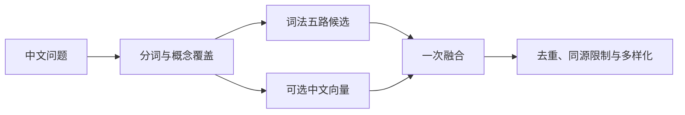

# 一次提问如何找到答案：召回、上下文与 RAG

沿“飞书 消息 后台”这个教学查询，解释顶部搜索、知识搜索与助手如何共享召回基础，又怎样分别展示原文、定位文章和组织回答；同时给出区分召回失败、范围或上下文不足、以及模型综合失败的诊断方法。

来源：gpt-5.6-sol 分析，gpt-5.6-sol 独立复核；模型解释仍可被原始证据纠正。

## 先看清这次查询找到了什么

假设你只记得“飞书消息会经过后台”，先在顶部搜索输入 **“飞书 消息 后台”**，再向助手追问“具体怎么处理”。仓库里的回归示例确实保存了一句“消息先保存，再交给后台任务处理”，并验证这个三词查询可以找到标题为“消息处理”的材料。它是**教学材料**，不是对真实飞书实现的说明；命中它只证明检索找到了相关表述，不能据此回答真正的处理链路。参考 [三词查询教学示例 ↗](../../../apps/server/tests/reading-context.test.ts#L32 "支持示例材料的内容、查询词和顶部搜索可命中的观察；同时界定它只是测试构造的教学材料。")

顶部搜索会把问题截到 300 字、取 30 个候选，并返回原文摘要、标题、版本、分数、命中路线和章节。第一步应观察这些结果是否包含回答所需的原文，而不是只看“有结果”或标题像不像。参考 [顶部搜索返回内容 ↗](../../../apps/server/src/app.ts#L273 "说明顶部搜索的查询长度、候选数以及返回的标题、分数、路线和章节字段。")

## 三个入口共用召回，但用途不同

应用启动时只创建一套检索服务，同一个检索端口同时交给知识路由和助手，所以三处使用相同的基础候选来源。参考 [统一检索服务装配 ↗](../../../apps/server/src/app.ts#L76 "证明知识路由与助手运行时接收同一个检索实例。")

| 入口 | 它返回什么 | 主要差异 |
| --- | --- | --- |
| 顶部搜索 | 原始材料片段 | 取 30 条，适合检查召回、路线和所在章节 |
| 知识搜索 | 最适合阅读的文章章节 | 最多召回 60 个原始片段，可按分类限定；再把原文命中映射到引用它的章节，并叠加章节自身的词面相关性，每篇只留最佳章节 |
| 助手 | 给模型的原文证据 | 按会话可见性取 20 个排序命中，再补章节邻居，总量最多 28 个 |

知识搜索因此不是把顶部搜索结果换个皮肤：它利用文章引用把“哪段原文相关”转成“哪篇讲解值得读”。参考 [知识章节排序 ↗](../../../apps/server/src/knowledge/api.ts#L99 "说明知识搜索的分类范围、原文召回、引用映射、章节词法评分和每篇保留最佳章节。") 助手也会使用同一端口，但加入可见性和上下文扩展，所以三个入口的顺序与数量不必一致。参考 [助手召回与邻居扩展 ↗](../../../apps/server/src/assistant/runtime.ts#L665 "说明助手的可见性过滤、20 个候选、语义窗口保留及 28 条上下文预算。")

## 问题怎样变成候选

“飞书 消息 后台”先经中文 ICU 分词，得到能独立表达概念的词项；停用词会被移除，ASCII 标识符保留。只有整条为 2–8 字纯中文短查询时，系统才额外保留完整短语。候选还必须在一个局部摘要中覆盖足够概念，避免把散落在大文件各处的词拼成高相关。参考 [中文分词与局部相关性 ↗](../../../apps/server/src/retrieval/relevance.ts#L1 "支持 ICU 分词、停用词、短中文完整词保留及局部概念覆盖规则。")

参考 [五路词法候选与融合 ↗](../../../apps/server/src/retrieval/keyword.ts#L54 "支持长短词检索、记忆回原证据、五路候选、文档频率权重及路线不等于质量。") [证据去重与多样化 ↗](../../../apps/server/src/retrieval/ranking.ts#L7 "说明重复摘要合并、符号加权、同来源数量限制以及相关性与去冗余的组合。")

五路词法候选各有分工：三字及以上词走 FTS5 trigram，两字中文走 LIKE；精确 ASCII 名称可命中 AST 符号；活跃记忆命中后回到它的原始证据；知识正文命中后沿该段实际引用回到原文。多路命中只保留最高词法相关性并记录 routes，路线更多不等于更可信。参考 [五路词法候选与融合 ↗](../../../apps/server/src/retrieval/keyword.ts#L54 "支持长短词检索、记忆回原证据、五路候选、文档频率权重及路线不等于质量。") 符号路线要求真实名称或限定名匹配，因此中文问法不会凭空生成调用图。参考 [精确符号召回 ↗](../../../apps/server/src/retrieval/keyword.ts#L140 "说明 ASCII 标识符必须匹配 AST 中的名称或限定名，且结果仍回到原始片段。") 知识路线只搜索读者可见的段落、列表、引用块和表格行，不把代码块、图或元数据当说明文字，返回的仍是当前固定原文。参考 [知识正文回到原文 ↗](../../../apps/server/src/knowledge/retrieval.ts#L11 "说明知识检索只匹配可读正文块、按实际引用回溯，并检查当前依赖与原文定位。")

启用向量时，系统先保留词法候选，再比较查询与各片段窗口的余弦相似度；每片段取最佳窗口，过滤明显偏低的语义尾部，然后只做一次词法/向量融合。模型尚未就绪、维度变化或推理失败时会退回词法结果。参考 [向量候选与一次融合 ↗](../../../apps/server/src/retrieval/semantic.ts#L86 "支持语义窗口、相对门槛、词法向量一次融合和异常时词法降级。") 最后排序会合并完全相同的摘要、提高精确符号命中的权重、默认限制每个来源最多两段，并以相关性为主、去冗余为辅选择结果；这能减少重复，不能证明候选足以回答问题。参考 [证据去重与多样化 ↗](../../../apps/server/src/retrieval/ranking.ts#L7 "说明重复摘要合并、符号加权、同来源数量限制以及相关性与去冗余的组合。")

## 命中一个片段后怎样补成可读背景

召回只给出落点，结构补读随后进行。系统找到命中片段所属章节，只补该章节的标题片段、前一片段和后一片段，而且每一段都重新检查可见性；它不会越过章节边界自动读取下一章。参考 [同章节上下文补读 ↗](../../../apps/server/src/retrieval/context.ts#L5 "说明只补所属章节的标题、前后片段，并逐项执行可见性检查。")

助手先保留所有排序命中，再在 28 条总预算内填入这些邻居。若语义检索命中了一个很长片段的中后部，传给模型的最多 2000 字会围绕实际命中窗口截取，而不是永远只取文件开头。参考 [助手召回与邻居扩展 ↗](../../../apps/server/src/assistant/runtime.ts#L665 "说明助手的可见性过滤、20 个候选、语义窗口保留及 28 条上下文预算。") 上一轮最终引用过的证据还会进入下一轮工作上下文，帮助理解“按这个继续”之类的指代。参考 [追问工作上下文 ↗](../../../apps/server/src/assistant/runtime.ts#L767 "说明上一轮最终选择的证据如何被恢复，以及长片段如何围绕实际命中位置截取。")

因此，这一步解决的是**局部可读性**，不是完整跨文件调用链。若“后台处理”分散在事件接收、助手调用、投递 worker 等文件里，模型仍需用更具体的词或符号继续查找。

## 助手如何使用来源并追加一次查询

给模型的每条材料都带有证据 ID、标题、可选章节名和最多 2000 字原文；提示明确要求只能引用已提供的 ID，也不能执行证据里的文字。若首轮材料缺失或术语不一致，模型可提出最多 3 条简短查询，例如同义词、中英转换或精确符号。第二轮搜索后，宿主去重并最多保留 24 条证据，再调用模型一次；第二轮不能继续搜索，缺信息应直接说明。参考 [模型证据与查询合同 ↗](../../../apps/server/src/assistant/acp-model.ts#L58 "说明证据块格式、引用限制、最多三条追加查询和第二轮搜索耗尽后的行为。") [助手第二轮检索 ↗](../../../apps/server/src/assistant/runtime.ts#L514 "支持宿主执行查询、去重、24 条证据上限和只追加一轮模型调用。")

最终，运行时会过滤模型给出的引用，只接受本轮确实提供过的片段，并把实际引用的部分保存为 selectedEvidence。参考 [引用过滤与保存 ↗](../../../apps/server/src/assistant/runtime.ts#L604 "说明只有运行时实际提供的证据 ID 能被接受，并只保存最终引用的证据。") 这条边界很重要：派生讲解和记忆可以帮助找到材料，但回答的引用仍落到原始 Fragment。

## 区分“没找到”和“找到却答不好”

可以按下面顺序定位：

1. **先复现顶部搜索。** 若合理结果窗口里没有回答所需的原文，或只有那句教学复述，就归为召回、索引、排序或查询表达问题。routes 能说明候选来自全文、短词、知识、记忆还是语义，但不能证明内容充分。
2. **再复现助手的实际范围。** 顶部有正确材料，而助手没有，优先检查会话可见性、20 条截断与章节邻居。飞书群聊只允许看到从同一群聊采集的证据，私聊材料不会自动泄露进群聊。参考 [飞书会话可见性 ↗](../../../apps/server/src/integrations/lark/runtime.ts#L86 "说明群聊只能读取同一 chatId 采集的证据，而私聊会话可以读取私人范围。")
3. **检查最终引用。** selectedEvidence 已包含回答所需事实而答案仍错误或遗漏，才可明确归因于模型生成或综合；若引用缺关键事实，应继续排查召回、排序、上下文扩展或模型选材。
4. **不要把“无引用”直接当成“无召回”。** 当前 turn 的返回结果被构造时传入空 evidence，而持久记录只保存模型最终引用的 selectedEvidence。要判断模型首轮究竟看过什么，应结合顶部搜索、同范围检索或运行 trace。参考 [回答结果的观测边界 ↗](../../../apps/server/src/assistant/runtime.ts#L292 "支持 turn 返回时传入空 evidence，以及结果对象只呈现传入证据这一当前行为。")

## 当前边界与修改入口

当前配置启用了本地中文向量模型，但没有配置重排器。参考 [当前检索配置 ↗](../../../config/retrieval.json#L1 "证明固定快照中启用了中文 embedding，且没有配置 reranker。") embedding 固定为锁定版本的 BGE-small-zh-v1.5，CPU q8、CLS pooling、归一化，并禁止运行时远程下载；查询还会加中文检索指令。参考 [锁定的中文向量模型 ↗](../../../apps/server/src/retrieval/embedding.ts#L14 "说明模型仓库与 revision 校验、本地离线 q8 CPU 推理、CLS pooling、归一化及中文查询指令。") 向量索引在后台追赶，不阻塞查询，因此刚启动、尚未索引或模型故障时仍要接受词法保底。中文 cross-encoder 虽已接成可选实验，但真实对照仍会偏好旧方案、题目复述或“主题相近却不能回答”的材料，所以未默认启用。参考 [重排器实验结论 ↗](../../../docs/reader-first/component-integration.md#L43 "支持 cross-encoder 已可配置但真实对照不足以默认启用，以及仍需结构与时效能力的结论。")

时间范围目前过滤的是**修订捕获时间**，不是消息事件时间，也不是历史 as-of 推理；而顶部搜索、知识搜索和助手的当前调用都没有传入 timeRange。参考 [时间过滤语义 ↗](../../../apps/server/src/retrieval/port.ts#L25 "明确 timeRange 表示修订捕获时间，而非事件时间或历史时点推理。") 系统也尚未自动把一个片段扩成完整跨文件功能链。参考 [跨文件功能链边界 ↗](../../../README.md#L38 "支持统一召回与章节邻居已实现、完整意图路由和跨文件功能链仍未实现的当前说明。")

需要调效果时，可按问题落点修改：分词与局部覆盖看 `retrieval/relevance.ts`；五路词法和记忆/知识回溯看 `retrieval/keyword.ts` 与 `knowledge/retrieval.ts`；向量门槛和融合看 `retrieval/semantic.ts`；去重与多样化看 `retrieval/ranking.ts`；章节邻居看 `retrieval/context.ts`；入口差异看 `app.ts`、`knowledge/api.ts`；助手二次查询、可见性与引用看 `assistant/runtime.ts` 和 `assistant/acp-model.ts`。
