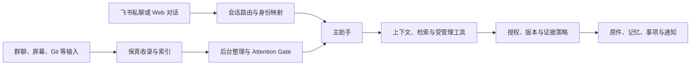

# 渐进记忆与个人主助手设计

本章概述 v3 设计如何先保留可追溯材料，再按实际价值渐进整理，并规划由飞书与 Web 共用的持久主助手、受管理操作和会话路由。该文档在 2026 年 9 月 27 日仍标记为待实现，因此这里只陈述设计目标与当时基线，不把后续实现状态或验证结果当作既成事实。

来源：gpt-5.6-sol 分析，gpt-5.6-sol 独立复核；模型解释仍可被原始证据纠正。

## 为什么采用渐进记忆

v3 用渐进整理替代“材料一进入就全量提炼、非自动通过便询问用户”的旧路径，同时计划复用既有数据、事务、任务、ACP、飞书和界面基础设施。设计首先保证原材料与上下文可找回，再用轻量、可修正的分类建立基础结构；深度整理的优先级由实际任务、反复使用、用户纠正和来源变化决定。缺少背景时先保留来源并按需补证，只有会改变用户行动的选择才主动询问。参考 [渐进记忆原则 ↗](../../../docs/implementation/assistant-v3/README.md#L3 "支持 v3 替换旧默认路径、优先保留原材料、采用轻量分类并按使用价值渐进整理的设计原则。")

## 主助手负责什么

主助手面向当前工作上下文，计划支持查询材料、回答问题、维护事项与知识关系、安排提醒，并只在明确授权范围内驱动受管理工具。私聊和明确提及进入交互路径，群聊背景、屏幕观察与 Agent 日志进入采集路径，内部状态只形成有限建议。文档同时明确：当时普通 owner 私聊尚未接入，持久 AssistantRuntime 仍需新增。参考 [主助手职责与基线缺口 ↗](../../../docs/implementation/assistant-v3/README.md#L15 "支持主助手计划承担的上下文、问答、事项和工具职责，并证明文档记录时持久飞书主助手尚未可用。")

## 会话、检索与后台整理如何协作

这套设计把交互请求和被动材料分流：前者构建上下文并调用检索或治理工具，后者先收录、索引，再由后台任务按价值整理；只有确需交流的问题才经 Attention Gate 返回主助手。参考 [主助手协作流程 ↗](../../../docs/implementation/assistant-v3/README.md#L23 "支持飞书与 Web 路由、上下文构建、检索、受管理工具、后台整理和 Attention Gate 之间的设计关系。")

## 路由、安全与会话边界

路由依据主体、频道、会话线程、是否明确呼叫助手及转述状态决定处理方式。群内回答只能使用群可见信息，不能因为提问者也是 owner 就泄露私人记忆；跨 Web 与飞书可以共享记忆和事项，但只有用户显式关联时才复用同一会话。设计还要求模型轮次串行、重启后从持久记录恢复，并区分已投递与未投递回复；取消或超时后不得继续产生未授权动作。参考 [消息与会话路由 ↗](../../../docs/implementation/assistant-v3/README.md#L45 "支持不同输入的路由规则、群聊可见性、跨端显式关联、持久恢复以及取消后的行为边界。")
