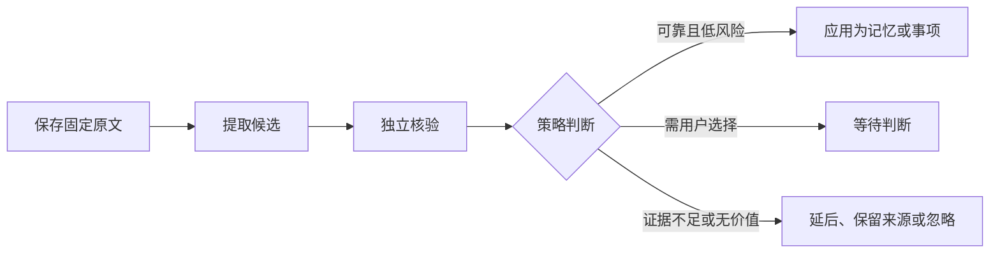

# 规则变了以后：原文、记忆与待办如何更新

用“重试三次改为五次”和“明早 9 点跟进评审”两个例子，解释材料保存、记忆应用、来源重核验、Wiki 更新与事项提醒各自的流程和状态，帮助读者判断什么已经生效、什么仍在排队或等待决定。

来源：gpt-5.6-sol 分析，gpt-5.6-sol 独立复核；模型解释仍可被原始证据纠正。

## 先分清两件事：事实变更与用户交办

假设同一天发生两件事：项目约定从“重试三次”改为“重试五次”；另一条消息是你明确说“明早 9 点提醒我跟进张三的评审”。前者是**来源内容发生变化**，系统要重核验由它产生的记忆；后者才是**用户交办**，可以形成个人事项。

约定文档即使写着“张三明早评审”，也只是待理解的材料，不能自动变成你的待办。日常消息规则明确区分讨论、他人承诺和本人交办；服务端还会检查当前话语是否真有任务意图，咨询问句不会因为模型提出写操作就创建事项。参考 [讨论与交办边界 ↗](../../../apps/server/src/assistant/message-workflows.ts#L1 "支持约定文本、他人承诺与当前用户明确交办必须区分。") [任务意图服务端校验 ↗](../../../apps/server/src/assistant/runtime.ts#L657 "支持咨询或非明确交办时拒绝模型提出的创建事项操作。")

## 保存原文不等于记忆已经生效

材料进入系统后，先按来源身份找到同一份 Source。内容相同会复用当前版本；内容变化则新增不可变 Revision，并切成可定位的 Fragment。旧版本仍保留，所以以后看到“重试三次”的历史引用，仍能回到当时原文。参考 [来源版本保存 ↗](../../../apps/server/src/store.ts#L168 "支持同一来源复用相同内容、内容变化新增修订并保存可定位片段。")

原始材料保存后会排入学习作业；模型派生材料不会再次自我学习。后台学习只有在 `learning.enabled` 开启且存在有效 Agent 配置时才运行。参考 [捕获后排队 ↗](../../../apps/server/src/store.ts#L348 "支持原始材料进入提取队列而派生材料不自我循环学习。") [后台学习启用条件 ↗](../../../apps/server/src/app.ts#L92 "支持学习流水线依赖显式启用和有效 Agent 配置。")

提取器只提出候选；有候选才排入独立核验，核验结果再整批交给 MemoryService。证据无效或被反驳会拒绝，噪声会忽略，证据不足会延后，他人的未验证交办只保留为来源；只有明确、受支持且影响可控的结果才自动应用。参考 [候选提取与核验排队 ↗](../../../apps/server/src/learning/pipeline.ts#L421 "支持提取器形成候选后再排入独立核验步骤。") [独立核验与整批评估 ↗](../../../apps/server/src/learning/pipeline.ts#L458 "支持核验器覆盖全部候选并把整批结果交给记忆服务。") [记忆应用策略 ↗](../../../apps/server/src/memory/service.ts#L780 "支持拒绝、忽略、延后、仅保留来源、等待决定与自动应用的区别。")

因此，判断“完成”不能只看作业写着“处理完成”：它可能只是某一步结束，候选仍在核验。真正生效要看候选是否为“已生效”。参考 [处理状态文案 ↗](../../../apps/web/src/LearningView.vue#L22 "支持作业步骤完成不等于候选记忆已生效。")

## 规则改版后，旧结论先冻结再重核验

当同一来源出现“重试五次”的新版本，系统会提高来源有效性版本，把仍依赖旧版的记忆依赖标为过期，并立即把这些记忆设为 `invalidated`；随后记录受影响集合并排入刷新作业。这样旧结论不会在核验期间继续冒充当前事实。参考 [来源更新使旧记忆失效 ↗](../../../apps/server/src/store.ts#L231 "支持新修订提升有效性版本、标记旧依赖并排入刷新。")

刷新不是旁路改写。它先确认新版本仍是来源当前版本，再复用普通提取作业；研究上下文只允许当前原始材料作为证据，同时把失效记忆作为待更新目标，要求更新同一条记忆而非新建副本。如果来源又出现更新版本，本轮记为 `superseded`。参考 [刷新复用提取作业 ↗](../../../apps/server/src/learning/pipeline.ts#L126 "支持刷新确认当前来源版本、复用普通提取身份并识别被取代的刷新。") [重核验上下文约束 ↗](../../../apps/server/src/learning/pipeline.ts#L254 "支持只以当前原始材料取证并更新同一条失效记忆。")

| 你看到的状态 | 应怎样理解 |
| --- | --- |
| 原文已保存 | 新版本可读；不代表模型已运行 |
| 等待处理 | 已排队，尚未产生模型结果 |
| 记忆已失效 / `needs_review` | 旧结论已冻结，尚未完全修复 |
| `applied` | 受影响记忆已恢复活动，并依赖新版本 |
| `superseded` | 本轮刷新已被更晚的来源版本取代 |

刷新记录依据实际记忆状态和当前依赖对账，调度成功只代表已排后续步骤。示例行为是：同一条记忆从版本 1 更新到版本 2，内容由 3 变为 5，旧原文仍可读，刷新最终才标为已应用。参考 [刷新状态对账 ↗](../../../apps/server/src/learning/refresh.ts#L27 "支持排队与应用的区别，以及 needs_review、applied、superseded 的判定。") [重试次数更新示例 ↗](../../../apps/server/tests/learning-refresh.test.ts#L253 "支持同一记忆版本递增、旧原文保留且独立重核验后恢复活动状态的教学示例。")

## 记忆重核验与 Wiki 更新是两条流程

记忆面向助理后续判断和行动；Wiki 面向读者解释问题。两者都固定引用来源版本，但状态并不联动。来源或子文章变化时，知识仓储会把受影响文章标为非当前，并把过期沿文章依赖向上传递；历史文章仍可按固定版本读取。参考 [Wiki 新鲜度传播 ↗](../../../apps/server/src/knowledge/repository.ts#L156 "支持来源或子文章变化把受影响文章标为非当前，并可读取固定历史版本。")

这一步只表示“旧文章需要重看”，不会自动写出新正文。重新整理 Wiki 需要显式选择当前材料并填写阅读目标；只有新产物发布且依赖仍未变化，文章才重新成为当前版本。参考 [显式整理文章 ↗](../../../apps/server/src/knowledge/api.ts#L147 "支持选择固定材料和阅读目标后显式启动知识生成。") [知识发布条件 ↗](../../../apps/server/src/knowledge/repository.ts#L122 "支持发布前检查依赖未变化，并在成功发布后更新当前文章。")

所以可能出现两种正常的中间状态：记忆已经依据“五次”恢复为活动状态，但 Wiki 仍非当前；或者 Wiki 已重写，而某条高影响记忆仍在等待判断。不要用其中一边的状态推断另一边已经完成。

## 等待、跟进、截止、暂缓和已读各管一件事

事项状态只有 `open`、`waiting`、`done`、`cancelled`。其中 `waiting` 表示在等外部人或结果，不是完成。跟进数据另存等待对象、下次检查时间、暂缓时间、用户原始时间表达和时区。参考 [事项状态与跟进字段 ↗](../../../packages/contracts/src/task-flow.ts#L3 "支持事项状态、等待对象、检查时间、暂缓时间、原始时间表达和时区的定义。")

- **等待对象 `waiting_on`**：在等谁或什么，必须来自当前用户原话，不能猜。
- **下次检查 `next_check_at`**：我什么时候回来查看进展，不是事情必须完成的时间。
- **截止时间 `due_at`**：事情真正应完成的时间；改期修改它。
- **暂缓 `snoozed_until`**：在此之前不提醒。暂缓会保留原等待对象，并把下一次检查移到暂缓时间，不会延长截止时间。参考 [跟进信息来自用户原话 ↗](../../../apps/server/src/tasks/follow-up.ts#L5 "支持等待对象和时间表达必须来自当前用户指令，已有时间戳由服务端规范化。") [等待暂缓与截止 ↗](../../../apps/server/src/memory/service.ts#L97 "支持等待、暂缓、改期分别修改不同的事项字段。")

在贯穿示例中，明确消息“明早 9 点提醒我跟进张三的评审”可以创建 waiting 事项：等待对象是张三，`time_expression` 保留“明早 9 点”，得到明确时刻后再按用户时区保存 `next_check_at`；若你没说截止时间，`due_at` 仍为空。若只说“明早”而无法得到具体时刻，助理应追问，不能自行补一个分钟数。服务端会检查时间原话确实来自当前指令并规范化已经给出的时间戳，但这项校验本身不负责证明模糊自然语言被正确换算。参考 [跟进信息来自用户原话 ↗](../../../apps/server/src/tasks/follow-up.ts#L5 "支持等待对象和时间表达必须来自当前用户指令，已有时间戳由服务端规范化。") [明确时间合同 ↗](../../../apps/server/src/assistant/acp-model.ts#L103 "支持跟进时间与截止时间分离，以及没有具体时间时应询问而非虚构分钟。") [明确时刻跟进示例 ↗](../../../apps/server/tests/task-follow-up.test.ts#L10 "支持以含日期和上午九点的明确表达创建 waiting 事项，并按上海时区保存对应时间戳。")

到点后，运行中的服务扫描开放或等待事项，生成去重的**站内通知**，提示你检查进展，并明确不会自动联系张三或声称已经收到回复。参考 [站内跟进提醒 ↗](../../../apps/server/src/tasks/follow-up.ts#L17 "支持扫描开放或等待事项、区分截止与跟进触发、去重并明确不自动联系他人。")

把通知标为已读只会记录阅读时间，不会把事项改为完成，也不会批准记忆变更。完成或取消才是事项状态变化。参考 [通知已读操作 ↗](../../../apps/server/src/store.ts#L630 "支持已读只写入通知阅读时间，不改变事项状态。")

## 怎样判断下一步，以及当前边界

你可以按下面顺序判断：先确认原文版本是否已保存；再到“材料处理”看后台是否启用、作业是否仍排队；接着看候选是已生效、等待判断还是被拒绝；来源改版时再看刷新是否 `applied`。Wiki 显示非当前时，需要单独发起整理。事项则看状态、截止时间和跟进时间，通知已读不能替代完成。

当前系统能够在配置可用时自动提取、核验并应用低风险记忆，能在来源更新后重核验，也能按跟进或截止时间生成站内提醒。真正影响现有工作的大范围变化或跨来源冲突仍可能等待用户决定。尚不能自动联系等待对象、监听对方回复并完成事项；持续的人物、项目与主题综合理解、周期回顾等仍是后续能力。参考 [当前记忆与事项边界 ↗](../../../docs/reader-first/current-system.md#L52 "支持已实现的记忆链、来源重核验和站内提醒，以及尚未实现的持续理解与自动监听回复。")

若要修改机制，主要入口分别是：捕获与失效在 `store.ts`，重核验编排在 `learning/pipeline.ts` 与 `learning/refresh.ts`，应用策略在 `memory/service.ts`，事项时间与提醒在 `tasks/follow-up.ts`，Wiki 新鲜度与发布在 `knowledge/repository.ts` 和 `knowledge/pipeline.ts`。这些入口对应前述不同状态，不应合并成一条“处理完成”开关。延伸阅读：[当前产品入口概览 ↗](../../../README.md#L38 "提供当前项目对记忆、事项、Wiki 与后续能力的总体入口说明。")
