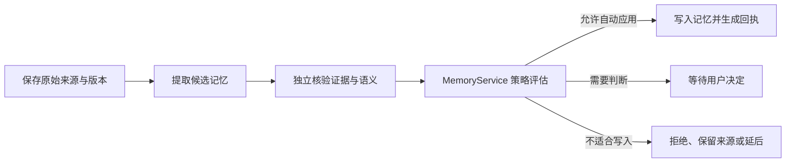

# 规则变化后，记忆与待办如何各自推进

以“重试次数改为五次”和“明早跟进评审”为贯穿示例，说明原始材料如何成为可用记忆、来源变化后如何失效与重核验、Wiki 为何需要独立更新，以及等待、跟进、截止、稍后提醒和通知已读之间的区别。

来源：gpt-5.6-sol 分析，gpt-5.6-sol 独立复核；模型解释仍可被原始证据纠正。

## 先分清两件事：规则变化与个人交办

假设项目文档把“最多重试三次”改成“最多重试五次”，同时你另发消息说“帮我跟进张三的评审回复，明早提醒我检查”。系统不应把它们揉成一个任务：前者是**同一来源的新版本**，要重新判断依赖它的记忆；后者是**当前用户明确交办的跟进事项**。

讨论、会议记录或项目约定可以成为有出处的材料，但其中出现“需要跟进”并不自动代表用户把事情交给了助手。只有本人明确要求记录或跟踪，才允许创建个人待办；他人的承诺仍只是带归属的观察。参考 [消息处理边界 ↗](../../../apps/server/src/assistant/message-workflows.ts#L4 "支持区分明确交办、讨论材料、等待跟进与事项回顾，说明讨论内容本身不授权创建个人任务。") [候选提取规则 ↗](../../../packages/agent-runtime/roles/extractor/1/prompt.md#L3 "说明提取器只能基于固定证据提出候选、不能执行或批准，并规定刷新时更新同一记忆及不得把旧派生正文当证据。")

这一边界也经过实际场景验证：明确要求跟进评审会建立等待事项，而询问“张三说会回复是什么意思”不会创建个人任务。参考 [明确跟进示例 ↗](../../../apps/server/tests/task-follow-up.test.ts#L28 "支持明确要求跟进会创建 waiting 事项，跟进时间与截止时间分开，且稍后提醒和取消会按任务状态推进。") [讨论不创建任务 ↗](../../../apps/server/tests/task-follow-up.test.ts#L52 "支持仅讨论他人承诺时不会创建个人待办。")

## 原始记录怎样成为可用记忆

保存材料和更新记忆是两个阶段。原文先作为可追溯的来源版本保留下来；学习管线随后处理提取、独立核验和来源刷新三类持久作业。作业开始时会确认自己读取的仍是当前来源版本和有效期，过期输入不能继续覆盖新材料。参考 [学习作业类型 ↗](../../../apps/server/src/learning/pipeline.ts#L105 "说明学习 worker 处理提取、核验和依赖刷新三类持久作业。") [过期输入保护 ↗](../../../apps/server/src/learning/pipeline.ts#L180 "支持作业必须匹配当前来源头版本与有效期，否则以过期输入拒绝。")

提取器只能提交带固定证据的候选，不能自行执行动作或宣称已经应用；有候选时，管线把持久化的提取结果交给独立核验，再将完整批次交给 MemoryService。参考 [候选提取规则 ↗](../../../packages/agent-runtime/roles/extractor/1/prompt.md#L3 "说明提取器只能基于固定证据提出候选、不能执行或批准，并规定刷新时更新同一记忆及不得把旧派生正文当证据。") [提取后进入核验 ↗](../../../apps/server/src/learning/pipeline.ts#L421 "说明提取结果持久化后，有候选才排入独立核验；无候选则直接协调来源刷新。")

因此应分别理解这些状态：**原文已保存**、**提取已完成**、**核验已完成**、**记忆已应用**和**等待判断**。MemoryService 的结果还可能是拒绝、延后使用、仅保留为来源或忽略噪声；只有真正应用时才有应用回执。整批变化超过自动应用预算时，原本可自动应用的候选也会先停在等待判断，而不是部分写入。参考 [记忆策略结果 ↗](../../../apps/server/src/memory/service.ts#L18 "支持区分自动应用、等待判断、拒绝、延后、保留来源和忽略噪声，并区分应用回执与待决策记录。") [整批候选核验与评估 ↗](../../../apps/server/src/learning/pipeline.ts#L458 "说明独立核验覆盖每个候选后，整批交给 MemoryService 评估，并将真实评估结果用于刷新协调。")

## 来源变化后，旧结论如何失效与重核验

当同一来源出现新版本时，捕获事务会记录一次来源刷新并排入依赖刷新作业。系统先冻结本次受影响的记忆集合：这些记忆依赖旧来源、依赖已过期，并已被标为失效。这样即使作业重复投递，已经修复的项目也不会从最初的影响范围中消失。参考 [来源更新排队 ↗](../../../apps/server/src/store.ts#L262 "支持同一来源更新时记录刷新并在事务内排入依赖刷新作业。") [冻结受影响集合 ↗](../../../apps/server/src/learning/refresh.ts#L6 "说明来源刷新首次记录时固定受影响记忆集合，重复处理不会缩小最初范围。")

刷新作业不会直接改写旧结论。它先确认新版本仍是当前版本，再复用提取作业重新阅读原始材料。旧记忆正文只能帮助定位待复核对象，不能充当新证据；新材料仍支持或修改结论时，应更新同一条记忆，不再复制一条。参考 [复用重新提取作业 ↗](../../../apps/server/src/learning/pipeline.ts#L126 "说明刷新作业确认新版本仍为当前版本，并复用 extract_claims 作业而非直接修正文。") [候选提取规则 ↗](../../../packages/agent-runtime/roles/extractor/1/prompt.md#L3 "说明提取器只能基于固定证据提出候选、不能执行或批准，并规定刷新时更新同一记忆及不得把旧派生正文当证据。")

以重试次数为例，旧记忆会先进入失效状态；新版本经过提取、独立核验和应用后，同一个记忆实体升级为新版本，内容变为“五次”，旧来源版本仍可回看，刷新记录最终才成为 `applied`。参考 [三次改五次示例 ↗](../../../apps/server/tests/learning-refresh.test.ts#L253 "以测试场景支持旧记忆失效后更新同一实体、保留历史来源并最终标记刷新已应用。")

如果新材料已经不支持旧结论，提取器可以诚实放弃更新。此时刷新调度作业即使显示成功，旧记忆仍保持失效，刷新记录仍是 `needs_review`。最终协调只在所有受影响记忆都重新处于有效状态、依赖当前新版本时标记完成；若来源又更新了一次，本轮会成为 `superseded`。参考 [不支持时保持待复核 ↗](../../../apps/server/tests/learning-refresh.test.ts#L221 "说明新证据不再支持旧结论时，即使调度作业成功，记忆仍失效且刷新保持 needs_review。") [刷新最终状态判定 ↗](../../../apps/server/src/learning/refresh.ts#L27 "支持依据当前依赖和真实应用状态判定 applied、needs_review 或 superseded，而非依据调度成功。")

旧待判断事项也不能继续提交：界面会提示原件已更新，要求等待基于新版本的重新核验。参考 [旧判断失效提示 ↗](../../../apps/web/src/DecisionsView.vue#L120 "说明来源变化后旧的待判断事项不能再提交，必须等待新版本重新核验。")

## 记忆重核验不等于 Wiki 已更新

结构化记忆和读者 Wiki 是两条独立流程。记忆侧产出可检索、可应用的事实或任务，并由 MemoryService 控制写入；Wiki 侧则先调查材料，再生成完整文章，由知识复核角色逐篇检查。只有被接受的文章才会发布，未通过的草稿进入下一轮修订，多轮仍未通过则不发布。参考 [Wiki 写作与复核 ↗](../../../apps/server/src/knowledge/pipeline.ts#L114 "说明知识文章经过写作、独立复核和修订，只有被接受的文档才会发布。") [Wiki 独立角色链 ↗](../../../apps/server/src/knowledge/pipeline.ts#L61 "支持 Wiki 管线通过独立知识角色运行和保存输出，而不是复用结构化记忆应用结果。")

读者页面的生成还会固定本轮调查过的材料范围和版本；若输入在运行期间发生变化，流程会失败且不发布新文章。参考 [读者页面调查流程 ↗](../../../apps/server/src/knowledge/pipeline.ts#L190 "说明读者页面先调查固定材料，再交给知识写作与复核流程。") [输入变化不发布 ↗](../../../apps/server/tests/knowledge-pipeline.test.ts#L55 "支持知识输入在运行期间变化或流程失败时，不会发布新文章。")

因此，“重试五次”的记忆已经重新应用，并不能证明相关 Wiki 已发布新版；Wiki 已更新也不能反向证明结构化记忆已经写入。当前材料没有显示来源刷新会自动调用 Wiki 生成流程，两边都应查看各自的最终应用或发布状态，而不能把“已排队”当成完成。

## 等待、检查时间、截止时间和已读各表示什么

任务状态只有 `open`、`waiting`、`done`、`cancelled`；可执行的操作包括完成、重新打开、改期、设为等待、稍后提醒和取消。参考 [任务状态与跟进字段 ↗](../../../packages/contracts/src/task-flow.ts#L3 "支持任务的四种状态，并给出等待对象、检查时间和稍后提醒时间的字段定义。") [任务操作集合 ↗](../../../packages/contracts/src/task-flow.ts#L12 "支持完成、重新打开、改期、等待、稍后提醒和取消六类操作。")

| 概念 | 表示什么 | “明早跟进评审”中的用法 |
|---|---|---|
| `waiting_on` | 正在等谁或什么结果 | 例如“张三” |
| `next_check_at` | 下次回来检查进展的时间 | 明早 |
| `due_at` | 工作本身真正的截止时间 | 没有另说截止日期时保持为空 |
| `snoozed_until` | 在某时刻前抑制提醒 | 用户说“后天再提醒我”时使用 |
| 通知已读 | 用户看过提醒 | 不代表事项已经完成 |

等待对象和时间表达必须来自当前用户指令，不能根据上下文猜测；跟进时间会被规范化保存，但仍保留用户的原始时间说法。参考 [跟进信息来自原话 ↗](../../../apps/server/src/tasks/follow-up.ts#L5 "说明等待对象和时间表达必须来自当前用户指令，并将时间规范化保存。")

到点后，系统只为仍处于开放或等待状态的事项生成站内通知，不会自动联系对方，也不会声称已经收到回复。提醒按任务版本、触发类型和发生时间留回执，重复轮询或重启后的补处理不会反复发送同一提醒；稍后提醒尚未到时，会暂时抑制截止与跟进通知。参考 [提醒触发与去重 ↗](../../../apps/server/src/tasks/follow-up.ts#L17 "说明截止、跟进和稍后提醒的触发关系、通知回执去重，以及系统不会自动联系他人。")

读取通知只更新通知自己的 `read_at` 字段。它不会改变任务状态、任务版本或跟进信息，所以用户仍需明确选择完成、取消或其他操作。参考 [通知已读写入 ↗](../../../apps/server/src/store.ts#L629 "支持已读操作只更新 notifications.read_at，不改变任务记录。")

## 现在可以主动完成什么，哪里仍需判断

系统目前可以在来源更新时自动标记依赖记忆失效、固定受影响范围并排队重提取；学习作业运行后，可完成候选提取、独立核验与策略评估。普通、高置信度且在预算内的变化可以自动应用；含糊、缺背景、风险较高或批次影响过大的变化会留待判断。模型本身没有直接写入事实或任务表的权限，最终应用由 MemoryService 负责。参考 [整批候选核验与评估 ↗](../../../apps/server/src/learning/pipeline.ts#L458 "说明独立核验覆盖每个候选后，整批交给 MemoryService 评估，并将真实评估结果用于刷新协调。") [模型与应用层边界 ↗](../../../AGENTS.md#L43 "说明模型不能直接写入事实，MemoryService 负责应用，且失败或过期结果不能覆盖有效知识。")

用户也可以明确创建跟踪事项，或对现有事项执行完成、重新打开、改截止时间、等待、稍后提醒和取消。修改已有任务需要当前用户的有效原始证据；已完成或取消的事项若要改期、设为等待或稍后提醒，需要先重新打开。执行 `reschedule` 必须提供有效截止时间，`wait` 必须说明等待对象，`snooze` 必须给出明确的下次提醒时间。参考 [任务命令授权与校验 ↗](../../../apps/server/src/memory/service.ts#L86 "说明修改已有任务所需的 owner 原始证据，并精确支持已完成或取消事项在改期、等待、稍后提醒前需重新打开，以及各操作的参数限制。")

仍需用户或后续流程介入的情况包括：候选处于 `awaiting_decision`；新材料不再支持旧记忆而保持 `needs_review`；等待对象或时间不明确；以及需要更新相关 Wiki。系统不会从普通约定文本制造个人待办，不会自动联系他人，也不会把通知已读或调度成功包装成事项完成。
