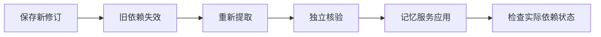

# 规则变化后：原文、记忆、Wiki 与待办如何各自更新

用“重试次数从三次改为五次”和“明早跟进评审”两个贯穿示例，解释原文保存、记忆提取与应用、来源重核验、Wiki 刷新以及任务提醒之间的边界，并说明怎样判断更新究竟进行到了哪一步。

来源：gpt-5.6-sol 分析，gpt-5.6-sol 独立复核；模型解释仍可被原始证据纠正。

## 先分清两条输入、三条处理链

假设项目材料中的约定由“最多重试三次”改成“最多重试五次”；随后，你又单独对助手说：“明早跟进评审。”前一句是**来源事实发生修订**，应进入原文保存、记忆失效与重核验；后一句才是本人明确交办，可进入任务与提醒。讨论、转述或他人的承诺不能仅因带有时间和动作词就变成你的待办。参考 [交办与讨论的边界 ↗](../../../apps/server/src/assistant/message-workflows.ts#L4 "支持项目约定、讨论和他人承诺不能自动成为用户任务，并说明明确交办与等待跟进属于不同工作流。")

同一次规则变化还可能影响面向读者的 Wiki，但 Wiki 是第三条独立流程。因此，界面上需要分别理解四种结果：原文是否已保存、记忆是否已应用、Wiki 是否仍为当前版本、任务处于什么状态。“已排队”只说明下一步已安排，不能替代后三者的完成状态。

## 一条原始记录怎样成为可用记忆

学习流程针对固定的来源修订构造上下文；若任务引用的修订已经不是当前版本，或有效性批次不匹配，任务会被视为过期，不会继续用旧输入产出结论。参考 [过期输入检查 ↗](../../../apps/server/src/learning/pipeline.ts#L180 "支持学习任务只处理当前来源修订和匹配的有效性批次。")

随后，提取角色从原始材料产生观察、候选记忆和放弃项。候选存在时才排入独立核验；提取输出与运行信息会被保存，但此时仍只是候选，并非可用记忆。参考 [提取与核验排队 ↗](../../../apps/server/src/learning/pipeline.ts#L421 "支持提取结果先保存为候选，存在候选时才进入独立核验，放弃项则直接参与刷新协调。") 核验阶段还会检查候选归属、覆盖完整性和内容摘要，然后把整批变更交给记忆服务评估。参考 [独立核验与整批评估 ↗](../../../apps/server/src/learning/pipeline.ts#L458 "支持核验候选完整性和摘要后，将整个变更集交给记忆服务评估。")

记忆服务可能选择自动应用、等待用户判断、拒绝、延后到使用时处理、仅保留为来源或忽略噪声；整批影响超过自动处理预算时，本来可自动应用的候选也会停在等待判断，而不会先写入。参考 [记忆评估结果 ↗](../../../apps/server/src/memory/service.ts#L18 "支持自动应用、等待判断、拒绝等不同策略结果，以及整批超预算时不应用的语义。") 只有服务层真正调用应用入口并取得持久化回执，才能称为“记忆已应用”；模型本身没有直接写入事实的权限。参考 [实际记忆应用入口 ↗](../../../apps/server/src/memory/service.ts#L1258 "支持只有 MemoryService 调用持久化应用入口后才发生真正的记忆写入。") [事实写入权限 ↗](../../../AGENTS.md#L46 "明确模型不能直接写入事实，应用由 MemoryService 负责。")

## 来源变化后，旧结论如何失效和重核验

保存同一来源的新修订时，系统会记录旧版到新版的刷新范围，并排入依赖刷新任务。参考 [来源更新触发刷新 ↗](../../../apps/server/src/store.ts#L259 "支持同一来源产生新修订时记录刷新范围并在事务中排入依赖刷新任务。") 刷新任务先确认新版仍是当前来源版本，再复用该版本的提取任务；若来源随后又更新，本轮刷新会被标为已被后续版本取代。参考 [刷新任务派发 ↗](../../../apps/server/src/learning/pipeline.ts#L126 "支持刷新任务确认当前来源版本、处理被后续版本取代的情况并排入提取。")

重核验上下文会带入已经失效的目标记忆，并要求只依据当前原始材料更新同一个记忆，而不是把旧派生正文当证据或另建重复项。参考 [同一记忆重核验 ↗](../../../apps/server/src/learning/pipeline.ts#L275 "支持重核验只依据当前原始材料更新同一 memory_id，不把旧派生正文作为证据。") 最终状态取决于实际结果：原受影响记忆重新变为 active、依赖新版且依赖状态为 current，刷新才是 `applied`；仍未修复则保留 `needs_review`，来源已前进则为 `superseded`。任务派发成功本身只代表已经排队。参考 [刷新结果协调 ↗](../../../apps/server/src/learning/refresh.ts#L27 "支持 applied、needs_review 与 superseded 必须依据实际记忆状态和当前依赖判定，排队本身不代表完成。")

当前行为测试展示了完整结果：“三次”先失效，独立提取、核验和应用完成后，同一个记忆升级为“五次”，版本递增，旧原文仍可追溯，刷新才成为 `applied`。参考 [重试规则更新示例 ↗](../../../apps/server/tests/learning-refresh.test.ts#L253 "用当前行为测试支持同一记忆从三次更新为五次、版本递增、旧原文保留且刷新最终 applied。") 如果新版不再支持原结论，提取器可以诚实放弃更新；此时记忆继续失效，刷新保持 `needs_review`，而不会猜测替代答案。参考 [不支持时保持待复核 ↗](../../../apps/server/tests/learning-refresh.test.ts#L221 "支持新材料不再支持旧记忆时，提取器放弃更新，记忆保持 invalidated 且刷新记录保持 needs_review。")

## 记忆重核验不等于 Wiki 更新

记忆服务维护的是可检索、可用于行动的记忆；Wiki 则由知识流水线重新调查材料、写作并交给独立角色复核。只有复核接受的文章才会发布；取消发布或多轮修订仍未通过，都不等于页面已经更新。参考 [Wiki 写作与复核 ↗](../../../apps/server/src/knowledge/pipeline.ts#L114 "支持知识页面经过写作、独立复核和有限修订，只有接受的文档才发布，并说明取消或最终未通过不会发布。") 知识任务若失败、取消或等待用户输入，也会中止当前生成过程，而不是发布未完成内容。参考 [知识任务中止状态 ↗](../../../apps/server/src/knowledge/pipeline.ts#L72 "支持知识角色任务处于 failed、cancelled 或 awaiting_user 时不会继续取得并发布生成结果。")

Wiki 会保存它依赖的材料摘要和下层文章版本。来源或子文章发生变化时，仓库把相关页面标为非 current，并继续向上层依赖传播；这一步只是判定旧页面已经过时，不会借记忆的应用回执直接改写正文。参考 [Wiki 依赖失效传播 ↗](../../../apps/server/src/knowledge/repository.ts#L178 "支持材料或下层文章变化会使页面变为非 current，并向上层依赖传播。") 重新生成时，系统会调查当前原文、写作和复核；只有现有页面仍为 current、阅读目标和写作版本均未变化时才直接复用。参考 [读者页面重新生成 ↗](../../../apps/server/src/knowledge/pipeline.ts#L192 "支持页面仅在当前状态、阅读目标和写作版本均未变化时复用，否则重新调查、写作和复核。")

所以可能出现“记忆已经更新为五次，但 Wiki 仍 stale”。若 Wiki 生成失败，本轮不会发布新页面；知识修订仍单独保存，并可按指定 revision 读取历史版本。参考 [Wiki 历史修订 ↗](../../../apps/server/src/knowledge/repository.ts#L110 "支持知识修订独立保存、当前 head 单独更新，并可按文档键和 revision 读取历史版本。") 查看进展时，应把记忆的 `needs_review/applied/superseded` 与 Wiki 的 `current/stale/生成失败` 分开。

## 等待、跟进时间、截止时间和已读的区别

任务只有 `open`、`waiting`、`done`、`cancelled` 四种状态；完成、重新打开、改期、等待、稍后提醒和取消是对任务执行的动作。等待信息另行保存等待对象、下次检查时间、暂停提醒时间、原始时间表达和时区。参考 [任务状态与跟进字段 ↗](../../../packages/contracts/src/task-flow.ts#L3 "定义任务状态、动作以及 waiting_on、next_check_at、snoozed_until 等字段。")

| 概念 | 含义 |
|---|---|
| `waiting` / `waiting_on` | 正在等某个人或某个结果；等待对象必须来自用户当前指令 |
| `next_check_at` | 下次检查进展的时间，不是交付期限 |
| `due_at` | 事项真正的截止时间 |
| `snoozed_until` | 在此之前暂停提醒，不应改写原截止时间 |
| 通知已读 | 只表示看过通知，不表示任务完成或对方已回复 |

系统会校验等待对象和原始时间表达确实出现在当前指令中，再把时间规范化。参考 [跟进信息校验 ↗](../../../apps/server/src/tasks/follow-up.ts#L5 "支持等待对象和原始时间表达必须来自当前用户指令，并说明时间会被规范化。") 因此“明早跟进评审”适合把“明早”保存为原始表达并解析成 `next_check_at`；除非你明确说“明早截止”，否则不应虚构 `due_at`。明确要求等待某人时，任务可以进入 waiting；只要求稍后检查时，则不应凭空补出等待对象。参考 [等待事项示例 ↗](../../../apps/server/tests/task-follow-up.test.ts#L14 "支持明确要求跟进等待对象时创建 waiting 任务、将检查时间与截止时间分开，并在稍后提醒时保留原截止语义。")

提醒器只扫描 open 或 waiting 的事项：暂停时间未到就跳过，截止时间到达产生到期提醒，检查时间到达产生跟进提醒；回执按任务版本、提醒类型和发生时间防止重复发送。通知还会说明尚未确认收到回复、不会自动联系他人。参考 [任务提醒行为 ↗](../../../apps/server/src/tasks/follow-up.ts#L17 "支持截止与跟进提醒的触发、防重、暂停规则，以及不会自动联系他人的边界。") 已读操作只更新通知的 `read_at`，不会修改任务状态。参考 [通知已读操作 ↗](../../../apps/server/src/store.ts#L629 "支持通知已读只更新 read_at，不会修改任务状态。")

## 当前能主动完成什么，哪里仍需人处理

当前系统可以保存新修订、确定性地使旧依赖失效、排入重新提取与独立核验，并对普通、高置信度且处于自动处理预算内的变化通过记忆服务应用。服务运行时会每三十秒扫描一次任务提醒；读取通知列表时也会立即再扫描一次。参考 [周期提醒扫描 ↗](../../../apps/server/src/app.ts#L650 "支持服务运行时每三十秒调用一次提醒扫描。") [读取通知时扫描提醒 ↗](../../../apps/server/src/app.ts#L328 "支持读取通知列表时先触发一次任务提醒扫描。")

它不会把含糊、缺背景、危险或超预算的变化伪装成已完成：这些情况可能停在等待判断；新版材料不再支持旧结论时，记忆会保持失效和待复核。它也不会把项目约定当作你的交办、自动联系评审人、推断对方已经回复，或因为通知已读就完成任务。

因此，本例最准确的进展描述是：**新版规则原文保存后，“三次”结论立即不再作为 active 记忆；取得实际应用结果后，同一记忆才更新为“五次”，刷新才是 applied。独立的“明早跟进评审”可形成待办并设置检查时间；只有明确说明正在等待谁或什么结果时才进入 waiting。明早系统提醒你检查，但联系对方、确认回复和最终标记完成仍需要后续明确操作。** 对已有任务的修改还必须以已验证的本人原始指令为依据，模型不能自行写任务状态。参考 [任务修改授权 ↗](../../../apps/server/src/memory/service.ts#L86 "支持已有任务的操作必须有已验证的本人原始证据，模型不直接写任务行，并说明终态任务的操作限制。")
