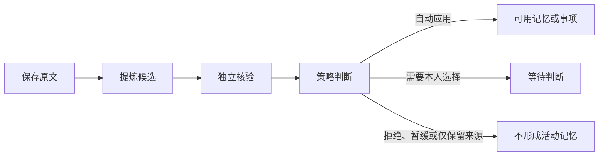

# 规则变了以后：原文、记忆与待办如何更新

用“重试次数从三次改为五次”和“明早跟进评审”两条独立输入，解释原文保存、记忆应用、来源重核验、Wiki 更新与事项提醒的不同流程，并给出判断各阶段是否真正完成的方法。

来源：gpt-5.6-sol 分析，gpt-5.6-sol 独立复核；模型解释仍可被原始证据纠正。

## 先把两件事分开

假设项目约定原来写“失败后重试 3 次”，新版改成“重试 5 次”；你又在另一条消息里说：“帮我明早跟进评审。”前者是**来源内容发生变化**，后者才是**本人明确交办**。约定文本即使出现“必须检查”“明早处理”之类动作词，也只是待理解的材料，不能自动变成你的待办；讨论中别人的承诺同样不是对你的授权。参考 [消息与行动授权 ↗](../../../apps/server/src/assistant/message-workflows.ts#L1 "支持约定文本和他人承诺不自动构成 owner 待办，以及等待时间与截止时间分离。")

系统还会再做一层确定性检查：只有当前请求确实表达了任务意图，才允许创建事项；最终回复也必须以持久化后的任务和回执为准，而不是相信模型口头说“已经安排”。因此，这两个输入可以同时被处理，却不会互相污染：规则走记忆维护，交办走事项流程。参考 [事项写入的确定性护栏 ↗](../../../apps/server/src/assistant/runtime.ts#L546 "支持只有明确任务意图才允许创建事项，且成功以持久化结果而非模型自述为准。")

## 保存原文不等于记忆已经生效

材料进入系统后，首先按来源身份找到或创建 Source，再追加不可变的 Revision，并把正文拆成可检索的 Fragment。此时能确认的是“原文已经保存、可以回看”，还不能确认其中的结论已经成为可用记忆。参考 [来源版本与片段保存 ↗](../../../apps/server/src/store.ts#L168 "支持 Source 身份、不可变 Revision 和 Fragment 的保存流程。")

非派生材料会排入提炼任务；后台依次让 extractor 提出候选，让 verifier 覆盖并核对全部候选，最后由 MemoryService 整批判断。学习功能默认关闭，所以关闭时队列可以存在，原文与检索仍可使用，但模型尚未处理。参考 [捕获后的提炼排队 ↗](../../../apps/server/src/store.ts#L348 "支持非派生材料保存后排入 extract_claims，而不是当场成为记忆。") [学习默认配置 ↗](../../../apps/server/src/config.ts#L58 "支持后台学习默认关闭及需要 profile 的配置事实。") [候选提取与独立核验 ↗](../../../apps/server/src/learning/pipeline.ts#L421 "支持 extractor 产出候选后排入 verifier 的阶段关系。")

只有策略结果为自动应用时才写入并返回 application receipt；等待判断、拒绝、延后使用、仅保留来源和忽略噪声都不会直接形成活动记忆。参考 [记忆策略分流 ↗](../../../apps/server/src/memory/service.ts#L780 "支持拒绝、忽略、等待判断、延后使用、仅保留来源和自动应用等不同结果。") [自动应用与回执 ↗](../../../apps/server/src/memory/service.ts#L1395 "支持只有 auto_apply 继续调用 apply，其他结果不形成活动状态。")

## 来源变化后，先失效再重核验

当同一个 Source 出现新版，系统切换 head、递增有效性代次，把旧证据依赖标为 stale，并立即把相关记忆标成 invalidated；旧 Revision 和旧记忆修订并不会被删除。同时系统冻结本次受影响的记忆集合，避免重试时因部分项目已修好而丢失原始影响范围。参考 [来源更新触发失效 ↗](../../../apps/server/src/store.ts#L231 "支持新版切换 head、递增代次、旧依赖 stale、记忆 invalidated 并排入刷新任务。") [冻结刷新影响集合 ↗](../../../apps/server/src/learning/refresh.ts#L6 "支持刷新记录冻结受影响记忆，并区分初始 needs_review 与 no_effect。")

以示例来说，“重试 3 次”的活动记忆会先失效。新的提炼任务只能读取仍是当前 head、且代次没有变化的 Revision；对旧记忆，写作指令要求在新证据仍支持或内容已变化时更新**同一个 memory_id**及其版本，若新证据不再支持则放弃更新，让旧记忆保持 invalidated。参考 [拒绝过期学习输入 ↗](../../../apps/server/src/learning/pipeline.ts#L180 "支持学习任务必须引用当前 head 和匹配有效性代次。") [同一记忆的重核验要求 ↗](../../../apps/server/src/learning/pipeline.ts#L276 "支持刷新时更新同一 memory_id，证据不再支持则保持 invalidated。")

刷新状态要按下面理解：

| 状态 | 实际含义 |
| --- | --- |
| `no_effect` | 来源变化时没有冻结到受影响记忆 |
| `queued` | 已完成依赖检查，并排入基于新版的重新提炼 |
| `applied` | 冻结集合中的记忆都已恢复 active，且当前依赖指向新版 |
| `needs_review` | 仍有记忆未被新证据修复 |
| `superseded` | 处理期间来源又前进到更新版本 |

所以 `refresh_dependents` 任务成功通常只说明“已经排队”；真正完成要等独立核验、应用和最终对账。参考 [刷新任务只负责排队 ↗](../../../apps/server/src/learning/pipeline.ts#L126 "支持 refresh_dependents 在来源仍当前时排入重新提炼，并把刷新记录改为 queued。") [刷新最终对账 ↗](../../../apps/server/src/learning/refresh.ts#L27 "支持 applied、needs_review、superseded 由真实依赖与应用状态对账，而非由派发成功决定。")

## 记忆重核验与 Wiki 更新不是同一件事

记忆刷新面向可被助手使用的事实、经历、流程或事项；Wiki 面向读者，把多份材料组织成一篇解释。创建 Wiki 时需要选择仍为当前的材料版本、填写阅读目标，并配置可用 Agent；接口先返回 `running`，调查、写作、独立复核和发布在后续完成。参考 [Wiki 整理入口 ↗](../../../apps/server/src/knowledge/api.ts#L133 "支持 Wiki 需要选择当前材料、阅读目标和 Agent，并先返回 running 后异步发布。")

来源摘要或上游文章版本变化时，知识仓储会把直接依赖和递归上层文章标为非 current，但仍能解析写作时引用的历史材料。页面会明确提示“原始材料已有变化，这篇内容正在等待更新；引用仍指向写作时的版本”。这只是**陈旧标记**，不会因记忆刷新成功而自动重写正文；只有单独完成 Wiki 生成并发布，文章才算更新。参考 [文章依赖陈旧判定 ↗](../../../apps/server/src/knowledge/repository.ts#L178 "支持材料或上游文章摘要变化会递归把知识文章标为非 current，同时历史材料仍可解析。") [陈旧文章提示 ↗](../../../apps/web/src/knowledge/KnowledgeDocument.vue#L32 "支持页面向读者说明正文等待更新且引用仍指向写作时版本。")

## 等待、跟进、截止、暂缓和已读

事项中的几个字段解决不同问题，不能相互替代。参考 [事项状态与跟进字段 ↗](../../../packages/contracts/src/task-flow.ts#L3 "支持 open、waiting、done、cancelled 四种状态以及等待、检查、暂缓时间字段。")

| 概念 | 回答的问题 | 会发生什么 |
| --- | --- | --- |
| `waiting` | 这件事是否正在等某人或某个结果？ | 改变事项生命周期状态，可以没有时间 |
| `next_check_at` | 什么时候回来检查一次？ | 到点生成跟进提醒，不等于交付截止 |
| `due_at` | 这件事最晚何时完成？ | 只有改期动作修改；等待或暂缓会保留原截止时间 |
| `snoozed_until` | 在什么时候之前先别提醒？ | 暂缓期间抑制提醒，并把下次检查设到该时刻 |
| 通知已读 | 我是否看过这条通知？ | 只写通知的 `read_at`，不会完成或取消事项 |

等待、暂缓和改期的具体写入规则彼此分开；提醒器只扫描 open/waiting 事项，到截止或检查时刻后生成站内通知，并明确说明它不会自动联系他人、也没有确认对方已经回复。参考 [等待暂缓与改期规则 ↗](../../../apps/server/src/memory/service.ts#L97 "支持 wait、snooze、reschedule 分别修改状态、跟进信息和截止时间。") [站内提醒派发 ↗](../../../apps/server/src/tasks/follow-up.ts#L20 "支持到期与跟进提醒、暂缓抑制、去重，以及不会自动联系他人或确认回复。") [通知已读写入 ↗](../../../apps/server/src/store.ts#L630 "支持已读操作只更新 notifications.read_at，不改变事项。")

在示例里，“明早跟进评审”表示检查时间，不自动表示“评审明早截止”。如果“明早”不足以解析为具体时刻，系统应追问，而不是自行补一个分钟；等待对象与原始时间表达也必须来自当前请求。参考 [明确时间与跟进边界 ↗](../../../apps/server/src/assistant/acp-model.ts#L73 "支持检查时间不是 deadline，未给具体时刻时应追问而非编造。")

## 怎样判断哪一步真的完成了

判断完成状态时，优先看最终产物，不要只看某个后台 job：

| 你看到的状态 | 可以确认 | 还不能确认 |
| --- | --- | --- |
| 原文已保存 | Revision 与 Fragment 已落库，可阅读检索 | 已形成记忆 |
| 提炼/核验任务 succeeded | 该步骤结束 | 所有候选都已应用 |
| 候选 `applied` 或有 application receipt | 记忆或事项已实际写入 | Wiki 已更新 |
| 刷新 `applied` | 本次受影响记忆已全部修复并指向新版 | 依赖文章已重写 |
| Wiki `published` 且 `current` | 新正文已发布且依赖仍当前 | 后续来源永远不会再变化 |
| 通知已读 | 你看过提醒 | 事项已完成、回复已到 |

“材料处理”页面已经区分等待、处理完成、等待判断、已应用和已过期，并在任务完成时显示形成了多少候选、其中多少已应用。完整的记忆刷新记录则由 `/api/memory-refreshes` 提供，包括受影响集合、状态和结果。参考 [材料处理状态说明 ↗](../../../apps/web/src/LearningView.vue#L22 "支持界面区分任务和候选状态，并显示候选数量与实际应用数量。") [记忆刷新查询接口 ↗](../../../apps/server/src/app.ts#L70 "支持完整刷新记录可查询受影响集合、状态与结果。")

## 当前能主动做什么，边界在哪里

当前实现可以在明确启用学习并配置 Agent 后，后台提炼与核验材料；来源更新时自动失效旧依赖并排队重核验；对已获授权的事项，服务会周期扫描并生成站内提醒。需要本人介入的包括：高影响或冲突变化的选择、Wiki 的选材与阅读目标，以及无法从当前指令确定的等待对象或具体时间。

它目前不会自动联系评审人、监听对方是否回复，也不会因为你读了通知就完成事项。持续的项目、人物和主题理解，自动监听回复、周期回顾与英语卡片仍列为后续能力。参考 [当前助理能力边界 ↗](../../../README.md#L38 "支持现有事项、提醒和记忆重核验能力，以及自动监听回复等仍属后续。")
