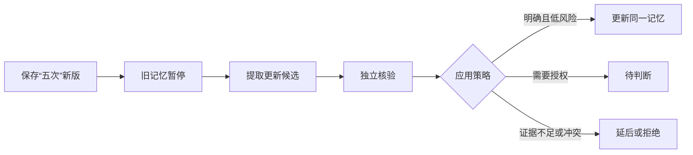

# 规则变了以后：原文、记忆与待办如何更新

用“重试三次改为五次”和“等待评审人回复，明早提醒我检查”两个独立输入，解释原文保存、记忆重核验、Wiki 更新与事项提醒的分工和完成标志。

来源：gpt-5.6-sol 分析，gpt-5.6-sol 独立复核；模型解释仍可被原始证据纠正。

## 先分清事实变化与行动委托

假设项目约定原来写着“失败后重试三次”，现在改为“五次”；另一条消息是你明确说“等待评审人回复，明早提醒我检查”。前者是**来源事实换版**，目标是让当前记忆改用“五次”；后者是**行动委托**，目标是建立一个可提醒、可完成的事项。约定文本即使写着“明早检查”，也不等于你在交办；讨论中别人的承诺同样不能自动变成你的任务。参考 [事实与交办边界 ↗](../../../apps/server/src/assistant/message-workflows.ts#L1 "支持捕获材料不授予行动权限、他人承诺不是用户任务，只有当前用户明确要求才创建事项。")

| 输入 | 应做什么 | 不应做什么 |
| --- | --- | --- |
| 同一约定由三次改为五次 | 保存新版、暂停依赖旧版的记忆、重新核验 | 把业务句子当成待办 |
| “等待评审人回复，明早提醒我检查” | 建立等待事项，记录检查时间 | 擅自联系评审人或声称已收到回复 |

等待对象和时间表达必须能在当前用户指令中找到。参考 [等待信息来自当前指令 ↗](../../../apps/server/src/tasks/follow-up.ts#L5 "支持等待对象和跟进时间的原始表达必须直接来自当前用户指令。") 如果用户只明确要求“明早提醒我检查评审”，却没有说正在等待谁或什么结果，系统可以建立带检查时间的 **open** 事项；只有明确提供等待对象时，新事项才是 **waiting**。参考 [新事项状态取决于等待对象 ↗](../../../apps/server/src/memory/service.ts#L1267 "支持新建事项仅在 waiting_on 非空时设为 waiting，否则设为 open。")

## 从新版原文到当前记忆

保存新版首先完成的是**原文层**：系统写入新的 Revision 和文本片段，旧 Revision 不被覆盖。参考 [新版原文写入 ↗](../../../apps/server/src/store.ts#L197 "支持捕获时创建新的 Revision 和片段，而不是覆盖旧修订。") 随后来源 head 指向新版；依赖旧修订的证据关系被标为 stale，相应记忆立即变成 invalidated，并登记刷新记录和后台任务。此刻只能说“新版已保存、旧结论已暂停”，还不能说“五次已经成为可用记忆”。参考 [换版失效与刷新排队 ↗](../../../apps/server/src/store.ts#L231 "支持推进来源 head、增加有效性轮次、将旧依赖和记忆失效，并登记刷新任务。")

刷新任务复用这次捕获对应的提取身份，避免另起一个提取器重复创建记忆。参考 [刷新复用提取任务 ↗](../../../apps/server/src/learning/pipeline.ts#L126 "支持刷新任务按当前来源版本复用 extract_claims 身份并记录为 queued。") 提取上下文带入失效记忆的 ID、版本、范围和正文，参考 [失效记忆进入上下文 ↗](../../../apps/server/src/learning/pipeline.ts#L181 "支持把失效记忆的 ID、版本、范围和正文读入刷新上下文。") 并明确要求：新原文仍支持或改变该结论时，使用目标 ID 与期望版本更新同一记忆；不再支持时放弃更新，让旧记忆继续失效。参考 [更新同一记忆的指令 ↗](../../../apps/server/src/learning/pipeline.ts#L386 "支持提取上下文携带刷新目标，并要求更新同一 memory_id、校验期望版本且不复制旧记忆。")

提取结果仍只是候选：有候选时必须排入 verifier。参考 [候选进入独立核验 ↗](../../../apps/server/src/learning/pipeline.ts#L550 "支持提取候选后排入 verify_proposals，没有候选时直接进行刷新对账。") verifier 要覆盖全部候选，随后把整批结果交给 MemoryService 评估，并在应用后重新对账来源刷新。参考 [核验后整批评估 ↗](../../../apps/server/src/learning/pipeline.ts#L645 "支持 verifier 覆盖全部候选、调用 MemoryService.evaluateBatch，并据实际评估结果重新对账刷新。") 证据无效或自相矛盾会被拒绝；含糊但不阻塞当前工作的内容延后到使用时；跨来源且影响当前重要知识，或整批影响超过自动预算，才进入待判断。参考 [自动应用与待判断策略 ↗](../../../apps/server/src/memory/service.ts#L796 "支持拒绝矛盾证据、延后软不确定性，并只对大范围影响或触及当前重要知识的跨来源冲突升级。")

## 怎样判断真的完成了

不同状态回答的是不同问题，不能只看一个“处理完成”标签：

| 状态 | 可以确认 | 仍不能确认 |
| --- | --- | --- |
| 材料已保存 | 新原文可读，历史版本保留 | 已形成新记忆 |
| job queued / running | 已排队或正在处理 | 模型已产出、候选已生效 |
| job succeeded | 该步骤结束 | 整条更新链完成 |
| proposal applied | 这一候选已写入记忆或事项 | 本次换版影响的全部记忆都已修好 |
| memory invalidated | 旧结论已暂停 | 新结论已经可查 |
| refresh applied | 冻结的受影响记忆已恢复并依赖新版 | Wiki 也已更新 |
| awaiting_decision | 需要用户作真实选择 | 系统已经替用户决定 |

材料处理页把 job 与 proposal 分开展示：queued 明示“尚未调用模型”，refresh job 成功也可能只完成依赖检查。参考 [材料处理状态说明 ↗](../../../apps/web/src/LearningView.vue#L16 "支持界面区分排队、步骤完成和候选生效，并说明刷新步骤成功可能仅完成依赖检查。") 整次换版以 refresh 对账为准：若来源又推进则为 superseded；只有冻结集合中的记忆全部恢复 active、依赖新版且依赖状态为 current，才是 applied；否则仍是 needs_review。参考 [刷新记录最终对账 ↗](../../../apps/server/src/learning/refresh.ts#L27 "支持 applied、needs_review 与 superseded 依据当前记忆、依赖和来源 head 判定。")

真正应用时，MemoryService 把目标 ID、期望版本、正文和证据集合交给记忆仓储，并把“proposal 变为 applied”定义为 `after` 钩子。参考 [目标版本交给记忆仓储 ↗](../../../apps/server/src/memory/service.ts#L1294 "支持 MemoryService 使用 target_id、expectedVersion、正文和证据集合调用 applyMemory，并传入事务钩子。") [应用后的状态钩子 ↗](../../../apps/server/src/memory/service.ts#L1249 "支持 proposal 变为 applied 是传入仓储的 after 钩子，并同时维护待判断决策状态。") 仓储在同一事务中先校验并创建或更新实体修订，再写变更记录；参考 [事务先写实体与变更 ↗](../../../apps/server/src/storage/repository.ts#L219 "支持仓储在单一事务中先运行实体创建或更新，再记录 change。") 随后写入通知、投递意图和 application receipt，最后才调用 `after`，把 proposal 标为 applied。参考 [回执后调用状态钩子 ↗](../../../apps/server/src/storage/repository.ts#L366 "支持仓储先写 application receipt，构造应用回执，最后才调用 after 钩子；这些操作都在同一事务中。") 因而 **proposal applied 表示实体和应用回执已经写入**，不是先标记成功再尝试保存。更新既有记忆时，仓储沿用目标记忆 ID、检查期望版本、生成递增版本、更新 head，并写入 current 证据依赖。参考 [同一记忆生成新版本 ↗](../../../apps/server/src/storage/repository.ts#L425 "支持仓储沿用目标记忆 ID、检查期望版本、写入新修订、更新 head 并记录 current 证据依赖。")

## 记忆重核验不等于 Wiki 更新

**记忆**服务当前问答与行动，维护个人事实、经历、流程和事项的有效版本；**Wiki**围绕读者问题组织连贯讲解。两者可以依赖同一原文，但使用独立流程。

材料或子文章变化时，知识仓库比较固定依赖的内容身份，把受影响文章及其上层文章标为非 current。参考 [Wiki 依赖失效传播 ↗](../../../apps/server/src/knowledge/repository.ts#L178 "支持知识文章按材料摘要和子文章修订判断 current，并向依赖它的上层文章传播失效。") 旧文仍可阅读，页面会提示“原始材料已有变化，这篇内容正在等待更新；引用仍指向写作时的版本”。参考 [待更新文章提示 ↗](../../../apps/web/src/knowledge/KnowledgeDocument.vue#L32 "支持非 current 文章仍显示正文，并提示引用继续指向写作时版本。") 因此，memory refresh 已 applied 不能推出 Wiki 已重写。

Wiki 要恢复 current，需要另行发起整理：选择当前材料和阅读目标，调查原文，再经过写作与独立复核。参考 [读者页面调查与写作 ↗](../../../apps/server/src/knowledge/pipeline.ts#L212 "支持 Wiki 页面独立执行材料调查、写作与复核，而不是复用记忆刷新结果。") 接口先返回 running，最终才会成为 published 或 failed。参考 [知识整理运行状态 ↗](../../../apps/server/src/knowledge/api.ts#L147 "支持整理请求先返回 running，异步执行后成为 published 或 failed。") 发布前仓库还会再次比较材料摘要和子文章修订；输入已变化就拒绝发布，成功发布才把文章 head 标为 current。参考 [Wiki 发布前依赖检查 ↗](../../../apps/server/src/knowledge/repository.ts#L122 "支持发布前检查材料与文章依赖，输入变化时拒绝发布，成功后将新文章设为 current。")

## 等待、检查、截止与稍后提醒

对贯穿示例“等待评审人回复，明早提醒我检查”，若没有项目截止日期，合理结果是：事项为 **waiting**，next_check_at 是明早，due_at 为空。

- **waiting**：正在等某人或某个结果。
- **next_check_at**：何时再检查进展，不表示事情必须在此时完成。
- **due_at**：真实截止时间；改截止才修改它。
- **snoozed_until**：在此之前抑制提醒；稍后提醒会把下一次检查移到新时间。

事项合同把状态、检查时间、暂缓时间和操作类型分别建模。参考 [事项状态与时间字段 ↗](../../../packages/contracts/src/task-flow.ts#L3 "支持事项状态、等待对象、检查时间、暂缓时间和操作类型是独立字段。") 命令处理还规定：wait 必须说明等待对象，snooze 必须给出明确的新提醒时间；snooze 保留原等待对象与原截止时间，complete、cancel 和 reopen 会清除 follow-up；已完成或取消的事项要先 reopen，才能再等待、暂缓或改期。参考 [事项命令状态转换 ↗](../../../apps/server/src/memory/service.ts#L102 "支持 wait、snooze、reschedule、完成、取消和重新打开对跟进字段与截止时间的不同影响。")

创建事项时，follow_up 存在但 waiting_on 为空会得到 open；waiting_on 非空才得到 waiting。参考 [创建事项的 open 与 waiting ↗](../../../apps/server/src/memory/service.ts#L1267 "支持新事项只有在 follow_up.waiting_on 非空时成为 waiting，否则保持 open。") 待办页也分别展示状态、等待对象、下次跟进和暂缓时间。参考 [待办页分开展示跟进字段 ↗](../../../apps/web/src/App.vue#L997 "支持页面分别展示事项状态、等待对象、下次跟进和暂缓时间。")

## 提醒已到不等于事项完成

提醒调度器只扫描 open 与 waiting 事项；未到 snoozed_until 时跳过。到检查时间或截止时间后，它写入站内通知，并以事项版本、触发类型和发生时间记录回执，所以服务重启可以补发，而重复轮询不会重复发送同一次提醒。正文明确写出“尚未确认收到回复”和“不会自动联系他人”。参考 [站内提醒与防重复 ↗](../../../apps/server/src/tasks/follow-up.ts#L17 "支持提醒筛选、暂缓门槛、检查与截止触发、持久回执去重及不自动联系他人。")

“已读”只是通知中心的阅读标记：服务端只更新通知的 read_at。参考 [通知已读写入 ↗](../../../apps/server/src/store.ts#L630 "支持标记已读只更新通知记录的 read_at 字段。") 页面也明确说明，已读不会批准变更、完成待办或取消后续提醒。参考 [已读不改变业务状态 ↗](../../../apps/web/src/App.vue#L1045 "支持通知中心明确说明已读不会批准变更、完成待办或取消后续提醒。") 因而看到提醒后，仍需你报告评审是否回复，再选择完成、稍后提醒、取消或继续等待。

## 目前可以主动到哪一步

当前已经能完成：保存固定原文和历史版本；在 learning 已启用且 Agent 可用时后台提取、独立核验并应用清晰的低风险变化；来源换版后暂停旧记忆并更新同一记忆；对明确的本人委托创建或更新事项；在服务运行时生成去重的站内提醒。真实个人流程已走通过同一约定换版、等待事项、延后、重启补发和完成后停止提醒。参考 [当前个人流程能力 ↗](../../../docs/reader-first/progress.md#L9 "支持当前已完成记忆换版、同一记忆更新、等待事项、延后和去重提醒的真实流程。")

仍需用户参与的是：明确授权事项、处理待判断、报告外部回复和完成情况，以及主动选择材料发起 Wiki 整理。当前不能承诺自动监听群聊回复、替用户联系他人、周期性生成人物或项目综合回顾；现有服务仍是单用户范围。参考 [当前未实现边界 ↗](../../../docs/reader-first/progress.md#L47 "支持持续综合理解、自动监听外部回复和团队隔离仍未完成。")

实际查看时，可在**材料处理**看 job 与 proposal，在**待判断**处理需要选择的变化，在**需求与待办**看状态与时间，在**通知中心**看应用回执和提醒，在**知识库**看文章是否“待更新”。若要对账一次来源换版影响的全部记忆，当前服务还提供 memory-refreshes 接口，返回受影响集合、状态和结果。参考 [来源刷新对账接口 ↗](../../../apps/server/src/app.ts#L77 "支持通过专门接口读取受影响记忆集合、刷新状态和结果明细。")
