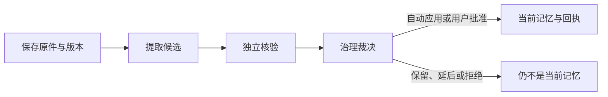

# 规则变了以后：原文、记忆与待办怎样更新

用“重试三次改为五次”和“明早跟进评审”两条并行输入，解释材料保存、记忆提取与应用、来源换版后的失效和重核验、Wiki 更新，以及等待、检查时间、截止时间、延后和通知已读之间的区别。

来源：gpt-5.6-sol 分析，gpt-5.6-sol 独立复核；模型解释仍可被原始证据纠正。

## 先把两条消息分开

假设项目约定从“失败后重试三次”改为“五次”；另一条独立消息是你说“请明早跟进评审”。可观察的结果应当不同：新版约定先保存为原件，并推动旧记忆失效、重核验；明确交办才形成一条可跟进事项。约定文档即使写着“明早检查”，也不因此替你创建待办；他人的承诺同样不是你的任务。参考 [消息与交办边界 ↗](../../../apps/server/src/assistant/message-workflows.ts#L1 "说明只有本人明确交办才能创建或修改事项，讨论材料和他人承诺不构成授权，并区分只读回顾。")

这是贯穿本页的**教学示例**，不是这组措辞已经跑过的真实记录。当前已有一条相似的真实流程：预算从 80 元改为 120 元时更新同一记忆，另一次明确委托才创建等待事项；它证明主链可用，但不能外推到所有材料和自然语言时间。参考 [已验证的个人流程 ↗](../../../docs/reader-first/assistant-memory-flow.md#L5 "支持预算换版更新同一记忆、独立委托创建等待事项的当前真实案例及其有限外推范围。")

## 从已保存原件到当前可用记忆

“保存成功”和“已经记住”之间还有几层边界。保存时，系统按来源身份建立或找到 Source，为内容创建不可变 Revision，并把正文拆成可定位 Fragment；相同内容可以复用已有版本。参考 [原件与版本保存 ↗](../../../apps/server/src/store.ts#L171 "说明捕获按来源找到或创建 Source，复用相同内容，创建 Revision 与 Fragment。")

提取角色只产生候选，随后独立核验覆盖全部候选，再交给 MemoryService 裁决。证据清楚、影响有限的变化可以自动应用；提案与自身引用相矛盾时会被拒绝；跨来源冲突若不影响当前重要知识或任务，会延后到实际使用时处理，若确实影响当前工作则请求用户决定。含糊信息也可延后，未验证主体提出的事项只保留为来源。参考 [候选提取与复核排队 ↗](../../../apps/server/src/learning/pipeline.ts#L550 "说明提取角色保存候选产物，并把仍待处理的候选排入独立复核。") [独立核验与批量治理 ↗](../../../apps/server/src/learning/pipeline.ts#L604 "说明复核覆盖全部候选，并把核验结果交给 MemoryService 批量评估。") [记忆治理裁决 ↗](../../../apps/server/src/memory/service.ts#L755 "区分自身证据矛盾时拒绝，以及跨来源冲突按当前影响延后处理或请求用户决定。")

只有应用服务实际写入带版本的记忆或事项并返回回执，才算完成。记忆更新会沿用目标 ID，并在通知中显示“之前/现在”；事项更新通知只展示更新后的事项内容。无论哪一种对象，队列成功、模型给出答案或出现候选都不能代替真实应用回执。参考 [真实应用与通知内容 ↗](../../../apps/server/src/memory/service.ts#L1192 "说明记忆与事项经统一应用服务写入；记忆更新提供前后对照，事项通知只展示更新后内容。")

## 来源换版后，旧结论先停用再重查

同一来源保存新版本时，系统先把旧依赖标为 stale，并把相关记忆设为 invalidated，然后排入重核验。以示例推演：旧的“三次”不会在检查期间继续冒充当前规则；若新版支持“五次”，应更新同一记忆，而不是创建副本。参考 [换版失效与重查 ↗](../../../apps/server/src/store.ts#L234 "说明新 Revision 成为来源头后，旧依赖被标为 stale，相关记忆失效并排入刷新任务。")

刷新记录冻结首次受影响的记忆集合。`queued` 只表示重查已排队；只有每条冻结记忆都重新 active、依赖新版且该版仍是来源当前头，才是 `applied`。证据不足时仍是 `needs_review`；来源再次前进则为 `superseded`；没有受影响记忆则是 `no_effect`。参考 [刷新状态的完成条件 ↗](../../../apps/server/src/learning/refresh.ts#L6 "说明影响集合如何冻结，以及 applied、needs_review、superseded 和 no_effect 基于真实依赖状态判定。")

所以若新版删掉规则或无法支持“五次”，正确结果是旧记忆继续失效，而不是猜一个新值。旧原件和旧记忆修订仍保留，历史问题可以回到当时版本。

## 记忆重核验不等于 Wiki 已更新

| 对象 | 来源变化后的动作 | 何时算完成 |
| --- | --- | --- |
| 当前记忆 | 立即失效旧依赖，重新提取、核验和治理 | 新记忆已真实应用，并依赖当前原件 |
| Wiki 页面 | 依赖摘要不匹配时标为非当前；旧正文仍可按历史版本阅读 | 重新调查、写作、独立复核并发布新版本 |

知识仓储的刷新只传播失效并把页面标为非当前，不会自行重写正文；发布还会再次确认输入版本没有变化。参考 [Wiki 失效与发布 ↗](../../../apps/server/src/knowledge/repository.ts#L122 "说明知识依赖变化只标记页面非当前，发布前还会验证输入版本并建立新 head。")

Wiki 更新另走页面写作流程：围绕读者问题调查材料，作者生成完整页面，独立角色复核，只有被接受的文档才发布。参考 [页面写作与独立复核 ↗](../../../apps/server/src/knowledge/pipeline.ts#L157 "说明页面生成、独立复核、接受后发布以及被拒稿件继续修订的流程。") 因而“记忆已恢复为 active”不能证明解释页已经更新；反过来，一篇新 Wiki 也不是新的独立事实来源。

## 等待、检查时间和截止时间各管一件事

| 字段或状态 | 读者应怎样理解 |
| --- | --- |
| `open` | 事项进行中，未声明正在等待外部结果 |
| `waiting` / `waiting_on` | 事项未完成，当前在等某人或某个结果 |
| `next_check_at` | 什么时候回来检查，不是交付截止 |
| `due_at` | 真正的截止时间 |
| `snoozed_until` | 在此之前不提醒；延后检查，不改截止 |
| `done` / `cancelled` | 终态，跟进信息被清除 |

状态和跟进字段有独立合同。等待对象和时间原话必须来自当前所有者请求；时区由当前用户或运行环境提供，并通过合同的 IANA 时区校验。助手入口会注入运行时用户时区，网页控制则读取浏览器时区。参考 [事项状态与跟进字段 ↗](../../../packages/contracts/src/task-flow.ts#L3 "定义事项状态、检查时间、延后时间、原始时间表达，并校验时区为合法 IANA 名称。") [跟进信息来自当前请求 ↗](../../../apps/server/src/tasks/follow-up.ts#L5 "说明等待对象与时间表达必须来自所有者当前文字，并把跟进时刻规范化。") [助手使用运行时用户时区 ↗](../../../apps/server/src/assistant/runtime.ts#L1086 "说明助手创建或更新跟进事项时会以当前运行时配置的用户时区覆盖模型字段。") [网页读取浏览器时区 ↗](../../../apps/web/src/TaskFollowUpControls.vue#L14 "说明网页跟进控件以浏览器当前解析出的时区提交跟进信息。")

事项操作也保持这种分工：`reschedule` 修改截止时间，`snooze` 把下一次检查移到延后时刻并保留等待对象；完成或取消会清除跟进。参考 [事项操作语义 ↗](../../../apps/server/src/memory/service.ts#L102 "说明等待、延后、改期、完成和取消如何分别更新状态、跟进字段与截止时间。")

因此“明早跟进评审”若只要求检查进展，应把明早放在 `next_check_at`，`due_at` 留空。若“明早”无法唯一解析，系统应询问具体时间，而不是擅自假定九点。

## 提醒出现、通知已读，都不代表事情完成

提醒器只扫描 `open` 和 `waiting` 事项；到截止时间或检查时间后生成站内通知，并按事项版本、触发类型和发生时刻去重。提醒正文会说明尚未确认收到回复，也不会自动联系他人。参考 [提醒触发与去重 ↗](../../../apps/server/src/tasks/follow-up.ts#L17 "说明提醒只处理开放或等待事项，按截止或检查时间触发、持久去重，且不会自动联系他人。")

把通知标为已读，只更新通知的 `read_at`，不会修改事项状态。参考 [通知已读操作 ↗](../../../apps/server/src/store.ts#L633 "说明通知已读只写 read_at，不会改变事项状态。") 所以评审方是否回复仍要由你报告；之后你可以完成、取消、延后或改截止。普通的“今天还有什么事”查询也只读取现状，不应暗中改变事项。参考 [消息与交办边界 ↗](../../../apps/server/src/assistant/message-workflows.ts#L1 "说明只有本人明确交办才能创建或修改事项，讨论材料和他人承诺不构成授权，并区分只读回顾。")

## 现在能主动做到什么，哪里仍要人介入

当前可以保存固定原件与历史版本；来源换版后暂停旧记忆，后台重新提取、独立核验，并对清晰有限的变化更新同一记忆；对明确的本人交办，可创建或更新同一事项，并在服务重启后按持久时间补查提醒。当前个人流程已经覆盖交办、等待、改期、延后、完成、取消和站内提醒。参考 [当前个人流程能力 ↗](../../../docs/reader-first/progress.md#L29 "支持当前已有来源换版重核验、事项操作与站内提醒能力的概括。")

仍需要你介入的地方有：明确表达交办或状态变更；补充无法唯一解析的检查时间或截止时间；报告外部回复与完成结果；处理影响过大或确实触及当前重要知识的跨来源冲突。普通材料、讨论和他人承诺不构成行动授权。

尚未实现的是自动处理所有新材料、完整时态推理、外部回复监听、周期回顾和团队隔离；当前 SQLite/shared-token 基础仍是单用户。参考 [当前未实现能力 ↗](../../../docs/reader-first/progress.md#L47 "说明自动处理、完整时态推理、外部回复监听、周期回顾与团队隔离仍是边界。") 开发时可从保存与失效入口、学习流水线、记忆治理、Wiki 仓储与写作流水线、事项跟进器分别修改；判断结果时始终看最终对象和回执，不只看后台任务是否结束。
