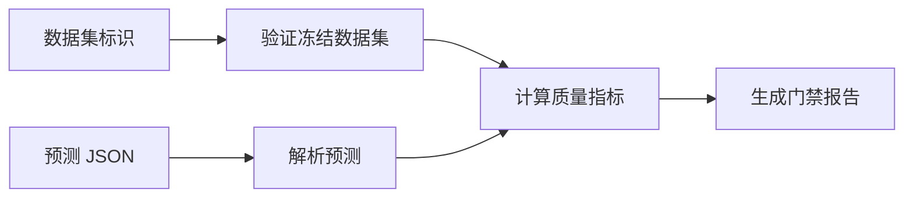

# 离线质量评估与发布门禁

该命令读取冻结质量数据集与外部预测，生成带稳定指纹的指标报告并执行统一门禁，适合作为模型或规则版本上线前的离线验收入口。

来源：gpt-5.6-sol 分析，gpt-5.6-sol 独立复核；模型解释仍可被原始证据纠正。

## 解决什么问题

该脚本把“某批预测是否达到可用标准”转化为可重复执行的离线检查。调用者提供数据集标识与预测 JSON；缺少参数或预测顶层不是数组时立即报错，避免无效输入进入指标计算。参考 [命令输入校验 ↗](../../../scripts/quality-evaluate.ts#L8 "支持脚本读取数据集与预测路径，并拒绝参数缺失或预测顶层非数组的说明。")

每条预测以 UUID 关联样本，包含符合质量标签合同的结果，并可附带耗时、Token 用量与错误信息。标签区分抽取、放弃和需要上下文，同时约束抽取对象及自动应用条件。参考 [预测记录合同 ↗](../../../apps/server/src/quality/evaluator.ts#L4 "支持预测的样本标识、质量标签及可选运行信息字段说明。")、[质量标签约束 ↗](../../../apps/server/src/quality/repository.ts#L39 "支持处置类型、抽取对象字段和自动应用约束的说明。")

## 从冻结数据到评估结果

脚本打开数据目录中的 SQLite，通过质量仓库验证冻结数据集，再把固定样本与预测交给评估器。参考 [冻结数据评估流程 ↗](../../../scripts/quality-evaluate.ts#L12 "支持打开存储、验证冻结数据集、读取预测并调用评估器的流程。")

当前 SQLite 明确是单用户基础，团队权限仍属于后续迁移范围。`Store` 在这里负责创建数据目录、执行迁移并初始化应用所需的仓库与服务；构造失败时关闭数据库。参考 [单用户存储边界 ↗](../../../apps/server/src/store.ts#L4 "支持当前 SQLite 仅为单用户基础、团队权限留待后续迁移的边界说明。")、[应用存储初始化 ↗](../../../apps/server/src/store.ts#L45 "支持 Store 创建数据目录和 SQLite、执行迁移、初始化应用仓库与服务以及失败时关闭数据库的说明。") 报告中的预测指纹会递归规范化对象键顺序、忽略 `undefined`，再计算 SHA-256，使等价 JSON 获得稳定摘要。参考 [稳定摘要算法 ↗](../../../apps/server/src/storage/digest.ts#L3 "支持预测指纹通过规范化 JSON 与 SHA-256 稳定生成的说明。")

## 门禁、报告与已知边界

报告记录数据集、分片、清单摘要、预测摘要和指标，并检查自动应用精确率、语义支持、引用位置、必要证据覆盖、显式覆盖、歧义负责人误报及预测完整性。参考 [质量门禁集合 ↗](../../../scripts/quality-evaluate.ts#L21 "支持报告字段、各项阈值、完整性门禁及失败判定集合的说明。") 任一门禁失败时，进程退出码会设为 1。参考 [报告输出与退出状态 ↗](../../../scripts/quality-evaluate.ts#L51 "支持报告默认路径、路径覆盖、权限设置、门禁失败退出码以及最终关闭存储的说明。")

语义支持门禁要求达到 95%。其评估采用确定性规则基线，可识别否定反转、反义冲突、限制条件丢失、时间错配和内容无关，而不是仅做引文子串检查，也不是 LLM 裁判。参考 [语义支持规则 ↗](../../../apps/server/src/quality/evaluator.ts#L33 "支持语义支持采用确定性规则并区分多类语义冲突，而非子串或 LLM 判断的论断。")

报告默认写入当前工作目录下的 `.omem/quality/<datasetId>-evaluation.json`，可由 `OMEM_QUALITY_REPORT` 覆盖；目录与文件权限分别收紧为 `0700` 和 `0600`，存储最终始终关闭。参考 [报告输出与退出状态 ↗](../../../scripts/quality-evaluate.ts#L51 "支持报告默认路径、路径覆盖、权限设置、门禁失败退出码以及最终关闭存储的说明。") 当前材料未覆盖评估器主体，因此不能确认重复、未知或缺失 `sampleId` 的具体计分规则。
