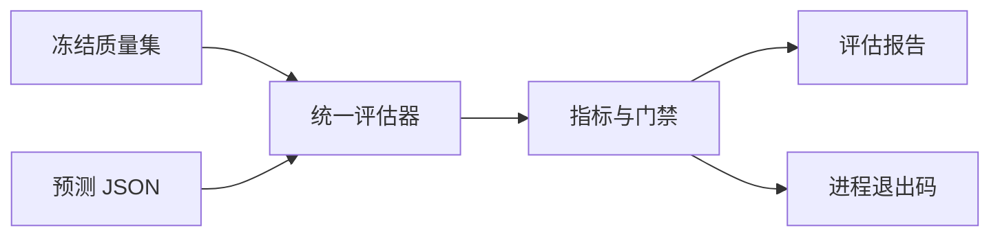

# 冻结质量集的离线评估与门禁

该脚本读取已冻结的数据集和外部预测文件，计算抽取质量指标，生成带输入指纹的 JSON 报告，并用进程退出码表达整组质量门禁是否通过，适合用于发布前或持续集成中的可复现验收。

来源：gpt-5.6-sol 分析，gpt-5.6-sol 独立复核；模型解释仍可被原始证据纠正。

## 解决什么问题

脚本把“模型输出是否足够可靠”转化为可重复执行的离线验收：调用者提供数据集标识与预测 JSON；参数既可来自命令行，也可来自环境变量，缺少任一项就立即报错。它使用指定数据目录中的 SQLite 存储，因此评估对象是仓库已有的冻结质量集，而不是运行时临时拼出的样本。参考 [评估入口参数 ↗](../../../scripts/quality-evaluate.ts#L8 "支持脚本从命令行或环境变量取得数据集与预测路径，并在参数缺失时终止的说明。")

存储层在初始化时创建数据库目录、执行迁移并构造多个仓储对象；当前实现明确以 SQLite 作为单用户基础，团队级隔离仍属后续迁移范围。延伸阅读：[单用户存储基础 ↗](../../../apps/server/src/store.ts#L4 "说明 Store 当前采用 SQLite 单用户基础，并展示初始化数据库、迁移和仓储对象的过程。")

## 从冻结样本到可追溯报告

核心流程是先通过质量仓储校验并取得冻结数据集，再解析预测文件并要求顶层必须为数组，随后将冻结样本与预测交给统一评估器。报告记录数据集划分、清单摘要、预测摘要和指标，使一次结果可以追溯到确切的基准与预测内容。参考 [评估与报告组装 ↗](../../../scripts/quality-evaluate.ts#L14 "支持冻结集校验、预测数组读取、统一评估以及报告记录清单和预测摘要的核心流程。")

预测摘要采用规范化 JSON 的 SHA-256：对象键排序、`undefined` 字段剔除、数组保持顺序，因此对象属性书写顺序不会改变摘要，但数组顺序仍会影响身份。参考 [稳定摘要算法 ↗](../../../apps/server/src/storage/digest.ts#L3 "解释预测摘要如何规范化对象后计算 SHA-256，以及键顺序和数组顺序的影响。")

参考 [评估与报告组装 ↗](../../../scripts/quality-evaluate.ts#L14 "支持冻结集校验、预测数组读取、统一评估以及报告记录清单和预测摘要的核心流程。")

## 门禁、输出与边界

门禁覆盖自动应用精确率、语义支持率、引用位置准确率、必要证据覆盖、显式样本覆盖、歧义归属误报以及预测完整性；前三项阈值为 0.95，两项覆盖率阈值为 0.8，任一指标为空也不会通过相应比例门禁。语义支持特意与“引文是否出现在原文中”分离，评估器以确定性规则识别否定翻转、反义概念、限制条件丢失、时间错配和低词汇重合，而非调用 LLM。参考 [质量门禁阈值 ↗](../../../scripts/quality-evaluate.ts#L28 "支持各项质量门禁、阈值以及缺失指标不会通过比例门禁的说明。") [语义支持判定基线 ↗](../../../apps/server/src/quality/evaluator.ts#L33 "支持语义支持与引用位置分离，以及判定器采用确定性规则而非 LLM 的边界说明。")

报告目录与文件分别以仅属主可访问、可读写的权限创建，路径可由环境变量覆盖；无论成功还是抛错，存储都会关闭。只要任一门禁失败，报告仍会落盘并打印，但进程退出码设为 1，便于 CI 拦截。参考 [报告写入与失败退出 ↗](../../../scripts/quality-evaluate.ts#L51 "支持报告路径、文件权限、控制台输出、失败退出码和最终关闭 Store 的行为。")

## 可确认与未覆盖的行为

脚本只验证预测顶层是数组；单条预测的 UUID、标签结构、耗时与 token 字段约束由评估器定义的严格 schema 表达，但当前所给片段未展示 `evaluateQuality` 如何处理无效条目、重复 sampleId 或额外预测，因此不能据此断言这些情况会报错还是计入缺失/错误指标。参考 [预测结构约束 ↗](../../../apps/server/src/quality/evaluator.ts#L4 "展示单条预测的严格 schema，同时界定当前材料未呈现 evaluateQuality 对异常集合的具体处置。")

此外，脚本本身没有生成预测、联网调用模型或更新冻结数据集的逻辑；它是质量仓储、评估器、稳定摘要和通用 Store 之间的编排入口。参考 [脚本依赖关系 ↗](../../../scripts/quality-evaluate.ts#L1 "支持该文件作为 Store、质量仓储、评估器和摘要函数编排入口的说明。")
