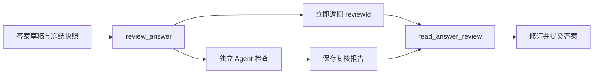

# 助手答案的独立复核与提交闸门

该模块为复杂助手回答提供一次可追踪的独立复核：作者先保存调查判断，按需提交带引用的答案草稿；系统立即返回复核任务 ID，在同一冻结材料快照上启动独立 Agent，并要求作者显式取回结果。复核引用会检查材料身份、历史版本、行范围和可见性。若复核仍在运行、失败未重试、结果未取回，或指出问题后草稿完全未改，最终答案都不能提交。

来源：gpt-5.6-sol 分析，gpt-5.6-sol 独立复核；模型解释仍可被原始证据纠正。

## 解决什么问题

这个模块位于助手自主调查与最终回答之间，解决的是：**复杂解释即使已有引用，也可能遗漏适用条件或误读跨材料关系**。`answerInvestigation` 为一次调查维护独立的取消信号、是否必须复核的标记，以及最近一项复核任务；作者可以通过 `investigation_notes` 保存简短的事实笔记，并明确本题是否需要独立检查。笔记是工作上下文，不会直接成为用户答案。参考 [调查级复核状态 ↗](../../../apps/server/src/assistant/answer-review.ts#L26 "支持模块为单次调查维护复核必要性、取消信号和最近任务状态的说明。") [调查笔记工具 ↗](../../../apps/server/src/assistant/answer-review.ts#L88 "支持调查者保存事实笔记并标记是否需要独立复核的说明。")

它把“是否要复核”交给调查者判断，而不是按关键词强制路由。简单、原文直接写明的查询可直接回答；一旦笔记标记必须复核，或作者主动启动复核，提交路径就必须看到一份已完成且已取回的结果。

## 一条代表性调用如何完成复核

假设作者准备回答“周五登记就会当天配送吗？”，输入是一个 `AnswerDraft`（答案正文与引用）以及本次调查的冻结 `ResearchSnapshot`。调用 `review_answer` 后，代码先对草稿 JSON 计算 SHA-256 指纹；已有任务仍在运行，或相同草稿已有结果时，直接复用原任务。否则创建 `running` 任务、持久化到工作区，并异步调用复核函数，所以首个响应只是 `reviewId` 和状态。复核函数既可通过 `publish` 提前保存有效报告，也可在 Promise 返回时发布；异常则落为 `failed` 或 `cancelled`。参考 [草稿指纹与任务复用 ↗](../../../apps/server/src/assistant/answer-review.ts#L107 "支持草稿指纹、运行任务去重、显式失败重试和立即返回任务状态的流程。") [异步报告生命周期 ↗](../../../apps/server/src/assistant/answer-review.ts#L133 "支持复核异步执行、提前发布有效报告以及失败或取消状态落盘的说明。")

作者随后用同一 `reviewId` 调用 `read_answer_review`；它最多等待 20 秒，只读取现有任务，不会再启动模型。完成时返回完整报告，仍在运行时可再次读取。参考 [按任务 ID 取回 ↗](../../../apps/server/src/assistant/answer-review.ts#L167 "支持按 reviewId 等待最多二十秒、只读取现有任务且不重复启动模型的说明。")

真正执行独立检查的是 `reviewAssistantAnswer`：它建立 `answer-reviewer` 工作区，写入原问题、对话、时钟、任务和草稿，再以同一材料、文章与快照准备只读研究环境。最后通过配置的 ACP profile 启动独立角色，读取提交结果并按 `AnswerReview` 合同返回；无论成功失败，研究环境都会关闭。参考 [独立复核工作区 ↗](../../../apps/server/src/assistant/answer-review.ts#L225 "支持复核器写入问题与草稿，并复用同一冻结材料、文章和快照准备研究环境的说明。") [ACP 独立角色执行 ↗](../../../apps/server/src/assistant/answer-review.ts#L304 "支持复核通过 answer-reviewer 技能与 ACP profile 独立运行、记录轨迹并关闭环境的说明。")

## 授权边界、失败与提交约束

复核报告不是任意文本。每条问题引用都必须指向快照中的授权材料；若指定历史版本，会从仓储解析该版本，但仍须属于同一来源。起止行顺序、材料总行数和片段可见性也会校验，越权引用会使复核提交失败。参考 [复核引用授权校验 ↗](../../../apps/server/src/assistant/answer-review.ts#L274 "支持对历史版本、同源身份、行范围和片段可见性进行校验的说明。")

提交闸门覆盖四类情况：任务仍在运行；调查已要求复核但没有成功结果；完成结果尚未取回；报告指出实质问题后，最终答案仍与被审草稿完全相同。失败不会隐式再调用模型，只有 `retry=true` 才会为失败任务开启新复核；调查关闭时会取消自己拥有的后台任务并等待其收尾。已经验证并保存的报告即使在 Agent 收尾阶段遭取消，也保持 `completed`，但它仍只是修改建议，不会替作者发布答案或执行行动。参考 [异步报告生命周期 ↗](../../../apps/server/src/assistant/answer-review.ts#L133 "支持复核异步执行、提前发布有效报告以及失败或取消状态落盘的说明。") [答案提交闸门 ↗](../../../apps/server/src/assistant/answer-review.ts#L197 "支持关闭时取消后台工作，以及提交前对运行中、未完成、未取回和未修改草稿进行阻断的说明。")

可调整点也很集中：等待上限与读取协议在 `read_answer_review`，重试和去重规则在 `review_answer`，引用授权在 `reviewAssistantAnswer.validate`，最终能否提交则由 `beforeSubmit` 控制。
