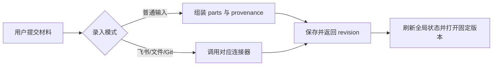

# 个人工作记忆的前端总控与材料流转

App.vue 是个人工作区的根编排组件：它识别运行模式、装载全局数据、切换业务页面，并把材料录入、统一搜索和递归证据阅读串成可操作流程。它主要负责状态与交互协调，HTTP、证据栈和具体业务页面由独立模块承担。

来源：gpt-5.6-sol 分析，gpt-5.6-sol 独立复核；模型解释仍可被原始证据纠正。

## 一个入口串起整套个人工作区

App.vue 是前端总控，而不是所有业务规则的实现处。它用 hash 与会话存储维护当前视图，并在日常助理、知识库、原始材料、录入、处理、待判断、事项等入口之间切换；材料、通知、任务、变更和 Agent 状态则保存在根级响应式状态中。参考 [工作区导航与根状态 ↗](../../../apps/web/src/App.vue#L51 "支持 App 以视图路由、会话状态和根级响应式数据统一编排多个工作区入口的说明。")

挂载后，`boot` 先探测知识评审模式；若是个人服务，再读取健康状态、Agent 配置和各类列表，打开首份材料，并启动 2.5 秒刷新。`refresh` 并行拉取七类全局数据且避免轮询重入；请求统一经 `api` 加 `/api` 前缀、带会话令牌，并把非成功响应转成异常。参考 [全局状态刷新 ↗](../../../apps/web/src/App.vue#L251 "支持并行拉取七类数据、防止刷新重入和维护当前版本状态的说明。")、[应用启动与模式分流 ↗](../../../apps/web/src/App.vue#L305 "支持启动时区分评审服务与个人服务、加载配置并建立轮询的流程说明。")、[统一 HTTP 请求封装 ↗](../../../apps/web/src/api.ts#L260 "说明 App 调用的 api 模块如何添加路径前缀、会话令牌、JSON 请求体并处理错误。")

## 代表性调用：保存一份带图片的材料

例如用户在“输入材料”填写标题、正文和图片。图片先在浏览器校验为 PNG/JPEG/WebP 且不超过 5 MB，再转成 base64 部件。提交时，`capture` 根据模式选择飞书、服务器文件或 Git 连接器；普通输入则组装文本、链接、图片与来源证明，调用 `/captures`。成功后依次刷新列表、打开服务端返回的 revision、提示“复用原版本”或“固定证据片段已生成”，最后只清空标题、正文和图片；附带链接、来源标识、来源类型及连接器字段仍保留当前值。参考 [图片输入校验 ↗](../../../apps/web/src/App.vue#L403 "支持图片类型、大小限制和 base64 转换这一录入前置步骤。")、[材料保存主流程 ↗](../../../apps/web/src/App.vue#L424 "支持不同来源分流、普通材料组装、保存后刷新与打开 revision，以及仅重置标题、正文和图片的准确界面状态。")

要增加录入来源，主要修改 `capture` 的模式分支及对应表单；版本生成、去重与切片语义属于服务端返回结果，不应在此组件中重造。参考 [材料保存主流程 ↗](../../../apps/web/src/App.vue#L424 "支持不同来源分流、普通材料组装、保存后刷新与打开 revision，以及仅重置标题、正文和图片的准确界面状态。")

## 搜索、证据阅读与真实边界

搜索监听问题、用途和材料角色，等待 250 ms 后发起请求；新输入会取消旧请求并递增版本号，只有当前版本能写回结果。结果跳转按类型分流：事项回到事项页，记忆优先追溯首个原始依据，原文与讲解进入递归阅读路径，文章中的引用则转成 citation frame。参考 [搜索防抖与取消 ↗](../../../apps/web/src/App.vue#L202 "支持搜索条件变化时取消旧请求、延迟执行并递增版本号的说明。")、[搜索请求版本隔离 ↗](../../../apps/web/src/App.vue#L384 "支持只有当前搜索版本才能写回结果或错误状态的说明。")、[搜索结果导航分流 ↗](../../../apps/web/src/App.vue#L151 "支持事项、记忆、原文、讲解和文章引用采用不同导航路径的说明。")

App 负责把阅读状态和组件事件接起来：`useEvidenceTrail` 管理帧入栈、返回、跳层与循环检测，并在首次打开时记录触发焦点；App 把该元素传给 `OmTrailDrawer`，由抽屉在关闭后实际归还焦点。`KnowledgeFrame` 渲染当前搜索帧；传统片段证据则由 `EvidenceReader` 读取 `/evidence/:id`，逐层保存并恢复滚动位置。参考 [阅读抽屉装配 ↗](../../../apps/web/src/App.vue#L1256 "说明 App 如何把保存的触发元素、证据栈状态、导航事件和 KnowledgeFrame 接到抽屉组件。")、[递归阅读状态管理 ↗](../../../packages/ui/src/useEvidenceTrail.ts#L6 "支持 useEvidenceTrail 管理帧、层级、循环检测，并在首次打开时记录触发焦点的职责说明。")、[抽屉关闭后归还焦点 ↗](../../../packages/ui/src/components/OmTrailDrawer.vue#L35 "支持 OmTrailDrawer 接收记录的触发元素，并在抽屉关闭后执行实际焦点归还的说明。")、[片段证据逐层阅读 ↗](../../../apps/web/src/EvidenceReader.vue#L16 "说明 EvidenceReader 获取证据、保存当前滚动、压入新层并在返回时恢复位置。")

边界上，代码“调用位置”只是按名称得到的候选，同名对象可能混淆，别名与动态调用也可能漏掉；界面明确要求结合上下文确认，不能把结果当成完整调用图。参考 [调用候选提示 ↗](../../../apps/web/src/App.vue#L711 "直接支持调用位置仅为名称候选、存在同名混淆及别名动态调用遗漏的边界说明。")
