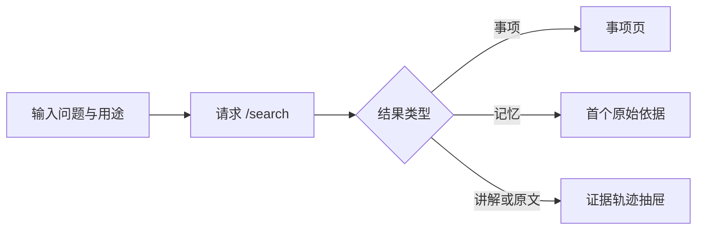

# 个人工作记忆的单页工作区编排

App.vue 是个人工作记忆 Web 端的顶层编排器：识别服务运行模式，维护全局导航与共享状态，把搜索、原始材料、采集、事项、通知及 Agent 配置连接到各自 API 或子组件，并统一承接证据阅读。

来源：gpt-5.6-sol 分析，gpt-5.6-sol 独立复核；模型解释仍可被原始证据纠正。

## 一个外壳承接多条用户流程

`App.vue` 可以理解为个人工作记忆的**单页控制器**：它定义稳定的主导航，用 URL hash 与会话存储恢复当前页面，并计算当前页标题。个人工作区进入 `OmShell` 后，顶部提供搜索和通知入口，侧栏则按同一导航数组切换页面；后续页面分支都在这个外壳内渲染。参考 [工作区导航与视图状态 ↗](../../../apps/web/src/App.vue#L48 "支持主导航覆盖的页面范围，以及 hash、会话存储和页面标题共同维护当前视图的说明。") [个人工作区外壳 ↗](../../../apps/web/src/App.vue#L626 "支持个人工作区由 OmShell 承载顶部搜索、通知入口、侧栏导航和后续页面分支的说明。")

启动时，它先探测 `/api/review/health`：确认是评审模式后会停止个人服务初始化，界面进入“知识库已合并到主应用”的迁移提示；只有该路由明确返回 404 才继续读取个人服务健康状态。连接失败会保留错误并定时重试，成功后再载入 Agent 配置、刷新业务数据并打开首份材料。参考 [启动模式识别与初始化 ↗](../../../apps/web/src/App.vue#L286 "支持先识别评审模式并停止个人初始化、仅以 404 转入个人服务、失败重试及成功后加载数据的启动流程。") [运行模式界面分支 ↗](../../../apps/web/src/App.vue#L604 "支持连接中、评审迁移提示和个人工作区互斥渲染，并证明评审模式展示合并迁移提示。")

## 代表性流程：从一次搜索走到证据

用户在顶部输入问题并选择“理解概念、定位实现、了解背景”等用途后，监听器会清空旧结果、取消前一请求并等待 250ms；响应只有版本仍是最新时才能写回，避免快速输入造成旧结果覆盖新结果。参考 [搜索防抖与竞态控制 ↗](../../../apps/web/src/App.vue#L178 "支持查询或用途变化时取消旧请求、延迟发起搜索并用版本号阻止过期结果写回。")

结果页区分讲解、原文、已应用记忆和事项；点击后，事项直接切页，记忆沿首个引用继续，讲解及其引用则压入证据轨迹。抽屉用 `KnowledgeFrame` 展示当前层，并支持返回、跳层、循环提示和焦点归还。参考 [搜索结果分流 ↗](../../../apps/web/src/App.vue#L134 "支持事项、记忆、讲解与原文结果采用不同导航动作，并将可递归阅读的目标压入证据轨迹。") [递归证据抽屉装配 ↗](../../../apps/web/src/App.vue#L1220 "支持搜索轨迹由抽屉和 KnowledgeFrame 展示，并具有关闭、返回、跳层、循环处理与焦点归还能力。")

## 材料闭环、模块分工与边界

另一条典型闭环是“输入材料”：图片先限制为 PNG/JPEG/WebP 且不超过 5 MB；提交时按文本、飞书、Git 或服务器文件选择不同端点。手工输入会组装文本、链接、图片和来源元数据，保存后刷新全局列表、打开新修订，并明确提示是复用重复版本还是生成了固定证据。参考 [材料采集与保存闭环 ↗](../../../apps/web/src/App.vue#L384 "支持图片约束、多种导入端点、手工材料及来源元数据组装，以及保存后的刷新、打开和重复提示。")

根组件采用**委派与内联并存**的分工：知识库、材料处理、待判断、日常助理、变更历史和飞书配置交给子组件，并通过属性与 `refresh/open/error/notice/navigate` 等事件回接顶层状态；事项和通知页面仍在 `App.vue` 内直接渲染，连接设置也由根组件内联实现。参考 [委派页面与内联页面 ↗](../../../apps/web/src/App.vue#L945 "支持知识库、材料处理、待判断、日常助理、变更历史和飞书配置由子组件承载，同时事项与通知页面直接写在根组件中。") [能力与连接设置 ↗](../../../apps/web/src/App.vue#L1072 "支持能力与连接页面直接在根组件中渲染，并管理 Agent 选择、模型与思考强度、服务访问令牌。")

搜索请求与结果路由、原文浏览和采集流程同样由根组件直接实现或编排，而不是全部下沉到业务子组件。原文阅读时，当前片段会交给 `ChatPane`，共享 `EvidenceReader` 负责打开证据。参考 [搜索防抖与竞态控制 ↗](../../../apps/web/src/App.vue#L178 "支持查询或用途变化时取消旧请求、延迟发起搜索并用版本号阻止过期结果写回。") [搜索结果分流 ↗](../../../apps/web/src/App.vue#L134 "支持事项、记忆、讲解与原文结果采用不同导航动作，并将可递归阅读的目标压入证据轨迹。") [材料采集与保存闭环 ↗](../../../apps/web/src/App.vue#L384 "支持图片约束、多种导入端点、手工材料及来源元数据组装，以及保存后的刷新、打开和重复提示。") [原文问答与证据阅读 ↗](../../../apps/web/src/App.vue#L1214 "支持共享证据阅读器接收 Agent 配置并在保存后刷新，以及原文页将当前片段交给 ChatPane。")

边界也很明确：原始材料目录最多展示 80 项但允许按标题筛选；组件卸载时会移除 hash 监听、清除轮询与延时器并中止搜索，避免离开页面后继续更新状态。参考 [材料目录展示上限 ↗](../../../apps/web/src/App.vue#L748 "支持原始材料按标题过滤、最多展示前 80 项并向用户提示筛选方式的边界。") [组件卸载清理 ↗](../../../apps/web/src/App.vue#L589 "支持卸载时移除监听、清除轮询和延时器、取消搜索请求并使旧版本失效。")
