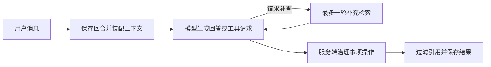

# 助手回合如何检索、决策并安全执行事项

AssistantRuntime 是 Web 与飞书共用的服务端回合协调层：它持久化用户输入，装配可见证据、历史、纠正和事项，驱动最多两轮模型生成，再由服务端校验事项写入、引用与取消状态，并按真实执行结果完成、取消、失败或保留待重试。

来源：gpt-5.6-sol 分析，gpt-5.6-sol 独立复核；模型解释仍可被原始证据纠正。

## 它解决什么问题

`AssistantRuntime` 把一次自然语言交互变成可持久化、可取消和可恢复的服务端回合。它位于会话路由、统一检索、模型适配器与记忆服务之间：模型负责提出回答和结构化工具请求，运行时负责决定证据是否可见、引用是否有效、写操作是否获准。Web 与飞书因此共享同一套助手行为。参考 [统一助手职责 ↗](../../../apps/server/src/assistant/runtime.ts#L233 "说明该运行时统一承接 Web 与飞书，并负责上下文、检索、服务端治理、持久化和降级。")

## 代表性调用：从一句提醒到已保存事项

以“提醒我 10 月 2 日上午 9 点复习英语”为例，调用方传入会话、原文和可选的外部事件 ID。运行时先保存 pending 回合，重复的外部事件直接复用原回合；新消息会中断该会话当前 `inflight` 链里正在执行或排队的旧回合，再接到同一串行链后执行。这里的覆盖范围只限当前进程仍持有的执行链：因模型不可用而已经退出执行、留下的可重试 pending 回合不在其中。参考 [回合入队与执行链 ↗](../../../apps/server/src/assistant/runtime.ts#L272 "支持先保存、按外部事件去重，并只中断当前 inflight 执行链中旧回合的行为范围。") [模型生成结果分流 ↗](../../../apps/server/src/assistant/runtime.ts#L632 "说明取消会终止回合，只有模型明确不可用会标回 pending，其他生成异常改用降级答复继续流程。")

上下文包括同会话已完成历史、当前检索结果、上一回合工作证据、用户纠正、可见事项和当前时钟。模型首轮可提出至多 3 个补搜请求，补搜后只再生成一次。参考 [上下文与补充检索 ↗](../../../apps/server/src/assistant/runtime.ts#L516 "支持历史、证据、纠正、事项和时钟的装配，以及最多一次补充检索和第二轮生成。")

若模型提出 `create_task`，服务端仍检查用户原话是否明确表达记录、安排或提醒意图；咨询句不会仅凭模型请求触发写入。时间还必须来自原消息中的表达，解析值有效并带时区。参考 [明确事项意图 ↗](../../../apps/server/src/assistant/runtime.ts#L171 "说明显式事项表达与咨询表达的确定性判定规则。") [时间校验 ↗](../../../apps/server/src/assistant/runtime.ts#L76 "支持时间表达必须出现在原消息中，且解析值必须有效并包含时区。")

## 模型提议不等于操作成功

通过意图检查后，运行时捕获本轮 owner 原话作为创建事项的直接证据，再把提案交给 `MemoryService.evaluate`。只有返回真实 task receipt 才算创建成功；最终展示文案也从已存储的事项状态、时间和跟进设置重建，不采用模型自报的“已完成”。参考 [服务端工具治理 ↗](../../../apps/server/src/assistant/runtime.ts#L653 "说明模型工具请求仍需经过用户意图检查和服务端治理，真实写入由 MemoryService 执行。") [回执决定结果文案 ↗](../../../apps/server/src/assistant/runtime.ts#L714 "支持最终答复依据持久化后的事项状态生成，而不相信模型对操作成功的描述。")

检索材料可以帮助模型理解“按这个”等指代，但创建提案实际采用的证据数组只有本轮捕获的 owner 指令。模型给出的材料引用仍会先验证是否存在于当前或上一回合上下文；普通回答的引用也只保留运行时实际提供过的 ID。参考 [用户原话作为创建证据 ↗](../../../apps/server/src/assistant/runtime.ts#L1218 "说明上下文引用会被校验，但创建提案实际采用本轮捕获的 owner 原话作为直接证据。") [回答引用白名单 ↗](../../../apps/server/src/assistant/runtime.ts#L755 "说明仅保存运行时实际提供给模型且被回答选中的证据。")

写入还有取消栅栏：工具治理前和最终保存结果前都会再次检查信号，避免被中断后到达的模型结果继续落库。参考 [工具前取消栅栏 ↗](../../../apps/server/src/assistant/runtime.ts#L653 "支持在治理写操作前再次检查取消状态。") [保存前取消栅栏 ↗](../../../apps/server/src/assistant/runtime.ts#L777 "支持最终持久化回合结果前再次检查取消状态。")

## 可见性、失败与恢复边界

未注入可见性策略时，私人会话可读证据，群聊默认不暴露证据；生产接入方需要按来源和会话范围提供策略。参考 [群聊默认拒绝证据 ↗](../../../apps/server/src/assistant/runtime.ts#L1180 "支持无自定义策略时私人会话可见、群聊证据默认不可见的边界。")

模型明确不可用时，回合会被标回 pending，可由 `retryTurn` 或重启恢复再次执行。取消或超时会标为 cancelled；其他模型生成异常会改用诚实的降级答复，并在后续流程正常完成时保存为 done；模型生成之外的执行链异常则会标为 failed。参考 [模型生成结果分流 ↗](../../../apps/server/src/assistant/runtime.ts#L632 "说明取消会终止回合，只有模型明确不可用会标回 pending，其他生成异常改用降级答复继续流程。") [待处理回合重试入口 ↗](../../../apps/server/src/assistant/runtime.ts#L368 "说明公开重试入口只接受 pending 回合，并在重新执行前检查有限范围的已提交回执。") [执行链终态处理 ↗](../../../apps/server/src/assistant/runtime.ts#L777 "说明最终保存成功时回合完成；执行链中的取消会标为 cancelled，其他未被内部处理的异常会标为 failed。")

重启恢复会枚举 pending 或 running 回合：若识别到已提交的创建事项回执，就直接补齐完成状态；否则重新进入 `executeTurn`。重跑后的状态仍由上一段各分支决定，并非所有失败都继续 pending，只有明确的 `ModelUnavailableError` 会调用 `markPending` 等待再次重试。参考 [未完成回合恢复 ↗](../../../apps/server/src/assistant/runtime.ts#L420 "说明恢复会直接完成已识别到创建回执的回合，并让其他 pending 或 running 回合重新进入 executeTurn；最终状态由执行分支决定。") [模型生成结果分流 ↗](../../../apps/server/src/assistant/runtime.ts#L632 "说明取消会终止回合，只有模型明确不可用会标回 pending，其他生成异常改用降级答复继续流程。") [执行链终态处理 ↗](../../../apps/server/src/assistant/runtime.ts#L777 "说明最终保存成功时回合完成；执行链中的取消会标为 cancelled，其他未被内部处理的异常会标为 failed。")

恢复逻辑的防重检查范围很具体：只有回合带外部事件 ID，且数据库中存在 `assistant-task:${eventId}:%` 形式的**创建事项**提案回执，才会直接补齐完成状态而不重做。没有外部事件 ID、`update_task` 回执或其他未匹配到该形式的情况，不会被这一检查识别。参考 [创建回执识别条件 ↗](../../../apps/server/src/assistant/runtime.ts#L349 "限定恢复前检查只在存在外部事件 ID 时，查询特定创建事项提案号前缀。")

重新执行不等于绕过写入治理：创建事项仍以外部事件 ID（没有时用回合请求 ID）和标题摘要构造提案并交给 `MemoryService.evaluate`；事项更新则以回合 ID 作为 `requestId` 调用 `commandTask`，同时校验可见事项版本。它们是写入服务自身的幂等与并发合同，不能被概括成恢复层对所有操作的统一防重。参考 [创建事项提案合同 ↗](../../../apps/server/src/assistant/runtime.ts#L1282 "说明创建事项以事件或回合请求身份构造提案，并由 MemoryService 返回真实回执及重复标志。") [事项更新命令合同 ↗](../../../apps/server/src/assistant/runtime.ts#L1003 "说明更新先校验用户指令与事项版本，再以回合 ID 作为请求身份调用 MemoryService。")
