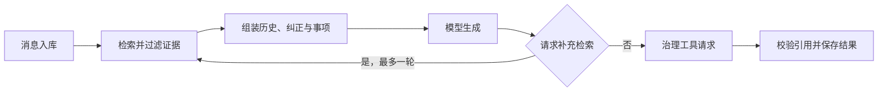

# 统一助理会话与受控事项执行

该运行时统一承接 Web 与 Lark 会话，在持久化、证据检索、模型调用和事项治理之间建立边界：模型负责生成回答与结构化请求，服务器负责可见性、意图、引用、写入和故障处理。

来源：gpt-5.6-sol 分析，gpt-5.6-sol 独立复核；模型解释仍可被原始证据纠正。

## 统一入口与安全边界

`AssistantRuntime` 是 Web 与 Lark 共用的主助理运行时，负责组装会话上下文、检索证据、调用模型、治理低风险事项操作并保存轮次结果。模型、检索、记忆治理和反馈能力均通过端口注入，因此它承担的是编排与安全边界，而不是模型或知识库本身。参考 [统一助理运行时职责 ↗](../../../apps/server/src/assistant/runtime.ts#L192 "支持运行时统一承接不同入口，并负责上下文、检索、治理、持久化和降级编排的说明。")

模型只能引用运行时提供的证据并提出声明过的结构化工具请求；是否允许读取材料或变更事项，仍由服务器依据会话可见性、用户原话和持久化回执判断，模型输出本身不构成授权。

## 从消息到可追溯回答

消息会在调用模型前入库，并以外部事件标识处理重复投递。同一会话收到新消息时，当前轮次会被中断并标记取消，新轮次在已有执行链之后运行，以维持普通消息的会话内顺序。参考 [轮次入库与会话串行化 ↗](../../../apps/server/src/assistant/runtime.ts#L241 "支持消息先持久化、重复投递幂等返回，以及普通新消息中断并串行等待同会话旧轮次的流程。")

执行时仅纳入同一会话最近的已完成轮次，并合并上一轮工作证据、会话级纠正、可见事项和当前时钟；补充检索结果按片段去重并限制总量。参考 [上下文组装与补充检索 ↗](../../../apps/server/src/assistant/runtime.ts#L454 "支持同会话历史、上一轮工作证据、纠正、事项和时钟进入模型，以及最多一轮补充检索的流程。")

最终引用会与实际提供给模型的证据集合求交，轮次结果、选中证据和工具动作一并持久化，避免回答指向模型未见过的材料。参考 [引用约束与轮次落库 ↗](../../../apps/server/src/assistant/runtime.ts#L602 "支持引用只能选自运行时实际提供的证据，并说明结果、证据和工具动作共同持久化。")

## 事项创建与更新如何受控

模型提出事项操作后，运行时会先检查用户原话是否表达明确的创建或变更意图；咨询式问题不会因为模型生成了工具调用而自动写入。发生变更时，展示给用户的结果依据真实任务状态重新生成，不沿用模型推测的成功文案。参考 [工具调用治理与结果文案 ↗](../../../apps/server/src/assistant/runtime.ts#L540 "支持工具执行前的取消栅栏、明确意图检查，以及依据真实任务状态生成操作结果。")

更新事项还要求原话匹配具体动作、目标事项对当前会话可见且版本一致；改期时间必须能在原消息中找到对应表达，并包含有效时区。变更指令先被捕获为原始证据，再交给记忆服务执行带版本和请求标识的命令。参考 [事项更新校验流程 ↗](../../../apps/server/src/assistant/runtime.ts#L702 "支持更新动作的原话意图、可见性、版本、时间和跟进参数校验，并说明指令先被捕获为证据。") 事项状态、动作及等待、复查、暂缓等字段由共享合同约束。延伸阅读：[事项动作共享合同 ↗](../../../packages/contracts/src/task-flow.ts#L3 "说明运行时依赖的事项状态、动作、乐观版本和带时区跟进字段约束。")

创建事项时，当前所有者的明确指令会被捕获为具有已验证来源信息的原始片段，并以外部事件标识或轮次标识构造稳定提案；随后由记忆治理服务评估，只有取得真实任务回执才报告创建成功。参考 [所有者指令证据与稳定提案 ↗](../../../apps/server/src/assistant/runtime.ts#L854 "支持把当前所有者原话捕获为原始证据，并依据外部事件或轮次信息构造稳定创建提案。") [记忆治理与任务回执 ↗](../../../apps/server/src/assistant/runtime.ts#L901 "支持创建事项请求经过记忆服务评估，且仅在取得真实任务回执后报告成功。")

## 取消、恢复与证据限制

检索优先走统一 `RetrievalPort`，未注入时才退回旧的存储搜索。检索候选必须回指不可变片段，使回答能够引用原始证据，而不是把重排摘要当成事实来源。参考 [助理证据检索实现 ↗](../../../apps/server/src/assistant/runtime.ts#L663 "支持优先使用统一检索端口、旧存储搜索仅作兼容回退，以及结果继续经过可见性过滤。") [不可变片段检索合同 ↗](../../../apps/server/src/retrieval/port.ts#L1 "说明检索结果必须回指不可变片段，使上层能够引用原始证据而非重排摘要。")

群聊在没有宿主可见性策略时默认不返回证据；片段还必须属于来源当前头版本，且不能是派生修订。长原文中的语义摘录仅作为定位信息，只有确实存在于当前原文时才用于截取上下文。参考 [证据头版本与默认可见性 ↗](../../../apps/server/src/assistant/runtime.ts#L770 "支持仅使用当前原始修订、校验语义摘录位置，以及群聊无可见性策略时拒绝证据访问的边界。")

取消检查位于模型调用后、工具执行前和最终持久化前，用于阻止已取消或超时轮次继续写入。模型明确不可用时轮次保留为待重试；其他生成异常则保存诚实的降级答复。

重试与启动恢复的回执保护范围较窄：只有轮次带有外部事件标识时，运行时才按该事件对应的创建事项提案前缀查询应用回执；没有外部事件标识时不会命中此保护，事项更新命令的回执也不在该查询范围内。参考 [创建事项回执查询范围 ↗](../../../apps/server/src/assistant/runtime.ts#L313 "支持回执查询仅在存在外部事件标识时，按创建事项提案前缀检查应用回执；也据此说明其不覆盖无事件标识轮次和事项更新命令。") 恢复流程会对命中的创建事项回执直接补齐轮次状态，其余未完成轮次则重新执行；模型仍不可用时保留后续重试机会。参考 [未完成轮次恢复 ↗](../../../apps/server/src/assistant/runtime.ts#L380 "支持恢复流程对命中的创建事项回执补齐状态，并重新执行其余未完成轮次；失败时保留后续恢复机会。")
