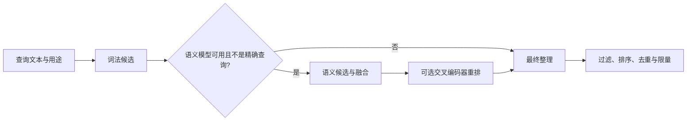

# 统一检索端口：让阅读、助手与 Agent 共用同一套结果

RetrievalPort 是服务端共享检索的稳定边界：调用者显式给出查询用途和过滤条件，统一实现融合原文、知识、记忆与事项，并保留可回到固定原文的引用。

来源：gpt-5.6-sol 分析，gpt-5.6-sol 独立复核；模型解释仍可被原始证据纠正。

## 它解决什么问题

读者搜索、助手补充上下文和 Agent 调查都需要检索，但消费方式不同：有的要直接阅读整理后的讲解，有的必须回到固定原文。`RetrievalPort` 把这些需求收束为一个边界；统一搜索可返回原文、知识、记忆或事项，旧式原文方法仍保留 Fragment 锚点。参考 [共享检索职责 ↗](../../../apps/server/src/retrieval/port.ts#L1 "说明端口服务于读者、助手和 Agent，并区分原文结构、派生讲解、应用状态与旧 Fragment 接口。")

查询用途包括均衡、概念、实现、背景和跟进五类。用途由读者或 Agent 明确传入，不从仓库路径推断；同一查询还可携带范围、可信项目、种类、分类路径、时间和可见性条件。参考 [五类检索用途 ↗](../../../apps/server/src/retrieval/port.ts#L10 "列出统一端口当前接受的五类显式检索用途。") [查询条件与用途来源 ↗](../../../apps/server/src/retrieval/port.ts#L82 "展示 scope、可信项目、时间、可见性、用途、种类和分类路径字段，并明确用途由读者或 Agent 提供。")

`RetrievalHit` 不只是文本和分数，还包含标题、上下文、标题路径、命中路线、固定目标、原文引用与来源信息。知识命中还能携带文章引用，因此消费方既能展示解释，也能继续打开依据。参考 [统一命中结构 ↗](../../../apps/server/src/retrieval/port.ts#L39 "展示命中携带正文、上下文、排序路线、固定目标、原文引用、文章引用和来源信息。")

## 一次顶部搜索怎样穿过端口

以用户在顶部搜索输入“记忆如何应用”为例：HTTP 入口用共享用途枚举校验参数，把查询截到 300 字并限制为 30 条；若统一 `search` 可用就直接调用，否则退回原文搜索并把 Fragment 补成页面结果。参考 [顶部搜索入口 ↗](../../../apps/server/src/app.ts#L274 "证明 HTTP 入口直接用共享枚举校验用途、限制查询长度与条数，并优先调用统一搜索。")

统一实现先同步检索单位并生成词法候选；空查询、精确查找或没有语义模型时直接进入最终整理，否则计算查询向量、筛选语义候选并与词法结果融合。可选重排失败时保留已有候选，再交给 `finish`。参考 [词法与语义融合 ↗](../../../apps/server/src/retrieval/unified.ts#L323 "支持同步投影、词法候选、条件启用语义分支及两路候选融合的流程。") [可选重排与收束 ↗](../../../apps/server/src/retrieval/unified.ts#L389 "展示可选交叉编码器重排、失败保留候选以及最终调用 finish 的行为。")

`finish` 才落实最终结果语义：按用途偏好、定义命中和知识新鲜度计算优先级，跟进用途还考虑事件时间；随后执行资格过滤、按来源与正文指纹去重，组装带路线和引用的 `RetrievalHit`，达到调用者的条数限制后停止。参考 [用途与优先级规则 ↗](../../../apps/server/src/retrieval/unified.ts#L423 "证明 finish 根据用途、定义命中、知识新鲜度和跟进事件时间计算最终优先级。") [资格过滤与去重 ↗](../../../apps/server/src/retrieval/unified.ts#L469 "证明最终排序后执行资格过滤，并按来源数量和正文指纹做多样化去重。") [结果组装与限量 ↗](../../../apps/server/src/retrieval/unified.ts#L508 "证明最终命中写入分数、用途路线、目标、引用和来源，并按查询条数限制停止。")

## 边界条件与修改入口

项目过滤有明确的信任边界：只有 `project_id` 来自已确认关系且 `project_trusted=true` 时才可缩小项目范围，否则必须保持工作区级召回。种类、分类路径、可见性和捕获修订时间等过滤集中在统一实现的资格检查中。参考 [查询条件与用途来源 ↗](../../../apps/server/src/retrieval/port.ts#L82 "展示 scope、可信项目、时间、可见性、用途、种类和分类路径字段，并明确用途由读者或 Agent 提供。") [统一资格过滤 ↗](../../../apps/server/src/retrieval/unified.ts#L218 "展示统一实现实际处理的项目、种类、分类路径、可见性和时间过滤；完整方法中没有读取 scope。")

`search` 和异步原文搜索是可选能力；同步原文搜索、记忆搜索、固定证据回读与健康检查是端口的必备能力。工厂装配 `UnifiedRetrieval`，开发模式再由 `developmentRetrieval` 注入可见性策略，使已移除材料和旧别名不进入当前检索，同时把请求继续委托给同一端口。参考 [端口能力分层 ↗](../../../apps/server/src/retrieval/port.ts#L145 "区分可选的统一搜索和异步原文搜索，以及同步原文、记忆、证据回读和健康检查等必备能力。") [统一检索装配 ↗](../../../apps/server/src/retrieval/factory.ts#L14 "证明检索工厂创建、启动 UnifiedRetrieval，并以 RetrievalPort 暴露。") [开发材料可见性 ↗](../../../apps/server/src/review/development.ts#L15 "证明开发适配器通过 visible 排除已移除材料和旧别名，并把统一搜索与原文搜索继续委托给底层端口。")

助手收到命中后，会沿 `references` 恢复可引用的原文证据，并把非原文命中作为独立背景输出，保持“讲解”和“事实依据”的区别。参考 [助手拆分证据与背景 ↗](../../../apps/server/src/assistant/runtime.ts#L841 "证明助手沿命中的原文引用恢复证据，并把非 source 命中作为单独背景返回。")

扩展通用的新用途时，先修改 `retrievalPurposes`；HTTP 的 `z.enum(retrievalPurposes)` 会随之采用新值。只有新用途需要独特的结果偏好时，才应在 `finish` 的用途分支中补排序规则。另一个当前限制是：`scope` 已是 `SearchQuery` 字段，但统一实现的完整资格检查未读取它，因此不能仅凭该字段宣称已有 project、topic、workspace 三套实际过滤行为。参考 [五类检索用途 ↗](../../../apps/server/src/retrieval/port.ts#L10 "列出统一端口当前接受的五类显式检索用途。") [顶部搜索入口 ↗](../../../apps/server/src/app.ts#L274 "证明 HTTP 入口直接用共享枚举校验用途、限制查询长度与条数，并优先调用统一搜索。") [用途与优先级规则 ↗](../../../apps/server/src/retrieval/unified.ts#L423 "证明 finish 根据用途、定义命中、知识新鲜度和跟进事件时间计算最终优先级。") [统一资格过滤 ↗](../../../apps/server/src/retrieval/unified.ts#L218 "展示统一实现实际处理的项目、种类、分类路径、可见性和时间过滤；完整方法中没有读取 scope。")
