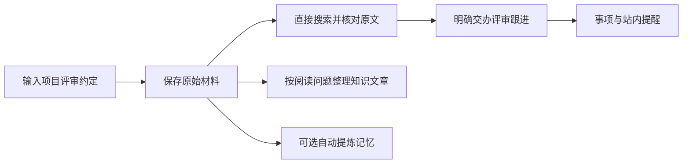

# 先认识 omem：把材料变成能找回的工作记忆

用一份项目评审约定贯穿 omem 的最短使用流程：保存原文、找回决定、按需整理知识或形成记忆，并把等待评审回复变成可持续跟进的事项。同时说明材料、知识文章、个人记忆和事项的分工，使用 Agent 的前提，以及当前搜索、提醒和主动能力的真实边界。

来源：gpt-5.6-sol 分析，gpt-5.6-sol 独立复核；模型解释仍可被原始证据纠正。

## 从一份容易遗忘的项目约定开始

omem 想解决的不是“多放一个文件”，而是让文档、代码、聊天、图片和个人经历在同一处变成**能读懂、能找回、能继续行动**的工作记忆。代码只是多了结构定位能力，并没有另起一套知识库。参考 [产品目标与统一知识库 ↗](../../../README.md#L3 "支持 omem 面向理解、找回与行动组织多类材料，并说明代码只增加结构定位能力。")

下面用一个**教学示例**贯穿全文：你保存《项目评审约定》，其中写着“合并前需要接口负责人评审”。几周后，你要回答“合并前谁来评审？”，还要等待张三回复，并在明天上午 9 点检查进展。

在当前仓库中体验时，依次运行 `osdk install`、`osdk deps --frozen`、`osdk run dev`，再打开终端打印的 Web 地址。开发模式会带入本仓库材料和已发布知识，并保留已有个人数据；正式构建后启动则从空工作区的“输入材料”开始。启动本身不会自动整理整个资料库。参考 [开始使用与启动边界 ↗](../../../README.md#L7 "支持开发模式启动步骤、正式启动入口、Agent CLI 前提，以及启动不会自动生成整库 Wiki。")

保存、阅读原文和基础检索可以独立使用。整理知识文章与日常助理依赖可运行的 ACP Agent；自动记忆处理则还要单独启用并配置对应 Agent。缺少这些条件时，原始材料能力仍然保留。参考 [材料、检索与讲解的分工 ↗](../../../docs/reader-first/architecture.md#L5 "解释原始材料、检索结构块和问题驱动讲解各自的用途，并说明派生内容不成为第二份独立事实。") [Agent 能力装配 ↗](../../../apps/server/src/app.ts#L66 "支持日常助理和知识整理使用 ACP profile，自动记忆处理另由 learning 配置与 profile 控制。")

## 第一步：保存原话，再从原话找回决定

进入“输入材料”，选择“文本＋图片＋链接”，填写标题和约定正文后保存；也可以导入飞书文档、指定提交中的 Git 文件，或服务器允许范围内的文本文件。参考 [材料输入入口 ↗](../../../apps/web/src/App.vue#L849 "支持文本图片链接、飞书文档、Git 文件和服务器文本文件等输入方式及其可见限制。") 保存完成后，界面会打开服务端返回的材料版本，并说明本次是新保存还是复用了已有版本。参考 [保存后的界面反馈 ↗](../../../apps/web/src/App.vue#L427 "支持保存后打开返回的材料版本，并根据服务端结果提示新保存或复用。")

如果你希望以后修改这份约定时仍归在同一份材料下，应填写并持续使用相同的“来源标识”；留空时系统会自动分配标识。这里不能简单理解为“正文一样就一定复用”，因为手工提交还携带本次捕获的来源信息。参考 [来源标识与手工捕获 ↗](../../../apps/web/src/App.vue#L427 "支持来源标识为空时自动分配、相同标识用于形成版本，并显示每次手工捕获会生成新的事件与时间信息。") 后续打开“原始材料”，可以区分当前版本与历史版本、阅读全文并进入固定片段，所以新表述不会把“当时到底写了什么”从阅读入口中抹掉。参考 [原文与版本历史 ↗](../../../apps/web/src/App.vue#L780 "支持原始材料页面区分当前和历史版本、阅读全文、打开固定片段并切换版本。")

三条支路不是必经顺序：原文保存后就能阅读和检索；知识文章由你选材并发起；自动记忆提炼也可以关闭。参考 [材料、检索与讲解的分工 ↗](../../../docs/reader-first/architecture.md#L5 "解释原始材料、检索结构块和问题驱动讲解各自的用途，并说明派生内容不成为第二份独立事实。") [记忆提炼与处理开关 ↗](../../../apps/web/src/LearningView.vue#L81 "支持材料经过提炼、核验后形成可应用记忆，并说明自动处理关闭时原文保存与检索仍可用。")

## 同一个例子里的四种东西

| 名称 | 在示例中是什么 | 作用 |
| --- | --- | --- |
| **原始材料** | 《项目评审约定》的原文和历史版本 | 回答“当时写了什么”，为后续解释提供可回看的依据。参考 [原文与版本历史 ↗](../../../apps/web/src/App.vue#L780 "支持原始材料页面区分当前和历史版本、阅读全文、打开固定片段并切换版本。") |
| **知识文章** | 围绕“合并前如何完成评审”组织的易读说明 | 帮人理解，可跨文档、代码和记录组织内容，但不是第二份独立事实。创建时先选材料，再说明主题、读者和想弄懂的问题。参考 [材料、检索与讲解的分工 ↗](../../../docs/reader-first/architecture.md#L5 "解释原始材料、检索结构块和问题驱动讲解各自的用途，并说明派生内容不成为第二份独立事实。") [知识文章选择材料 ↗](../../../apps/web/src/knowledge/ArticleComposer.vue#L102 "支持整理文章时先选择相关文档、代码或记录。") [知识文章阅读目标 ↗](../../../apps/web/src/knowledge/ArticleComposer.vue#L173 "支持用户填写文章主题、想弄懂的问题和目标读者后再发起整理。") |
| **个人记忆** | 经提炼、核验并应用的“本项目合并前需要评审” | 保存值得反复使用的事实、经历或方法，供以后搜索和助理调用；需要判断的内容不会直接冒充已确认记忆。参考 [记忆提炼与处理开关 ↗](../../../apps/web/src/LearningView.vue#L81 "支持材料经过提炼、核验后形成可应用记忆，并说明自动处理关闭时原文保存与检索仍可用。") |
| **事项** | “等待张三的评审回复” | 保存要推进的行动及状态，可记录等待对象、截止时间和下次跟进时间。参考 [事项状态与跟进信息 ↗](../../../apps/web/src/App.vue#L965 "支持事项的创建、状态、等待对象、下次跟进和截止时间等用户可见能力。") |

因此，“材料已保存”不等于“文章已整理”，也不等于“记忆已形成”或“待办已创建”。四者的职责分别是**证据、解释、可复用认知和行动状态**。文章引用可以回到写作时的固定原文；材料变化后，旧文章会提示等待更新，但原引用仍指向当时版本。参考 [文章引用与材料更新 ↗](../../../apps/web/src/knowledge/KnowledgeDocument.vue#L32 "支持文章材料变化时提示等待更新，并保留指向写作时版本的引用。")

## 第二步：在同一处找文档、知识、记忆和代码

几周后，在顶部搜索“合并前谁来评审”。你可以选择“综合查找、理解概念、定位实现、了解背景、跟进事项”；结果会区分讲解、原始材料、已应用记忆和当前事项，并提供阅读讲解、查看原文或进入事项的入口。参考 [统一搜索入口 ↗](../../../apps/web/src/App.vue#L674 "支持搜索用途选择、结果类型呈现，以及讲解、原文、记忆依据和事项的打开方式。")

代码和其他材料走同一条路。例如约定提到某个接口时，可以同时保存设计文档和相关代码，整理文章时也能把文档、代码或记录一起选入。系统会借助代码结构定位函数等位置，但最终仍围绕读者问题组织讲解。参考 [产品目标与统一知识库 ↗](../../../README.md#L3 "支持 omem 面向理解、找回与行动组织多类材料，并说明代码只增加结构定位能力。") [知识文章选择材料 ↗](../../../apps/web/src/knowledge/ArticleComposer.vue#L102 "支持整理文章时先选择相关文档、代码或记录。")

这条统一检索基础已经接通，但“可以搜索”不等于“每次都能给出最佳答案”。复杂概念问题仍可能命中主题相近、却不足以回答问题的内容；重要决定应打开原始材料核对。参考 [检索质量现状 ↗](../../../docs/reader-first/progress.md#L5 "支持统一召回基础已接通，同时复杂概念问题的整体相关性尚未达到可宣称稳定好用的程度。")

## 第三步：把等待评审回复变成可跟进的事项

确认日常助理所需的 ACP Agent 可用后，可以明确输入：“帮我跟进张三的评审回复，明天上午 9 点提醒我检查。”页面会使用固定日常会话读取已有消息；失败或未完成的消息会保留并可重试，回答带有依据时还能打开原文。参考 [日常助理会话与重试 ↗](../../../apps/web/src/DailyAssistant.vue#L14 "支持固定日常会话读取、交办示例、失败消息保留重试和证据入口。")

关键是**明确交办**。普通咨询不会因为模型猜测就自动创建任务；服务端会再次检查用户意图，并只根据实际保存成功的事项说明“已创建”或“已更新”。参考 [明确意图与持久化结果 ↗](../../../apps/server/src/assistant/runtime.ts#L645 "支持普通咨询不自动建任务，并且创建或更新的成功表述只依据服务端实际持久化结果。") 你也可以进入“事项与待办”手工创建，再设置等待对象和下次跟进时间。截止时间与跟进时间彼此独立，事项可处于待推进、等待回复、已完成或已取消。参考 [事项状态与跟进信息 ↗](../../../apps/web/src/App.vue#L965 "支持事项的创建、状态、等待对象、下次跟进和截止时间等用户可见能力。")

到约定时间，系统会写入站内通知。通知正文会提示这件事可以标记完成、稍后提醒或取消，但**通知本身不是这些操作的入口**：通知中心只提供标为已读和查看详情；要真正完成、稍后提醒或取消，需要进入“事项与待办”，也可以明确交办日常助理执行。参考 [站内提醒内容与边界 ↗](../../../apps/server/src/tasks/follow-up.ts#L20 "支持到期或跟进时间生成站内通知；通知正文提示后续选择，并明确不会自动联系等待对象。") [通知中心操作范围 ↗](../../../apps/web/src/App.vue#L1033 "直接说明通知中心只提供标为已读和查看详情，并明确已读不会完成待办或取消后续提醒。") [事项页跟进操作 ↗](../../../apps/web/src/TaskFollowUpControls.vue#L25 "直接支持稍后提醒和取消事项位于事项页的跟进设置中；完成入口由事项卡片提供。") [明确意图与持久化结果 ↗](../../../apps/server/src/assistant/runtime.ts#L645 "支持普通咨询不自动建任务，并且创建或更新的成功表述只依据服务端实际持久化结果。") 系统不会自动联系张三，也不会自动知道回复已经到达；通知标为已读同样不等于事项完成。参考 [站内提醒内容与边界 ↗](../../../apps/server/src/tasks/follow-up.ts#L20 "支持到期或跟进时间生成站内通知；通知正文提示后续选择，并明确不会自动联系等待对象。") [连接、文章与主动能力边界 ↗](../../../docs/reader-first/operations.md#L19 "支持单用户和外部集成边界、日常事项能力限制，以及从普通材料显式整理文章的流程。") [通知中心操作范围 ↗](../../../apps/web/src/App.vue#L1033 "直接说明通知中心只提供标为已读和查看详情，并明确已读不会完成待办或取消后续提醒。")

## 现在可用的闭环与仍需人工完成的部分

当前已经具备的基础闭环包括：输入并保留材料版本、阅读原文、统一搜索、按选材和阅读问题整理知识文章、可选的记忆提炼与来源更新后重核验，以及持久会话、事项交办和站内提醒。参考 [当前基础闭环 ↗](../../../README.md#L27 "支持统一检索、问题驱动 Wiki、日常事项、站内提醒和仍待实现能力的当前概览。")

仍要保留几条清晰边界：

- 启动不会自动整理全库；知识文章要由用户主动选择材料并发起。参考 [开始使用与启动边界 ↗](../../../README.md#L7 "支持开发模式启动步骤、正式启动入口、Agent CLI 前提，以及启动不会自动生成整库 Wiki。") [连接、文章与主动能力边界 ↗](../../../docs/reader-first/operations.md#L19 "支持单用户和外部集成边界、日常事项能力限制，以及从普通材料显式整理文章的流程。")
- 自动记忆处理可以关闭；关闭后原文保存与检索仍可用。参考 [记忆提炼与处理开关 ↗](../../../apps/web/src/LearningView.vue#L81 "支持材料经过提炼、核验后形成可应用记忆，并说明自动处理关闭时原文保存与检索仍可用。")
- 复杂搜索的整体相关性仍在改进，完整意图路由和跨文件功能链也尚未完成。参考 [检索质量现状 ↗](../../../docs/reader-first/progress.md#L5 "支持统一召回基础已接通，同时复杂概念问题的整体相关性尚未达到可宣称稳定好用的程度。") [当前基础闭环 ↗](../../../README.md#L27 "支持统一检索、问题驱动 Wiki、日常事项、站内提醒和仍待实现能力的当前概览。")
- 系统不会持续监听对方回复、自动催促他人，也没有周期回顾、日历或学习卡。当前提醒是站内提醒。参考 [站内提醒内容与边界 ↗](../../../apps/server/src/tasks/follow-up.ts#L20 "支持到期或跟进时间生成站内通知；通知正文提示后续选择，并明确不会自动联系等待对象。") [连接、文章与主动能力边界 ↗](../../../docs/reader-first/operations.md#L19 "支持单用户和外部集成边界、日常事项能力限制，以及从普通材料显式整理文章的流程。")
- 当前是 SQLite 单用户服务；飞书、外部通知、全局 hooks 和屏幕监听都要另行、明确启用。参考 [连接、文章与主动能力边界 ↗](../../../docs/reader-first/operations.md#L19 "支持单用户和外部集成边界、日常事项能力限制，以及从普通材料显式整理文章的流程。")

对第一次使用的人，最稳妥的心智模型是：**先保存原话，需要理解时再搜索或整理文章，需要推动时再明确创建事项；关键结论始终回到原始材料核对。**
