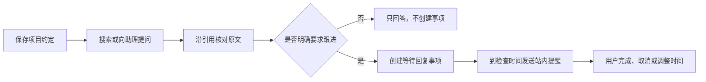

# 先认识 omem：把材料变成能找回的工作记忆

用一份“项目评审约定”贯穿保存、找回、解释与跟进，帮助新用户分清原始材料、知识文章、个人记忆和事项，了解代码如何与文档共同使用，以及当前可用能力和边界。

来源：gpt-5.6-sol 分析，gpt-5.6-sol 独立复核；模型解释仍可被原始证据纠正。

<a id="scenario"></a>
## 从一个会反复遇到的问题开始

omem 想解决的不是“文件放在哪里”，而是三个连续问题：**当时的原话是什么、现在采用的结论是什么、接下来要推进什么**。它把文档、代码、聊天、图片和个人经历放进同一个可检索、可追溯的工作记忆中；代码只是增加结构定位，不会进入另一套孤立的知识库。参考 [统一工作记忆目标 ↗](../../../README.md#L3 "支持 omem 统一组织文档、代码、聊天、图片和个人经历，以及代码使用结构定位但共享同一知识库。")

下面用一个**教学示例**贯穿全文：你保存《项目评审约定》，其中写着“失败请求默认重试三次；重要改动需要张三评审”。过几周，你想确认默认重试次数并查看依据；随后又明确交办：“帮我跟进张三的评审回复，明天上午 9 点提醒我检查。”前一句是需要找回的项目规则，后一句才是需要系统推进的行动。

<a id="start-and-save"></a>
## 第一步：启动并保存可持续换版的原话

在项目目录执行：

```bash
osdk install
osdk deps --frozen
osdk run dev
```

打开终端打印的 Web 地址。开发模式会载入已有材料、已发布知识和个人数据，但启动本身不会自动生成整库文章；涉及模型的处理还需要可用且已登录的 Agent CLI。参考 [启动与首次使用 ↗](../../../README.md#L7 "支持开发模式启动命令、打开 Web 地址、保留个人数据、不会自动生成整库 Wiki 及 Agent CLI 前提。")

进入“输入材料”，填写标题和正文。因为这份约定以后可能修改，还要在“来源标识”中填一个稳定、容易再次使用的值，例如 `project-review-rules`，并把它记下来，再点击“保存材料与证据”。界面明确提示“相同标识产生新版本”；如果留空，当前实现会为这次手工输入自动生成一个随机标识，下一次也留空保存就会成为另一份来源。参考 [稳定来源标识输入 ↗](../../../apps/web/src/App.vue#L890 "支持手工输入界面中“相同标识产生新版本”的提示，以及来源标识可留空自动分配的行为。") [留空时随机分配标识 ↗](../../../apps/web/src/App.vue#L416 "支持手工捕获在来源标识为空时生成随机 UUID，因此两次都留空不会自然复用同一来源。")

保存后到“原始材料”查看当前版本、历史版本、正文和固定片段。此时最可靠的可见结果是：**《项目评审约定》的原话已经保存，今后可以回到当时那一版核对**。这并不表示每句话都已经变成当前记忆，也不会自动创建评审事项。参考 [原文与版本阅读 ↗](../../../apps/web/src/App.vue#L797 "支持用户查看当前或历史版本、正文和固定片段，并继续打开原始证据。")

<a id="four-things"></a>
## 同一个例子里的四类内容

这四类内容分开，是为了避免把“保存过”“解释过”“当前采用”和“准备行动”混为一谈。系统也把保存原件、检索片段和面向读者的讲解视为不同用途。参考 [保存检索讲解分工 ↗](../../../docs/reader-first/architecture.md#L5 "支持原件、检索单位与讲解页面的用途分离，以及派生内容不成为第二份事实。")

| 类型 | 在示例中是什么 | 主要回答什么 |
| --- | --- | --- |
| **原始材料** | 《项目评审约定》及其历次版本 | 原话是什么？哪一版这样写？ |
| **知识文章** | 《这个项目怎样重试与评审》 | 多份约定、代码和背景怎样连成一套解释？ |
| **个人记忆** | “当前默认重试三次” | 以后提问时，可复用的当前结论是什么？ |
| **事项** | “明早检查张三是否回复评审” | 谁要跟进什么，何时再检查？ |

知识文章围绕读者问题整理多份材料，事实仍应沿引用回到原件；它不是多出来的一份独立事实。个人记忆则是从材料中提炼、核验后应用的当前事实、经历或方法。材料处理页面会显示提炼与核验进度；如果后台学习没有启用，原文保存和检索仍然可用。参考 [材料提炼与核验 ↗](../../../apps/web/src/LearningView.vue#L81 "支持材料排队提炼和独立核验，并说明后台处理未启用时原文保存与检索仍可用。")

事项具有独立的行动含义。约定里写“重要改动需要张三评审”，只是在描述规则；只有你明确要求系统记录或跟进时，才应创建或修改事项。讨论中别人的承诺也不会自动变成你的任务。参考 [明确交办才产生事项 ↗](../../../apps/server/src/assistant/message-workflows.ts#L3 "支持只有本人明确交办才创建或修改事项、讨论中的他人承诺不自动成为用户任务，以及不会自动联系对方。")

<a id="find-and-explain"></a>
## 第二步：找回答案，需要时再整理讲解

要确认“默认重试几次”，可以直接在顶部搜索输入自然问题，也可以在“日常助理”里提问。搜索结果会区分材料、讲解、记忆和事项，并分别提供阅读原文、阅读讲解、查看原始依据或查看事项的入口。这样你既能先得到答案，也能继续核对它来自哪里。参考 [统一搜索结果入口 ↗](../../../apps/web/src/App.vue#L685 "支持搜索材料、讲解、记忆与事项，并为不同结果提供对应阅读入口。")

如果只需找回一句规则，原始材料或记忆通常已经足够。若想理解“为什么这样重试、代码在哪里实现、评审规则如何配合”，再进入知识库点击“整理文章”：先选择相关文档、代码或记录，再说明希望读完后弄懂什么。文章围绕问题组织材料，不是把文件目录原样搬成 Wiki。参考 [按阅读目标整理文章 ↗](../../../apps/web/src/knowledge/ArticleComposer.vue#L102 "支持知识文章先选择相关材料，再说明阅读目标的两步流程。")

后来若约定从“三次”改为“五次”，再次手工输入时必须复用首次保存的来源标识 `project-review-rules`。服务端以“来源类型 + 来源标识”找到原来源；内容变化后才会追加下一版本。参考 [来源标识决定换版 ↗](../../../apps/server/src/store.ts#L171 "支持服务端按来源类型与来源标识查找已有来源，并在内容变化时为该来源追加新版本。") 旧原文仍可追溯，依赖旧版的记忆会先暂停，再根据新原件重新提炼、核验和更新；排入队列或模型给出结果，并不等于新记忆已经正式应用。参考 [换版后的记忆重核验 ↗](../../../apps/server/src/store.ts#L249 "支持来源追加新版本后标记旧依赖失效，并排入依赖刷新任务。")

<a id="follow-up"></a>
## 第三步：把评审跟进变成明确事项

现在向日常助理明确说：“帮我跟进张三的评审回复，明天上午 9 点提醒我检查。”也可以在“事项与待办”中手工记录。事项只有四种状态：**待推进、等待回复、已完成、已取消**。页面还会分别显示到期时间、下次跟进时间和暂缓提醒时间。参考 [事项状态与时间展示 ↗](../../../apps/web/src/App.vue#L1003 "支持事项只有待推进、等待回复、已完成、已取消四种状态，并分别展示跟进、暂缓和到期时间。")

“改期”和“稍后提醒”是动作，不是额外状态：**改期**修改事项真正的截止时间；**稍后提醒**保留原事项及等待对象，把下次检查时间和暂缓提醒时间改到指定时刻。记录等待会让事项进入“等待回复”，完成或取消才进入相应终态并清除后续跟进安排。跟进时间不会改动截止时间，系统也不会自动联系对方。参考 [等待与稍后提醒操作 ↗](../../../apps/web/src/TaskFollowUpControls.vue#L24 "支持记录等待、稍后提醒和取消是操作，跟进时间不改变截止时间，且系统不会自动联系对方。") [事项动作的字段效果 ↗](../../../apps/server/src/memory/service.ts#L113 "支持完成、取消、重开、等待对状态的影响，以及改期仅改截止时间、稍后提醒更新检查时间并保留等待对象。")



材料中出现“需要评审”不会自动产生行动；只有明确交办才会创建或修改事项。通知已读也不等于事项完成，评审者是否回复仍需要你告知系统。参考 [明确交办才产生事项 ↗](../../../apps/server/src/assistant/message-workflows.ts#L3 "支持只有本人明确交办才创建或修改事项、讨论中的他人承诺不自动成为用户任务，以及不会自动联系对方。") [运行与主动能力边界 ↗](../../../docs/reader-first/operations.md#L21 "支持当前单用户边界、明确触发文章整理、日常事项能力，以及没有自动监听回复、周期回顾、日历或学习卡。")

<a id="code-together"></a>
## 代码与其他材料如何一起工作

代码文件可以和约定文档、聊天记录一样被保存、搜索和引用。例如整理《这个项目怎样重试与评审》时，可以同时选择约定和实现重试逻辑的 TypeScript 文件；回答先说明当前规则，再让你打开对应代码或原文。Markdown 按章节和段落组织，代码则借助 TypeScript/Vue 的结构分析按函数或组件定位。参考 [代码与文档共用检索体系 ↗](../../../docs/reader-first/retrieval-redesign.md#L13 "支持 Markdown、代码和聊天采用各自结构化检索单位，同时进入统一检索入口。")

这种结构定位擅长回答“定义在哪里、文件里有哪些结构”，却不等于已经掌握完整业务调用链。跨文件的业务意义仍可能需要补读调用者、类型、配置、测试和设计记录。因此可以期待“同一次搜索和整理把约定与实现放在一起”，但不应把它理解成系统已自动理解所有跨文件关系。参考 [代码结构定位限制 ↗](../../../docs/reader-first/current-system.md#L36 "支持 AST 主要用于结构与导航，跨文件业务意义仍需结合调用者、类型、配置、测试和设计记录调查。")

<a id="boundaries"></a>
## 现在可以依赖什么，哪些仍需人工

截至 2026 年 10 月 3 日，可以实际使用的主线包括：保存并查看固定原文版本，搜索材料、讲解、记忆和事项；显式整理知识文章并沿引用回到依据；在启用后台学习时提炼和更新记忆；通过日常助理交办、等待、改期、完成、取消并接收站内提醒。参考 [当前个人使用主线 ↗](../../../README.md#L42 "支持显式整理知识、事项操作、来源更新后的记忆重核验和自主调查等当前可用能力。")

仍需记住几条边界：

- 新材料不会全部自动整理成知识，文章整理和材料用途分析需要显式触发或相应配置。
- 系统不会自动监听评审者回复、替你联系他人，也还没有周期回顾、日历或学习卡。
- 搜索可能把主题相关但不能直接回答问题的材料排在前面，长问题也可能漏掉关键方法；助理后来补查成功，不代表首轮排序已经可靠。
- 当前是单用户服务，不提供团队级数据隔离；稳定的长期项目理解、完整跨文件功能链和全面 PDF/Office/OCR 流程也仍在推进。参考 [运行与主动能力边界 ↗](../../../docs/reader-first/operations.md#L21 "支持当前单用户边界、明确触发文章整理、日常事项能力，以及没有自动监听回复、周期回顾、日历或学习卡。") [当前检索与长期能力缺口 ↗](../../../docs/reader-first/progress.md#L38 "支持检索排序、跨文件业务链、长期理解和多格式处理等仍在推进的边界。")

最合适的开始方式是：先保存一份你确实会再次查阅的约定，并从第一次起就保留稳定来源标识；用真实问题找回它，再明确交办一个需要跟进的事项。能读回原话、看清当前结论，并把行动与资料分开，才是这条流程真正带来的价值。
