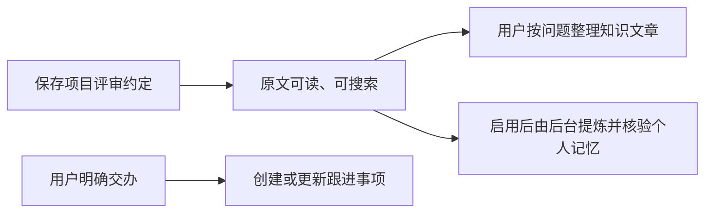

# 先认识 omem：把材料变成能找回的工作记忆

用一份“项目评审约定”贯穿保存、搜索、核对原文与跟进评审的完整流程，并区分原始材料、知识文章、个人记忆和事项，说明当前可用能力与尚未实现的主动能力。

来源：gpt-5.6-sol 分析，gpt-5.6-sol 独立复核；模型解释仍可被原始证据纠正。

## 从一份容易遗忘的约定开始

omem 想解决的不是“把文件堆在一起”，而是让文档、代码、聊天、图片和个人经历在需要时能够被读懂、找回，并继续推动行动；代码只是多了结构化定位能力，仍与其他材料共用一个知识库。参考 [omem 的产品目标 ↗](../../../README.md#L3 "支持开篇对统一组织多种材料、面向读懂找回与行动，以及代码仍共享同一知识库的说明。")

下面用一个**教学示例**贯穿全文：你保存一份《项目评审约定》，其中写着“合并前需要两位评审通过，评审负责人是张三”。几天后，你想确认到底需要几位评审，并希望明天检查张三是否回复。完整路线是：

1. 保存约定，得到可回看的原文；
2. 用自己的问题搜索决定：若已有相关讲解，先读讲解并沿引用核对；若没有，直接打开原始材料；
3. 另行向日常助理交办跟进，届时在通知中心检查。

这三步分别处理“证据、理解和行动”，不会因为材料里出现了人名或动作，就自动替你联系他人。

## 开始使用并保存约定

开发环境中先运行 `osdk install`、`osdk deps --frozen`、`osdk run dev`，再打开终端打印的 Web 地址。开发模式会载入仓库材料与已发布知识，并保留个人数据；启动本身不会自动生成整库 Wiki。参考 [启动与开发入口 ↗](../../../README.md#L7 "支持开发环境的启动命令、Web 地址、个人数据保留以及启动不自动生成整库知识的说明。")

进入“输入材料”，选择“文本＋图片＋链接”，标题填写“项目评审约定”，粘贴正文后点击“保存材料与证据”。同一入口也支持飞书文档、指定 Git 提交中的文件和服务器文本文件；Git 导入只读文件，不会拉取仓库或执行脚本。参考 [输入材料入口 ↗](../../../apps/web/src/App.vue#L850 "支持文本、图片、链接、飞书、Git 和服务器文件等用户可见导入方式，以及 Git 只读边界。")

保存后，界面会明确提示是“材料已保存”还是“内容未改变，复用原版本”。即使后台自动处理没有启用，原文仍然可以阅读和检索，所以保存成功不等于 AI 已经把每句话采纳成个人记忆。参考 [材料保存结果 ↗](../../../apps/web/src/App.vue#L405 "支持保存后区分新版本与内容复用，并给出固定证据已生成的用户可见反馈。") [材料处理不是保存前提 ↗](../../../apps/web/src/LearningView.vue#L82 "支持自动处理未启用时原文保存与检索仍可使用，从而区分保存与记忆提炼。")

## 用问题找回决定，再回到原话

几天后，在顶部搜索框输入“合并前需要几位评审”。可以按“理解概念”“了解背景”或其他用途调整查找侧重。结果会区分库中已有的讲解、原始材料、已应用记忆和事项，并提供“阅读讲解”“查看对应原文”“查看原始依据”或“查看事项”等入口。参考 [统一搜索的读者入口 ↗](../../../apps/web/src/App.vue#L674 "支持搜索用途选择、按已有结果类型展示，以及从讲解、记忆或原始材料进入下一步的说明。")

搜索结果取决于库中已经保存和整理的内容。**若已有相关讲解**，可以先快速理解，再沿引用打开《项目评审约定》，确认原话确实是“两位评审”；**若还没有讲解**，就直接点“阅读原文”核对约定。保存一份新材料不会自动替它生成文章；如果希望把规则来由和执行方式整理成连贯说明，需要到知识库另行选择材料、填写主题、读者和想弄懂的问题，等待调查、写作与复核完成。参考 [启动与开发入口 ↗](../../../README.md#L7 "支持开发环境的启动命令、Web 地址、个人数据保留以及启动不自动生成整库知识的说明。") [从材料整理文章 ↗](../../../docs/reader-first/operations.md#L27 "支持用户另行选择材料、填写主题、读者和想弄懂的问题，并经过调查、写作和独立复核后得到文章。")

原文负责保留当时的说法，检索片段负责定位相关位置，讲解则围绕读者问题组织上下文。三者用途不同，因此方便阅读的解释不会冒充新的事实来源。代码也走同一个搜索和阅读入口，只是可以按函数或 Vue/TypeScript 符号更精确地定位。参考 [保存、检索与讲解的分工 ↗](../../../docs/reader-first/architecture.md#L5 "支持一个来源体系、多种使用单位，以及派生内容不成为独立事实的概念区分。") [当前检索与助理基础 ↗](../../../README.md#L27 "支持代码和其他材料共享检索基础、知识引用可回原文，以及当前事项能力的概览。")

## 分清材料、知识、记忆与事项

四类对象各自回答不同问题：

| 对象 | 回答什么 | 评审示例 |
| --- | --- | --- |
| **原始材料** | 当时到底写了什么？ | 《项目评审约定》的原话与历史版本 |
| **知识文章** | 怎样把多份材料讲明白？ | 解释两位评审规则的来由和执行方式 |
| **个人记忆** | 哪些经过处理和核验的结论可继续复用？ | 当前有效的评审规则或工作经验 |
| **事项** | 接下来谁要做什么、何时检查？ | 等待张三回复，明天 9 点检查 |

知识文章需要用户选定材料，再说明主题、阅读对象和想弄懂的问题；系统完成调查、撰写和复核后，才会在知识库中出现。参考 [从材料整理文章 ↗](../../../docs/reader-first/operations.md#L27 "支持用户另行选择材料、填写主题、读者和想弄懂的问题，并经过调查、写作和独立复核后得到文章。") 个人记忆则来自另一条处理链：候选内容经过独立核验，再由服务应用；来源更新时，相关记忆会进入重核验。因此“保存材料”“整理文章”和“形成可用记忆”不能画成一条必然自动完成的流水线。参考 [记忆应用与重核验 ↗](../../../docs/reader-first/current-system.md#L52 "支持记忆经过抽取、独立复核和服务应用，并在来源更新后重新核验的说明。")

这套分工避免三种混淆：把作者原话当成系统已确认事实、把讲解当成第二份证据、把材料里提到的动作当成用户授权。参考 [保存、检索与讲解的分工 ↗](../../../docs/reader-first/architecture.md#L5 "支持一个来源体系、多种使用单位，以及派生内容不成为独立事实的概念区分。") [交办与讨论的权限边界 ↗](../../../apps/server/src/assistant/message-workflows.ts#L1 "支持只有当前用户明确交办才创建事项、他人承诺不会自动变成用户待办的说明。")

## 明确交办一次评审跟进

现在另开“日常助理”，发送：“帮我跟进张三的评审回复，明天上午 9 点提醒我检查。”这是明确交办；仅仅在《项目评审约定》中写到张三，不会创建你的待办。日常助理界面也以这句话作为使用示例。参考 [日常助理的跟进示例 ↗](../../../apps/web/src/DailyAssistant.vue#L135 "支持在日常助理中直接交办评审跟进、保存等待与跟进时间的具体用户场景。") 处理规则要求区分讨论中他人的承诺与当前用户的交办，只有用户明确要求跟踪时才创建或更新事项。参考 [交办与讨论的权限边界 ↗](../../../apps/server/src/assistant/message-workflows.ts#L1 "支持只有当前用户明确交办才创建事项、他人承诺不会自动变成用户待办的说明。")

事项会把**截止时间**和**下次跟进时间**分开，并可记录等待对象；你可以在“需求与待办”页查看、稍后提醒、标为完成或取消。完成或取消后停止提醒。参考 [事项状态与时间 ↗](../../../apps/web/src/App.vue#L967 "支持截止与跟进时间分开、等待状态、完成取消及通知已读不等于事项完成的说明。") 到约定时间，系统生成站内通知，提示你检查进展；它不会自动联系张三，也不会声称已经收到回复。参考 [站内跟进提醒 ↗](../../../apps/server/src/tasks/follow-up.ts#L20 "支持到期或跟进时间生成站内通知，并明确不会自动联系等待对象。")

因此，通知“已读”只表示你看过提醒，不代表评审已经完成，也不会自动取消后续提醒。是否完成仍以你对事项的实际操作为准。参考 [事项状态与时间 ↗](../../../apps/web/src/App.vue#L967 "支持截止与跟进时间分开、等待状态、完成取消及通知已读不等于事项完成的说明。")

## 现在能依赖什么，哪些仍在推进

当前已经具备统一材料保存与固定版本、结构化定位、搜索、知识阅读与引用、来源变化后的记忆重核验、持久事项和站内提醒等基础。顶部搜索、知识搜索与助手也已经接到同一检索基础。参考 [当前检索与助理基础 ↗](../../../README.md#L27 "支持代码和其他材料共享检索基础、知识引用可回原文，以及当前事项能力的概览。")

但“链路接通”还不等于每次自然语言搜索都能排出最佳答案。最新进度记录明确指出：概念问题仍可能命中主题相近却不能回答问题的旧说明，整体相关性和助手表达尚未通过质量验收。因此重要决定应继续沿结果回到原文核对。参考 [检索质量现状 ↗](../../../docs/reader-first/progress.md#L5 "支持基础检索链路已经接通但整体相关性和助手表达仍未通过质量验收的限制。")

主动能力也有清楚边界：目前没有自动监听对方回复、自动联系评审人、周期回顾、日历联动或学习卡；提醒只是站内的检查提示。当前服务还是 SQLite 单用户模式，飞书、外部通知和屏幕监听都需要分别显式配置。参考 [单用户与主动能力边界 ↗](../../../docs/reader-first/operations.md#L19 "支持当前单用户运行方式、外部连接需显式启用，以及尚无自动监听回复等能力的说明。") 换句话说，omem 现在适合做“保存—找回—核对—明确交办”的个人工作记忆闭环，还不能当作会自行追踪外部世界并替你推进协作的全自动助理。
