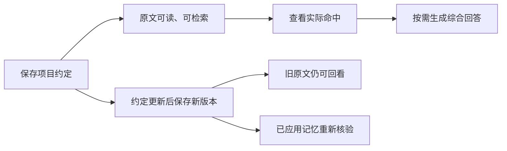

# 先认识 omem：把材料变成能找回的工作记忆

用“保存项目约定、找回决定、跟进评审”的贯穿示例，说明 omem 如何统一保存文档、代码、聊天和图片，并区分原始材料、知识文章、个人记忆与事项；同时标明当前可用链路和主动能力边界。

来源：gpt-5.6-sol 分析，gpt-5.6-sol 独立复核；模型解释仍可被原始证据纠正。

## 从一份项目约定开始

omem 想解决的不是“把文件放进另一个目录”，而是让散落在文档、代码、聊天、图片和个人经历里的内容，之后还能被读懂、找回，并在你明确需要时支持行动。代码也在同一个知识库中，只是多了适合代码结构的定位方式。当前已经有输入、检索、问答、记忆和事项基础，但完整的长期理解与主动助理仍在建设中。参考 [产品定位与当前阶段 ↗](../../../README.md#L3 "支持 omem 统一组织多类材料、代码共享知识库，以及完整知识整理和主动助理仍在推进的定位。")

**贯穿示例（教学场景）**：你保存一份项目约定，其中写着“失败最多重试三次”；后来约定改为“五次”。另一条独立消息是“明早提醒我跟进这次评审”。前者是需要保存和核对的事实，后者才是明确的行动交办；两者不能混为一谈。参考 [约定与交办示例 ↗](../../../config/wiki-pages.json#L83 "支持教学场景中把重试约定变化与明确评审跟进消息分开的设定。")

第一次使用时，在项目目录依次运行 `osdk install`、`osdk deps --frozen`、`osdk run dev`，再打开终端打印的 Web 地址。空工作区从“输入材料”开始；启动本身不会自动生成整库知识。参考 [首次启动方式 ↗](../../../README.md#L7 "支持开发启动命令、打开 Web 地址、空工作区入口以及启动不自动生成整库知识。")

## 保存、找回，再面对变化

先进入“输入材料”，给约定一个标题并粘贴正文；也可以附图片、链接，或从飞书文档、指定 Git 文件、允许范围内的服务器文本文件读取。保存完成后，页面会打开这次保存的原文，并提示固定证据片段已经生成。参考 [材料输入与保存反馈 ↗](../../../apps/web/src/App.vue#L413 "支持多种材料输入、保存后打开原文，以及网页显示固定证据片段已生成的成功反馈。")

接着在顶部搜索框问：“项目约定允许重试几次？”搜索后先看下方的实际命中，辨认结果来自材料、讲解、记忆还是事项，并可打开原文核对；如果需要系统补读并整理成答案，再点击“综合回答”。参考 [统一搜索结果 ↗](../../../apps/web/src/App.vue#L682 "支持搜索材料、讲解、记忆与事项，并在搜索页独立展示实际命中及其原文入口。") [按需启动综合回答 ↗](../../../apps/web/src/SearchAnswer.vue#L205 "支持搜索后的初始状态只显示说明与“综合回答”按钮，点击后才开始补读和整理回答。")

当约定从三次改为五次时，再以相同来源标识保存。原文阅读页会区分当前版本与历史版本，因此旧说法不会被悄悄覆盖。若旧版本曾形成个人记忆，更新后还要经过重新提炼、核验和应用，才能把“系统目前记住的结论”改成五次。真实流程已经验证过“旧值换成新值、更新同一记忆并保留旧原文”的主链，但这只是一个具体场景，不代表所有冲突材料都已可靠处理。参考 [代码视图与版本历史 ↗](../../../apps/web/src/App.vue#L792 "支持原始材料页区分当前与历史版本、打开版本历史，并对常见代码文件使用代码视图。") [约定换版的真实流程 ↗](../../../docs/reader-first/assistant-memory-flow.md#L41 "支持新旧值更新同一记忆、保留旧原文，并说明该验证只代表单一场景。")

这条流程刻意把“原文已经保存”和“记忆已经更新”分成两个可观察阶段。参考 [原文与记忆分阶段 ↗](../../../docs/reader-first/assistant-memory-flow.md#L29 "支持换版后先暂停旧记忆，再提取、核验并应用更新，排队不等于已经完成。")

## 四类对象各自回答什么

理解 omem 最省力的方法，是记住一句话：**材料保存原话，知识解释原话，记忆保留当前可复用结论，事项承接明确行动。**

| 对象 | 在示例中是什么 | 主要回答 |
| --- | --- | --- |
| 原始材料 | 写有“三次”或“五次”的项目约定及其历史版本 | 当时到底写了什么？ |
| 知识文章 | 把约定、相关代码和讨论组织成连续说明 | 这些材料合起来意味着什么？ |
| 个人记忆 | 经提炼、核验并已应用的“当前允许重试五次” | 系统目前替我记住了什么？ |
| 事项 | “明早跟进评审”及其等待、改期、完成状态 | 下一步做什么，何时再检查？ |

原始材料是事实依据；知识文章围绕读者问题跨材料讲解，但不会因此变成第二份独立事实。知识库中的“整理文章”要求先选择材料，再填写主题、阅读目标和读者，完成调查、撰写与复核后才能阅读。参考 [一种来源多种用途 ↗](../../../docs/reader-first/architecture.md#L5 "支持原始材料保留历史、页面跨材料解释，以及派生内容不是第二份独立事实。") [文章整理步骤 ↗](../../../apps/web/src/knowledge/ArticleComposer.vue#L102 "支持整理文章时选择材料，并进入说明阅读目标的后续步骤。")

个人记忆也不是模型刚提出一句话就算生效：当前链路包含提取、独立核验和应用，来源变化还会触发重核验并保留历史。事项则有不同的生命周期，因为它代表用户授权推进的行动，而不是对材料内容的另一种摘要。参考 [记忆与事项链路 ↗](../../../docs/reader-first/current-system.md#L52 "支持记忆经过提取、独立核验和应用，来源更新可重核验，以及事项与综合理解的边界。")

## 搜索负责找回，文章负责讲清

如果你只想确认“现在允许重试几次”，先用顶部搜索：它会在原始材料、知识讲解、已应用记忆和当前事项之间查找，并保留实际命中供你核对。你还可以选择“理解概念”“定位实现”“了解背景”或“跟进事项”等查找用途。参考 [搜索用途选择 ↗](../../../apps/web/src/App.vue#L682 "支持顶部搜索覆盖四类内容，并允许按理解概念、定位实现、背景和跟进等目的查找。")

如果问题变成“为什么从三次改成五次，这会影响哪些代码和操作说明”，单个命中片段往往不够。这时可以在知识库点击“整理文章”，显式选择相关文档、代码或记录，再说明希望读完后弄懂什么。知识文章的价值是组织上下文和解释关系；关键事实仍应沿文中引用回到固定原文。参考 [阅读目标与复核 ↗](../../../apps/web/src/knowledge/ArticleComposer.vue#L173 "支持用户说明主题、问题和读者，并在完成调查、撰写和复核后阅读文章。")

因此，**保存材料不会自动生成整库文章**；搜索命中也不会自动启动综合回答，更不等于已经形成一篇完整解释。对第一次使用的人，先搜索和核对原文，需要当场归纳时点击“综合回答”，只有在问题值得形成可持续阅读的跨材料说明时再整理文章。参考 [首次启动方式 ↗](../../../README.md#L7 "支持开发启动命令、打开 Web 地址、空工作区入口以及启动不自动生成整库知识。") [按需启动综合回答 ↗](../../../apps/web/src/SearchAnswer.vue#L205 "支持搜索后的初始状态只显示说明与“综合回答”按钮，点击后才开始补读和整理回答。")

## 代码与其他材料怎样共同使用

假设“五次重试”不仅写在约定里，也落实在配置或代码中。你可以在“输入材料”选择 Git 文件，填写服务器仓库、仓库内路径和 Git ref；该入口只读取指定 commit 的文件，不会拉取仓库或执行仓库脚本。参考 [Git 文件输入 ↗](../../../apps/web/src/App.vue#L933 "支持输入服务器仓库、文件路径与 Git ref，并说明只读取指定 commit、不拉取或执行仓库脚本。") 原始材料页会用代码视图显示常见代码文件，同时仍提供当前版本、历史版本和原文证据入口。参考 [代码视图与版本历史 ↗](../../../apps/web/src/App.vue#L792 "支持原始材料页区分当前与历史版本、打开版本历史，并对常见代码文件使用代码视图。")

代码不会另建一套知识产品。结构分析擅长帮助定位“定义在哪里、有哪些结构”，但业务意义仍要结合调用者、类型、配置、测试和设计说明来理解。当前跨文件调用关系和跨版本符号续接仍有限，所以更准确的期待是：**代码能与文档、聊天共同被搜索和讲解，并在需要时使用专门的结构定位；系统尚不能承诺已经得到完整调用图。** 参考 [代码定位能力边界 ↗](../../../docs/reader-first/current-system.md#L34 "支持 AST 用于结构定位、业务意义需要跨材料调查，以及当前调用和跨版本续接有限。")

## 跟进一次评审，但不越过你的意图

项目约定中出现“评审”二字，不会自动创建事项。只有你明确说“明早提醒我跟进这次评审”，系统才应记录行动。讨论中别人的承诺也不是你的交办；单纯询问“评审到哪了”属于回顾，不应偷偷改变状态。参考 [明确交办与只读回顾 ↗](../../../apps/server/src/assistant/message-workflows.ts#L3 "支持只有本人明确要求才创建或修改事项，讨论承诺不自动授权，回顾问题不改变任务。")

事项页把截止时间与下次跟进时间分开：前者表示事情何时到期，后者表示何时再次检查。等待他人回复时可以登记等待对象，之后可以改期、完成或取消；提醒进入通知中心，完成或取消后停止。参考 [事项状态与跟进时间 ↗](../../../apps/web/src/App.vue#L977 "支持事项页将截止和跟进时间分开，并展示等待、完成、取消等状态。")

到点提醒目前是**站内通知**。把通知标为已读只表示你看过提醒，不会批准变更、完成事项或取消后续提醒。评审方是否回复仍需要你明确报告，omem 目前不会自动监听群聊，也不会替你联系对方。参考 [通知已读的含义 ↗](../../../apps/web/src/App.vue#L1045 "支持通知已读只清除未读状态，不会完成事项或取消提醒。") [跟进的主动边界 ↗](../../../docs/reader-first/operations.md#L19 "支持当前没有自动监听对方回复、周期回顾、日历或学习卡，提醒为站内能力。")

## 现在能依赖什么，哪些仍在路上

目前可以依赖的基础链路是：保存并阅读带历史的原始材料；在同一入口搜索材料、讲解、已应用记忆与事项；按需点击“综合回答”让助理补读材料；显式选择材料整理知识文章；通过日常助理或事项页进行交办、等待、改期、完成、取消，并接收站内提醒。来源更新后，已有记忆能够进入重核验。参考 [当前可用基础能力 ↗](../../../README.md#L38 "支持统一检索与文章整理、持久会话、事项操作、站内提醒、来源更新后的记忆重核验，并说明基础排序仍有限。") [按需启动综合回答 ↗](../../../apps/web/src/SearchAnswer.vue#L205 "支持搜索后的初始状态只显示说明与“综合回答”按钮，点击后才开始补读和整理回答。")

但要留意两个条件。第一，后台材料处理需要显式启用并配置可用 Agent；未启用时，原文依然能保存和检索，只是不会自动形成已应用记忆。参考 [后台材料处理条件 ↗](../../../apps/web/src/LearningView.vue#L81 "支持未启用自动处理时原文仍可保存和检索，但不会由页面自动开启模型调用。") 第二，当前仍是单用户服务；外部通知、飞书接入和屏幕监听都是各自独立、需要明确配置的集成。参考 [单用户与外部集成 ↗](../../../README.md#L57 "支持当前单用户服务边界，以及飞书、外部通知和屏幕监听需要独立显式集成。")

更长期的项目、人物和主题综合理解，自动识别外部回复，周期回顾与学习卡，以及更全面的文档解析和多模态理解仍未完成。参考 [尚未完成的能力 ↗](../../../docs/reader-first/progress.md#L47 "支持持续综合理解、自动外部回复识别、学习能力、多模态覆盖和团队隔离仍未完成。") 当前也没有日历能力。参考 [跟进的主动边界 ↗](../../../docs/reader-first/operations.md#L19 "支持当前没有自动监听对方回复、周期回顾、日历或学习卡，提醒为站内能力。") 搜索已经有真实可用的主链，但基础排序仍可能把计划和旧说明排在实现前。参考 [当前可用基础能力 ↗](../../../README.md#L38 "支持统一检索与文章整理、持久会话、事项操作、站内提醒、来源更新后的记忆重核验，并说明基础排序仍有限。") 把 omem 看作一条已经能使用的“保存—找回—核对—明确跟进”基础链路，比把它当作已经会自动管理一切的全能助理更准确。
