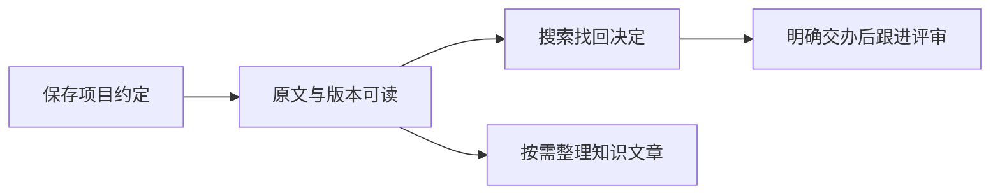

# 先认识 omem：把材料变成能找回的工作记忆

用一份“支付模块评审约定”的教学示例，说明如何保存和更新原文、找回决定、整理知识并明确交办跟进，同时区分材料、知识、记忆与事项，认识代码接入方式和当前能力边界。

来源：gpt-5.6-sol 分析，gpt-5.6-sol 独立复核；模型解释仍可被原始证据纠正。

## 它解决的是“以后还能找到并继续做”

omem 把文档、代码、聊天、图片和个人经历放进同一个工作记忆中，目标不只是收藏，而是让你以后能读懂来龙去脉、找回答案，并把明确的下一步持续跟进。代码会得到额外的结构定位，但不会被拆成另一套知识产品。参考 [统一工作记忆目标 ↗](../../../README.md#L3 "支持 omem 统一组织多类材料、代码使用 AST 定位且不形成另一套知识产品的定位。")

第一次运行时，依次执行 `osdk install`、`osdk deps --frozen`、`osdk run dev`，再打开终端打印的 Web 地址。进入界面后，从“输入材料”开始；启动只载入已有材料与已发布知识，不会自动生成整库 Wiki。参考 [首次启动方式 ↗](../../../README.md#L7 "支持开发模式启动命令、打开 Web 地址、保留个人数据以及不自动生成整库 Wiki。")

## 教学示例：先保存一份项目约定

假设你有一条项目约定：**“合并支付模块前，至少由一位同事完成评审，并在评审通过后合并。”** 这是贯穿本页的教学示例，不代表仓库中真实发生过这件事。

打开“输入材料”，选择“文本＋图片＋链接”。标题填“支付模块项目约定”，来源类型保留“主动输入”，**来源标识填写 `payment-module-convention`**，正文粘贴上面的约定，然后点击“保存材料与证据”。这个稳定标识很重要：留空时系统会自动分配新标识；想把以后修改归到同一份材料，必须继续使用相同的来源类型和来源标识。同一页也提供飞书文档、Git 文件和受限服务器文本文件入口。参考 [材料输入与来源标识 ↗](../../../apps/web/src/App.vue#L872 "支持四种输入入口，以及手工材料的标题、来源类型、可复用来源标识和正文输入。")

保存成功后，界面会打开原文，并提示材料与固定证据片段已经生成。以后约定变化时，修改正文但仍选择“主动输入”并填写 `payment-module-convention`；服务端会找到同一来源，并在内容指纹变化时建立下一版本。原文页会标明当前或历史版本，并提供版本历史入口。参考 [保存后的可见结果 ↗](../../../apps/web/src/App.vue#L462 "支持保存后刷新并打开返回的原文，以及界面显示保存结果。") [同一来源的版本形成 ↗](../../../apps/server/src/store.ts#L171 "支持按来源类型和来源标识定位同一来源，并在指纹变化时建立递增的新版本。") [原文版本阅读 ↗](../../../apps/web/src/App.vue#L797 "支持原文页区分当前与历史版本，并提供固定片段和版本历史入口。")

这条主线把“保留原话、形成解释、辅助回答、推进动作”分开，避免保存一段文字就被误当成已交办任务。参考 [不同使用单位的分工 ↗](../../../docs/reader-first/architecture.md#L5 "支持原件保留历史、检索按结构组织、页面按读者问题讲解，以及派生内容不成为第二份独立事实。")

## 用自然问题找回决定

想确认约定时，可在顶部搜索输入“支付模块合并前需要几人评审？”。搜索范围包含材料、讲解、记忆与事项；页面既给出综合回答，也保留实际命中，并允许打开原文、讲解或事项。参考 [统一搜索体验 ↗](../../../apps/web/src/App.vue#L685 "支持搜索材料、讲解、记忆与事项，并展示综合回答、实际命中和对应阅读入口。")

结果应帮助你回到那句真实约定，而不是只给一段没有出处的总结。当前检索能结合原文、知识和结构背景，但首轮排序并不保证每次都准确：相关却不能回答问题的说明可能靠前，长问题和跨文件机制也仍是难点。遇到不理想结果时，可换用原文中的关键词，或让助理继续补读。参考 [当前检索局限 ↗](../../../docs/reader-first/progress.md#L39 "支持主题相关但不能回答的结果、长问题候选不足和跨文件业务链仍有缺口。")

## 同一条约定为何会有四种形态

| 名称 | 在示例中是什么 | 主要作用 |
| --- | --- | --- |
| **原始材料** | “至少一位同事评审”的原文及其历史版本 | 保留当时实际写了什么，供追溯 |
| **知识文章** | 围绕“合并前怎样评审”整理出的可读解释 | 跨一份或多份材料回答读者问题，引用仍回原文 |
| **个人记忆** | 经提炼、核验并应用后可用于后续回答的当前约定 | 帮助持续协作；来源更新时需要重新核对 |
| **事项** | “等待评审回复，明天 9 点检查” | 记录要推进的动作、等待对象和状态 |

四者共享来源和检索，却不能互相替代：若把解释当原文，会丢掉准确措辞；若把所有材料都当当前记忆，旧计划和转述会污染回答；若把材料中的行动句直接当事项，系统就会在没有授权时替你安排工作。原件、检索单位和讲解单位承担不同用途，派生解释不是第二份独立事实。参考 [不同使用单位的分工 ↗](../../../docs/reader-first/architecture.md#L5 "支持原件保留历史、检索按结构组织、页面按读者问题讲解，以及派生内容不成为第二份独立事实。")

知识文章需要你在知识库中显式选择相关文档、代码或记录，再填写主题、想弄懂的问题和读者；系统完成调查、撰写和复核后才可阅读。保存材料本身不等于自动整理文章。参考 [知识文章选材 ↗](../../../apps/web/src/knowledge/ArticleComposer.vue#L102 "支持先选择相关文档、代码或记录作为文章材料。") [知识文章阅读目标 ↗](../../../apps/web/src/knowledge/ArticleComposer.vue#L179 "支持填写文章主题、想弄懂的问题和读者，并由 AI 调查、撰写、复核。")

个人记忆也不是每次保存的必然结果：后台学习默认关闭；启用后，仍需经过抽取、独立复核和服务应用，模型不能直接把候选写成事实。参考 [后台学习默认状态 ↗](../../../apps/server/src/config.ts#L58 "支持后台学习默认关闭，说明保存材料不必然立即生成个人记忆。") [记忆应用边界 ↗](../../../docs/reader-first/current-system.md#L54 "支持记忆需经过抽取、独立复核和 MemoryService 应用，模型没有直接事实写入权限。")

## 跟进评审必须来自明确交办

找回决定后，如果确实要推进评审，可在“日常助理”输入：**“帮我跟进支付模块的评审回复，明天上午 9 点提醒我检查。”** 助理入口支持直接交办、回顾事项或查找记忆，并会保存等待与跟进时间。参考 [日常助理入口 ↗](../../../apps/web/src/DailyAssistant.vue#L135 "支持助理可交办、回顾事项、查找记忆，并给出评审回复跟进的用户可见示例。")

系统应建立一条等待事项，记录等待对象和下次检查时间；讨论里提到别人的承诺，或仅仅查询约定，都不应自动创建事项。跟进检查时间也不等于真正的截止时间。参考 [明确交办规则 ↗](../../../apps/server/src/assistant/message-workflows.ts#L3 "支持只有所有者明确要求时才创建跟进事项，并区分下次检查时间与真实截止时间。")

到检查时间后，当前能力是产生站内提醒。你可以稍后提醒、完成或取消；提醒已读不代表事项完成。系统不会自动联系评审人，也不会自行得知对方已经回复，因此回复是否到达仍需你确认或报告。参考 [事项跟进操作 ↗](../../../apps/web/src/TaskFollowUpControls.vue#L25 "支持记录等待对象和下次跟进时间，并说明不会自动联系对方，可稍后提醒或取消。") [提醒能力边界 ↗](../../../docs/reader-first/operations.md#L21 "支持当前为站内到期提醒，没有自动监听回复，且通知已读不等于事项完成。")

## 代码与其他材料共用同一条路

如果约定还涉及实现，可从“输入材料”导入指定 Git 文件。它先像文档一样成为可版本化、可引用的原始材料，再利用 TypeScript/Vue 结构帮助定位函数、方法或模块。知识文章可以同时选择项目约定、评审记录和相关代码，让“为什么这样做”与“实现在哪里”出现在同一个解释中。参考 [统一工作记忆目标 ↗](../../../README.md#L3 "支持 omem 统一组织多类材料、代码使用 AST 定位且不形成另一套知识产品的定位。") [材料输入与来源标识 ↗](../../../apps/web/src/App.vue#L872 "支持四种输入入口，以及手工材料的标题、来源类型、可复用来源标识和正文输入。") [知识文章选材 ↗](../../../apps/web/src/knowledge/ArticleComposer.vue#L102 "支持先选择相关文档、代码或记录作为文章材料。")

这不等于系统已经自动理解整个仓库。当前 AST 主要用于单文件结构和候选调用定位，跨文件调用与类型解析有限；业务意义仍需结合调用者、配置、测试和设计材料调查。参考 [代码定位与限制 ↗](../../../docs/reader-first/current-system.md#L36 "支持 TypeScript/Vue 单文件 AST 的定位能力、跨文件候选局限，以及业务意义仍需结合其他材料调查。")

## 现在能做什么，还不能承诺什么

**现在可用的主线**包括：输入多种材料、阅读当前与历史原文、统一搜索材料/讲解/记忆/事项、显式整理知识文章，以及交办、等待、改期、完成、取消和站内提醒。来源更新后，已有记忆可以进入重核验。参考 [已有个人使用流程 ↗](../../../docs/reader-first/progress.md#L29 "支持自主搜索补读、来源换版后的记忆更新，以及事项交办到站内提醒的现有能力。")

**仍不能承诺的能力**包括：每份新材料都自动形成高质量知识或记忆、自动监听评审回复、主动联系他人、稳定维护完整的人物或项目综合理解、完整跨文件功能链，以及全面的 PDF、Office、OCR 闭环。当前服务仍是单用户形态，没有团队隔离。参考 [尚未实现的能力 ↗](../../../docs/reader-first/progress.md#L47 "支持自动处理、完整时态和综合实体理解、外部回复监听、周期回顾、文档处理闭环与团队隔离等边界。")

最小尝试可以只做三步：保存一条不含敏感信息的测试约定，并为它填写稳定来源标识；搜索一个能由原文回答的问题；再明确创建一条短期跟进并手动完成。做到这三步，你就已经走通了 omem 从“留住材料”到“找回答案”再到“推动行动”的核心体验。
