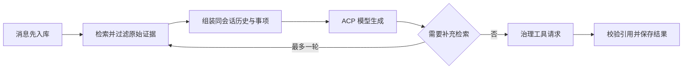

# 主助手如何用会话、检索与受治理记忆工作

主助手统一承接 Web 与 Lark 消息，先持久化会话轮次，再从固定原始片段检索证据，由 ACP 模型组织回答。引用、可见性、事项写入、记忆应用和恢复均由服务器控制；捕获材料形成长期记忆前还需经过独立复核、策略分流与来源更新后的重新对账。

来源：gpt-5.6-sol 分析，gpt-5.6-sol 独立复核；模型解释仍可被原始证据纠正。

## 面向日常问答与事项管理的统一入口

主助手服务于“找回以前说过什么、延续当前讨论、记录或调整事项”等场景，Web 与 Lark 共用同一运行时。运行时负责编排上下文、只读检索、模型调用、事项治理、轮次持久化和降级，模型本身不直接取得数据库写权限。参考 [统一助理运行时 ↗](../../../apps/server/src/assistant/runtime.ts#L192 "支持 Web 与 Lark 共用入口，以及运行时负责上下文、检索、治理、持久化和降级编排。")

消息策略覆盖随手交办、讨论归并、等待跟进和事项回顾。只有当前所有者的明确要求才可授权事项变更；转述、他人的承诺以及捕获材料中的命令式文字仍是待分析的来源。参考 [日常消息处理策略 ↗](../../../apps/server/src/assistant/message-workflows.ts#L1 "支持四类日常场景，并说明捕获消息本身不授予操作权限。")

## 从消息到可追溯回答

普通消息按外部事件标识幂等入库；同一会话的新消息会中断旧轮次，并接在已有执行链之后。参考 [轮次入库与会话串行 ↗](../../../apps/server/src/assistant/runtime.ts#L241 "支持消息先入库、重复投递幂等，以及同会话新消息中断并串行等待旧轮次。") 模型上下文仅回放同会话已完成历史，同时合并上一轮工作证据、纠正、可见事项和当前时间；首轮最多提出三个查询词，宿主只补充检索一轮。参考 [上下文与补充检索 ↗](../../../apps/server/src/assistant/runtime.ts#L463 "支持同会话历史、工作证据、纠正、事项和时钟的组装，以及最多一轮补充检索。") 最终引用必须属于本轮实际提供的证据，回答、证据和工具动作会共同保存。参考 [引用过滤与结果保存 ↗](../../../apps/server/src/assistant/runtime.ts#L602 "支持引用只能来自本轮证据，并与回答和工具动作共同持久化。")

检索结果必须回指不可变原始片段，重排摘要不能充当事实来源。参考 [固定原始证据合同 ↗](../../../apps/server/src/retrieval/port.ts#L1 "支持检索结果必须回指不可变片段，重排摘要不能替代原始证据。") 命中记忆正文时，系统通过其证据集合回查当前原始片段；知识文章则在依赖和引用有效时递归映射回原始 fragment。参考 [记忆证据回溯 ↗](../../../apps/server/src/retrieval/keyword.ts#L81 "支持记忆正文命中后通过 evidence set 回查当前原始片段。") [知识引用回溯 ↗](../../../apps/server/src/knowledge/retrieval.ts#L33 "支持知识文章在依赖和引用有效时递归映射回原始 fragment。") 运行时还排除派生修订和非当前头版本；群聊若没有宿主提供的真实可见性策略，默认不返回证据。参考 [当前版本与可见性过滤 ↗](../../../apps/server/src/assistant/runtime.ts#L770 "支持排除派生或非当前头版本材料，并在群聊缺少策略时默认拒绝证据访问。")

## 事项写入与长期记忆如何受控

记忆治理会先保存提案及所读来源版本，并查询可复用的应用回执；命中回执时立即返回，只有没有回执时才校验固定引用并保存复核评估。参考 [回执复用与评估顺序 ↗](../../../apps/server/src/memory/service.ts#L1318 "支持先查询并复用已有应用回执，只有未命中时才校验证据并保存评估。") 随后策略可选择自动应用、等待决定、拒绝、延后使用、仅保留来源或忽略噪声。在本轮 `evaluate` 中，只有 `auto_apply` 会立即进入应用入口；`awaiting_decision` 暂不写入，但所有者之后批准仍可调用同一应用流程。参考 [本轮策略分流 ↗](../../../apps/server/src/memory/service.ts#L1373 "支持 evaluate 中仅 auto_apply 立即应用，其他策略返回而不立即物化。") [待决事项批准 ↗](../../../apps/server/src/memory/service.ts#L1697 "支持所有者批准待决提案后调用应用入口并取得回执。")

模型提出事项操作后，运行时重新核对用户原话中的明确意图，在写入前设置取消栅栏，并依据持久化后的真实任务生成反馈。参考 [事项请求治理 ↗](../../../apps/server/src/assistant/runtime.ts#L540 "支持工具执行前的取消栅栏、用户意图检查和基于真实任务状态生成反馈。") 更新事项还要求动作与原话匹配、目标可见且版本一致；等待对象和时间表达必须来自当前指令，变更指令会先捕获为原始证据。参考 [事项更新校验 ↗](../../../apps/server/src/assistant/runtime.ts#L702 "支持动作意图、目标可见性、版本、时间和跟进字段校验，以及先捕获变更指令。") 创建事项同样先把本轮所有者原话捕获为原始材料，再形成带固定引用的提案。参考 [所有者原话捕获 ↗](../../../apps/server/src/assistant/runtime.ts#L854 "支持创建事项前把当前所有者原话捕获为带已验证来源信息的原始证据。") 只有记忆治理返回真实任务回执时，运行时才报告创建成功。参考 [创建事项真实回执 ↗](../../../apps/server/src/assistant/runtime.ts#L901 "支持创建提案经过记忆服务评估，并只在取得任务回执时报告成功。")

一般捕获材料形成长期记忆时，要先由提取者生成候选，再由独立复核者校验父作业、摘要和候选覆盖，最后把整批变更交给记忆服务计算联合影响。参考 [独立复核与整批评估 ↗](../../../apps/server/src/learning/pipeline.ts#L458 "支持复核父作业和候选覆盖后，将完整 ChangeSet 一次性交给记忆服务评估。")

## 来源更新、降级与当前限制

来源更新会先冻结当时受影响的失效记忆集合，避免重复投递因部分项目已修复而丢失待核验对象。参考 [刷新集合冻结 ↗](../../../apps/server/src/learning/refresh.ts#L6 "支持来源更新前冻结受影响记忆集合，重复投递不会抹去尚待核验的对象。") 调度成功只代表进入处理链；最终还要依据当前依赖、来源头版本和真实应用结果，将刷新记录对账为已应用、仍需复核或已被后续修订取代。参考 [刷新结果对账 ↗](../../../apps/server/src/learning/refresh.ts#L27 "支持队列入列不等于应用成功，并按依赖、来源头版本和修复结果计算最终状态。")

可选语义检索实现会报告索引中、就绪或降级状态，并在后台追赶新片段；这些源码只能证明实现路径，不能代替实际运行验收。参考 [语义索引健康与追赶 ↗](../../../apps/server/src/retrieval/semantic.ts#L21 "支持源码中的索引进度、健康状态、后台追赶和错误退避机制。") 确定性回答器仅供测试使用，生产环境缺少真实模型时应诚实报告不可用。参考 [测试回答器边界 ↗](../../../apps/server/src/assistant/default-model.ts#L7 "支持确定性回答器仅供测试，生产环境缺少真实模型时应明确失败。")

未完成轮次可在启动后恢复，并可利用已提交的创建事项回执避免重复执行；但该保护依赖外部事件标识且只检查创建提案，手动重试和恢复也没有显示复用普通消息的会话级执行链。参考 [重试与启动恢复 ↗](../../../apps/server/src/assistant/runtime.ts#L313 "支持创建事项回执检查和未完成轮次恢复，并揭示外部事件标识及会话串行方面的限制。") 生产模型要求 ACP Profile，非 ACP 传输会被拒绝；模型和推理强度还必须存在于当前 ACP 会话实际提供的配置选项中。参考 [ACP Profile 要求 ↗](../../../apps/server/src/assistant/acp-model.ts#L35 "支持缺少助理 Profile 或使用非 ACP 传输时拒绝模型调用。") [模型能力校验 ↗](../../../apps/server/src/agents.ts#L301 "支持模型与推理强度必须存在于当前 ACP 会话实际提供的配置选项中。")
