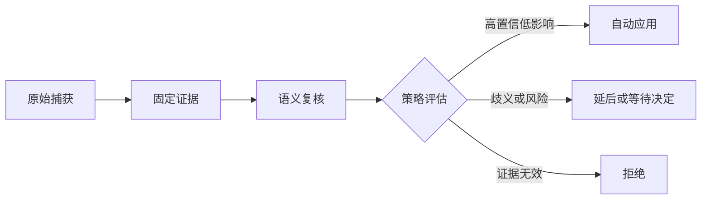

# 记忆提案治理与可信反馈验收

该验收测试以临时 SQLite 存储贯穿固定证据、提案策略、受控应用、反馈约束及知识关系，确认明确且低影响的本人事项可幂等落地，而身份不明、证据错配、语义越界、跨来源冲突及高风险变更会被拒绝、延后或保留待审。

来源：gpt-5.6-sol 分析，gpt-5.6-sol 独立复核；模型解释仍可被原始证据纠正。

## 从固定证据到策略落地

测试先捕获说话者、验证方式、时间与转发状态，再把固定 revision、fragment、精确引文及 Unicode 码点范围组成证据，交由提案策略评估。参考 [固定证据构造 ↗](../../../apps/server/tests/proposal-policy.test.ts#L29 "说明测试如何保存来源身份与时间信息，并构造固定 fragment、精确引文和码点选择器。")

明确且经验证的本人任务会自动创建任务，并产生应用回执、通知意图和任务修订；重复评估同一提案只返回重复回执，不制造第二份任务。存储层将不可变修订、变更与通知 outbox 共同提交。参考 [本人任务自动应用 ↗](../../../apps/server/tests/proposal-policy.test.ts#L160 "支持明确本人任务创建任务、产生回执、通知意图和任务修订，并在重复评估时保持幂等。") [SQLite 提交边界 ↗](../../../apps/server/src/store.ts#L4 "支持不可变修订、变更和通知 outbox 在单用户 SQLite 基础上共同提交的存储约定。")

## 风险分流与时效边界

安全分流同时考虑身份、语义、影响规模和证据一致性：未验证的转发内容仅保留为来源线索，模糊时间任务延后处理；来源修订被篡改为不存在的值时会拒绝且不产生有效副作用，把“仅测试环境”泛化为“所有环境”也会被语义复核拒绝。参考 [身份与时间分流 ↗](../../../apps/server/tests/proposal-policy.test.ts#L189 "支持未验证转发内容只保留为来源，以及模糊时间任务延后处理。") [证据与语义拒绝 ↗](../../../apps/server/tests/proposal-policy.test.ts#L227 "支持不存在的来源修订被拒绝且无活动副作用，以及语义范围泛化被拒绝。")

小范围安全变更可以自动应用，超过影响上限的批量变更进入决策，流程类知识保留来源等待复核。跨来源冲突不会覆盖现有有效记忆；形成决定后若来源头变化，批准会因过期而失败。参考 [影响规模分流 ↗](../../../apps/server/tests/proposal-policy.test.ts#L285 "支持小变更自动应用、超限影响进入决策、流程知识保留待审。") [跨来源冲突保护 ↗](../../../apps/server/tests/proposal-policy.test.ts#L259 "支持不同来源提出冲突更新时保留现有活动记忆并等待决定。") [过期决定拒绝 ↗](../../../apps/server/tests/proposal-policy.test.ts#L318 "支持决策记录后来源头更新时，批准被判定过期且原记忆不被覆盖。")

仅由图片推断出的成功结果会保留为待复核来源，并且不会写入记忆；现有断言没有验证是否创建决策卡。来源刷新会保留旧 revision、使依赖记忆失效并安排重核验任务，恢复旧版本还受期望版本与依赖状态约束。参考 [图片推断保留待审 ↗](../../../apps/server/tests/proposal-policy.test.ts#L415 "支持图片推断结果仅保留为来源并且不写入记忆；引用范围没有提供决策卡断言。") [来源刷新与依赖失效 ↗](../../../apps/server/tests/proposal-policy.test.ts#L426 "支持恢复操作的版本检查、旧 revision 保留、依赖失效和重核验任务入列。")

## 反馈学习的可信边界

反馈被区分为可执行纠正与弱信号。经过认证的本人纠正会形成确认约束，在相同作用域的后续候选上替换负责人，同时保留任务前后修订和原始纠正证据。参考 [认证纠正应用 ↗](../../../apps/server/tests/proposal-policy.test.ts#L473 "支持认证纠正在后续候选上生效，并保留任务修订和原始证据。")

“有用”评价与派生摘要只保持弱强度，重复事件会去重，也不会被召回为确认约束。现有验收直接证明纠正不会从项目 A 召回到项目 B；涉及 ACL 或自动审批的策略建议仅以未激活的 shadow 状态保存，防止普通反馈扩大权限。参考 [弱反馈不具权威性 ↗](../../../apps/server/tests/proposal-policy.test.ts#L561 "支持有用性反馈去重、派生摘要降为弱信号且不会召回为确认约束。") [项目隔离与策略降级 ↗](../../../apps/server/tests/proposal-policy.test.ts#L597 "支持纠正不跨项目召回，以及 ACL 或审批建议保持未激活的 shadow 状态。")

## 冲突与等价关系的可追溯关联

新建 claim 会关联语义相关的既有记忆，而不是数据库中的首条无关记录。冲突结果包含具体既有记忆、冲突修订、匹配理由和双方证据链；相同文本位于不同项目时，各自独立落地，不建立重复或等价关系。参考 [真实冲突关联 ↗](../../../apps/server/tests/proposal-policy.test.ts#L657 "支持冲突匹配指向语义相关的既有记忆，并返回冲突修订、匹配理由和双方证据链。") [跨项目不判等价 ↗](../../../apps/server/tests/proposal-policy.test.ts#L687 "支持相同文本在不同项目中独立落地，不建立重复或等价关系。")

同一作用域内由不同来源支持的等价陈述仍各自形成记忆，并持久化可从双方查询的等价关系；当前断言只证明关系带有非空证据引用，不能据此认定引用集合同时包含两侧来源，也不能外推匹配器对同义改写、实体别名或复杂否定的泛化能力。参考 [等价关系持久化 ↗](../../../apps/server/tests/proposal-policy.test.ts#L708 "支持同一作用域的等价记忆建立可从双方查询的关系，并仅能确认其证据引用非空。")
