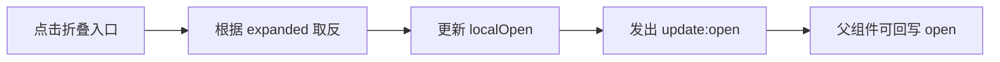

# 可展开且可选择的内容区块

OmDisclosure 为分组内容提供展开、收起和标题选择两种交互模式，既可由父组件控制状态，也可自行维护默认状态；同时通过插槽、ARIA 属性和动画降级兼顾复用性与可访问性。

来源：gpt-5.6-sol 分析，gpt-5.6-sol 独立复核；模型解释仍可被原始证据纠正。

## 解决折叠与标题操作冲突

该组件用于把一段内容收纳在可展开标题下，并允许调用方替换标题、补充元信息和注入正文。默认模式下，标题本身负责展开或收起；启用 `titleAction` 后，箭头按钮只控制折叠，标题按钮则触发 `select`，适合“展开分组”和“进入该分组”必须并存的列表。参考 [标题双操作模式 ↗](../../../packages/ui/src/components/OmDisclosure.vue#L23 "支持默认由标题切换、启用 titleAction 后箭头切换而标题触发 select 的交互说明。")

组件提供 `title`、受控的 `open`、非受控初值 `defaultOpen` 与交互模式 `titleAction`，并对后三者设置默认值。参考 [组件输入与默认值 ↗](../../../packages/ui/src/components/OmDisclosure.vue#L4 "说明组件公开的状态和交互属性，以及可选属性的默认配置。")

## 受控与非受控状态流程

`expanded` 优先读取父组件传入的 `open`；未传入时才使用内部 `localOpen`。点击折叠入口会基于当前展示状态取反、更新内部值，并发出 `update:open`，因此既能独立工作，也能配合 `v-model:open`。参考 [展开状态计算 ↗](../../../packages/ui/src/components/OmDisclosure.vue#L14 "支持 open 优先、内部状态兜底以及切换后发出 update:open 的流程。")

在受控模式中，最终显示仍以父组件的 `open` 为准；若父组件没有回写，内部更新不会改变 `expanded`。内容采用 `v-show`，收起时节点仍保留在 DOM 中，可避免反复销毁插槽内容，但也意味着隐藏内容的组件状态和资源仍然存在。参考 [内容显示策略 ↗](../../../packages/ui/src/components/OmDisclosure.vue#L54 "支持内容面板使用 v-show 并以 expanded 控制可见性的论断。")

## 可访问性与样式边界

折叠按钮通过 `aria-expanded` 和 `aria-controls` 关联带唯一 ID 的内容面板；双操作模式还为箭头按钮生成“展开/收起 + 标题”的可读名称。标题承担选择操作时不再错误声明自己控制面板。参考 [折叠控件语义 ↗](../../../packages/ui/src/components/OmDisclosure.vue#L25 "说明双操作模式下折叠按钮的可读名称、展开状态和面板关联。")

箭头复用 `OmIcon` 的 `arrow` 图形，展开态旋转 90 度；系统要求减少动态效果时会取消过渡。标题按钮最小高度为 44px，长文本允许断行，元信息保持不收缩。参考 [标题与箭头样式 ↗](../../../packages/ui/src/components/OmDisclosure.vue#L74 "支持点击区域尺寸、长标题布局以及展开态箭头旋转的说明。") [减少动态效果 ↗](../../../packages/ui/src/components/OmDisclosure.vue#L131 "支持在 prefers-reduced-motion 环境中关闭箭头过渡的说明。")

当前材料未包含该组件的测试，因此无法确认键盘焦点顺序、受控模式父组件延迟回写以及插槽中复杂交互内容的实际覆盖情况。

## 与图标组件的关系

OmDisclosure 直接导入并渲染 OmIcon，依赖其 `arrow` 名称提供方向提示。OmIcon 将图标标记为 `aria-hidden`，因此语义由外层按钮的文本、标签和展开状态承担；若图标名称不存在，OmIcon 会回退为书本图形，但本组件使用的 `arrow` 已在路径表中定义。参考 [箭头图标实现 ↗](../../../packages/ui/src/components/OmIcon.vue#L2 "说明 arrow 路径存在、未知名称回退为 book，并且 SVG 对辅助技术隐藏。")
