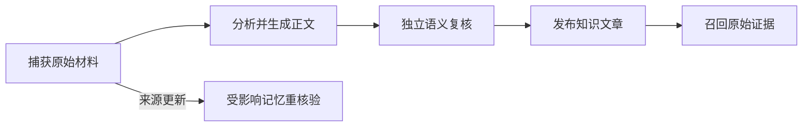

# 项目实现状态与能力边界

omem 已形成统一的个人知识与助理应用，原始材料、知识文章、中文语义检索、日常助理和事项跟进共用可追溯证据链。顶部日期化记录代表较新的能力状态；完整知识覆盖、失败和跳过范围仍须以当前覆盖及自动验证报告为准。

来源：gpt-5.6-sol 分析，gpt-5.6-sol 独立复核；模型解释仍可被原始证据纠正。

## 当前解决的问题

omem 将日常助理、知识库、原始材料和事项放在同一个人应用中。读者先阅读完整主题文章，需要核对时再沿句段末引用查看固定版本的代码或文档。参考 [统一知识阅读方式 ↗](../../../docs/implementation/unified-knowledge-reading.md#L5 "支持统一应用入口、完整主题文章、页内导航、固定代码范围和原始 Markdown 连贯渲染等阅读行为。")

截至 2026-10-01，系统已提供持久消息跟进入口，并接入中文语义检索、代码标识符召回及来源更新后的重核验闭环。参考 [日常消息与跟进 ↗](../../../docs/implementation/status.md#L5 "支持持久会话、等待与暂缓流程，并说明自动监听回复和外部到期投递等尚未接入。") [代码召回与结果去重 ↗](../../../docs/implementation/status.md#L9 "支持 AST 精确标识符召回、MMR 去重以及全库覆盖仍以当前报告为准。") [中文语义检索 ↗](../../../docs/implementation/status.md#L11 "支持按模型身份隔离的中文向量检索、词法降级、小样本限制及尚未实现的检索能力。") [来源更新闭环 ↗](../../../docs/implementation/status.md#L13 "支持来源更新后的提炼、独立复核、原子应用与失败待复查流程。")

状态页采用追加式记录：顶部的新进展已经指出部分旧检索描述过时，2026-09-29 的“当前状态”仍作为当时快照保留；Batch 2 仅用于历史追溯，不属于现行交付清单。参考 [统一词法检索进展 ↗](../../../docs/implementation/status.md#L17 "支持 FTS5/BM25、中文短词、原始证据与知识引用融合，并明确旧检索记录已有过时内容。") [Batch 2 历史定位 ↗](../../../docs/implementation/status.md#L117 "直接说明 Batch 2 仅供追溯，不作为当前已交付清单。") [九月状态快照 ↗](../../../docs/implementation/status.md#L37 "表明较旧的“当前状态”以 2026-09-29 为时间基线，应结合顶部更新理解。")

## 从原始材料到可追溯知识

知识正文建立在 Source、Revision 与 Fragment 证据链上。分析角色生成带内联引用的文章，宿主从固定版本复制引文，独立角色判断引用能否支持附近论断；知识修订不可变，来源变化后仍可读取旧引用对应的历史版本。参考 [固定引用与知识修订 ↗](../../../docs/implementation/knowledge-pipeline.md#L7 "支持内联引用、固定版本引文、独立语义复核、不可变修订和历史证据保留。")

只有复核通过的正文才发布；用户回答保存为新的原始材料，并触发相关知识重新核对。参考 [通用知识处理流程 ↗](../../../docs/implementation/knowledge-pipeline.md#L25 "支持先分析再独立复核、仅发布通过正文，以及用户回答作为原始材料进入重核对。") 来源更新会复用提炼、独立复核和原子应用流程，失败或缺少证据时保持待复查。参考 [来源更新闭环 ↗](../../../docs/implementation/status.md#L13 "支持来源更新后的提炼、独立复核、原子应用与失败待复查流程。")

知识正文可以引导检索，但送入助手的仍是经过可见性与当前来源检查的原始片段，派生文章不会成为新的独立事实。参考 [知识引导原始证据召回 ↗](../../../docs/implementation/knowledge-pipeline.md#L55 "支持派生正文只作检索导航，助手最终使用经过可见性和当前版本核对的原始片段。")

## 阅读、检索与日常使用

阅读端从功能目录进入完整文章，并以页内导航定位章节；引用代码默认展示固定行范围，原始 Markdown 连贯渲染。参考 [统一知识阅读方式 ↗](../../../docs/implementation/unified-knowledge-reading.md#L5 "支持统一应用入口、完整主题文章、页内导航、固定代码范围和原始 Markdown 连贯渲染等阅读行为。") 段末引用按目标与位置去重，共享证据弹窗可恢复各层滚动位置和代码展开状态。参考 [段末引用与证据弹窗 ↗](../../../docs/implementation/reading-and-activity.md#L3 "支持引用按目标和位置去重，以及证据弹窗的层级、滚动和代码展开状态恢复。") 材料处理页面区分排队、运行、结果与失败，并明确“原文已保存”不代表模型处理成功。参考 [变化记录与材料处理 ↗](../../../docs/implementation/reading-and-activity.md#L9 "支持版本变化展示、通知语义和材料处理队列的状态及失败说明。")

检索同时覆盖词法与语义路径：词法侧融合 FTS5/BM25、中文短词、活跃记忆原证据和知识正文引用，语义侧使用按模型身份隔离的中文 BGE 分窗向量；模型缺失时保留词法结果并报告降级。参考 [统一词法检索进展 ↗](../../../docs/implementation/status.md#L17 "支持 FTS5/BM25、中文短词、原始证据与知识引用融合，并明确旧检索记录已有过时内容。") [中文语义检索 ↗](../../../docs/implementation/status.md#L11 "支持按模型身份隔离的中文向量检索、词法降级、小样本限制及尚未实现的检索能力。") 精确代码标识符可由 AST 定义召回，混合结果使用 MMR 减少重复。参考 [代码召回与结果去重 ↗](../../../docs/implementation/status.md#L9 "支持 AST 精确标识符召回、MMR 去重以及全库覆盖仍以当前报告为准。")

## 验收口径与现有边界

依赖、全量检查和浏览器流程已有退出码记录；覆盖报告记录真实 ACP 重生成、独立复核和上层章节重建，自动验证报告记录自动检查。未通过文章保留旧版并标记待更新，未覆盖材料不能算作完成。参考 [统一阅读验收记录 ↗](../../../docs/implementation/unified-knowledge-reading.md#L28 "说明依赖、检查和浏览器验收，以及覆盖报告与自动验证报告各自记录的内容。") 另一次完整验收包含固定中文向量模型和六条 HTTP 检索，但单次记录不等于全库知识覆盖。参考 [Bun 与 HTTP 检索验收 ↗](../../../docs/implementation/status.md#L7 "支持一次完整验收包含中文向量模型和六条 HTTP 检索。")

当前仍未实现 reranker、ANN 和历史时点检索；自动监听外部回复、周期回顾、重复提醒及外部到期投递也尚未接入。参考 [中文语义检索 ↗](../../../docs/implementation/status.md#L11 "支持按模型身份隔离的中文向量检索、词法降级、小样本限制及尚未实现的检索能力。") [日常消息与跟进 ↗](../../../docs/implementation/status.md#L5 "支持持久会话、等待与暂缓流程，并说明自动监听回复和外部到期投递等尚未接入。") 跨文件调用解析和跨 revision 的符号、Fragment 语义身份续接仍是边界。参考 [代码关系与版本边界 ↗](../../../docs/implementation/code-wiki-review-2026-09-29.md#L36 "支持跨文件调用和跨 revision 语义身份续接尚未实现的结论。")

系统目前面向本仓库与单用户 SQLite 场景，不能宣称已经具备任意多仓库或多租户能力。参考 [单用户接入范围 ↗](../../../docs/implementation/code-wiki-review-2026-09-29.md#L33 "支持当前范围是本仓库与单用户 SQLite，不能宣称任意多仓库或多租户均已接入。") 原件可追溯也不意味着每项陈述都已由证据验证器证实。参考 [可追溯与验证边界 ↗](../../../docs/implementation/status.md#L142 "支持原件可追溯不等于每项陈述都已经过证据验证。")
